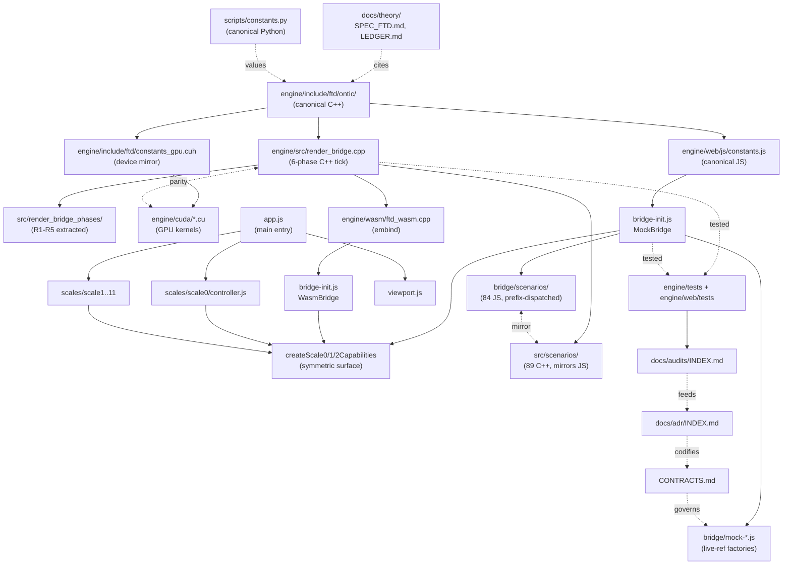

# META_PROJECT_ATLAS — FTD Engine Navigation Hub

**Audience: LLM agents and humans needing to find code/docs fast.**
**Update trigger: any directory creation, public-API change, or architectural decision.**
**Last refreshed: 2026-06-01 (post engine-flawless lifecycle/callstack/toggle audit, 16 commits on branch `flawless-engine-2026-06-01`; prior baseline: 2026-04-27 8-phase refactor sweep, 17 commits 2db67ca…87158ae).**

This file is the entry point for navigating the FTD codebase. If you are a
fresh agent looking at this project for the first time, read this file →
read [CLAUDE.md](CLAUDE.md) → read [docs/WHERE_WE_LEFT_OFF.md](docs/WHERE_WE_LEFT_OFF.md) → start work.

---

## §1 — "Where do I look for X?"

| If you want to… | Look here | Entry-point file |
|---|---|---|
| Add a new physics scenario | `engine/web/js/bridge/scenarios/` | `index.js` (prefix dispatcher) |
| Modify scenario toggle defaults | `engine/web/js/config/toggles.js` | `SCALE0_TOGGLES`, `SCALE0_SCENARIO_OVERRIDES` |
| Change a physics constant | `engine/web/js/constants.js` (JS) + `engine/include/ftd/ontic.h` (C++) | layered by category |
| Add a new toggle | `engine/include/ftd/term_toggles.h` (C++) + `engine/web/js/config/toggles.js` (JS) + `engine/wasm/bindings_render_bridge.cpp` (binding) | (Phase 6 will make this 1-place edit) |
| Change MockBridge physics (JS) | `engine/web/js/bridge-init.js` `MockBridge` class (lines 62–1568); helpers in `engine/web/js/bridge/mock-*.js` | `_tickFlux`, `_computePairwiseForces` |
| Change WasmBridge bindings | `engine/wasm/ftd_wasm.cpp`, `engine/wasm/bindings_*.cpp` | `EMSCRIPTEN_BINDINGS` block |
| Change C++ engine physics | `engine/src/render_bridge.cpp` phase methods | `phase_read`, `phase_write`, `phase_forces`, `phase_movement` |
| Change CUDA kernels | `engine/cuda/kernels_stencil.cu`, `kernels_forces.cu`, `kernels_poisson.cu` | `phase_*_kernel` |
| Add a new dashboard view (3D rendering) | `engine/web/js/viewport.js` + `engine/web/js/viewport/*.js` | `Viewport` class methods |
| Add a new dashboard panel | `engine/web/js/scales/scale0/ui/` (Scale 0 panels) | `bindings.js`, `controls/`, `overlays/` |
| Change scenario load flow | `engine/web/js/scales/scale0/runtime/scenario-loader.js` | `loadScale0Scenario`, `applyToggleDefaults` |
| Change diagnostics panel rows | `engine/web/js/ui/panels/diagnostics-panel/descriptors/scale0.js` | `sections[]` |
| Add a C++ unit test | `engine/tests/test_*.cpp` + register in `engine/CMakeLists.txt` (`ftd_add_test` macro) | template: `engine/tests/test_audit_regression.cpp` |
| Add a JS Playwright test | `engine/web/tests/*.spec.js` | template: `engine/web/tests/audit-regression.spec.js` |
| Add a Python verification script | `scripts/verification/` | template: `scripts/verification/verify_*.py` |
| Add a formal proof | `scripts/proofs/proof_*.py` | run via `python -m scripts.proofs.<name>` |
| Find a physics derivation | `docs/theory/03_derivations/` (DERIV_*.md) | `docs/theory/META_INDEX.md` catalog |
| Find a foundational document | `docs/theory/02_foundations/` (FOUND_*.md) | same catalog |
| Find an audit / assessment | `docs/theory/07_assessment/` (AUDIT_*.md) | same catalog |
| Find a load-bearing claim | `docs/theory/07_assessment/core_ledgers/LEDGER.md` | single source of truth for claim status |
| Find an architectural decision | `docs/adr/` | `docs/adr/INDEX.md` |
| Find an audit ledger | `docs/audits/` | `docs/audits/INDEX.md` |
| Find a contract / interface spec | `CONTRACTS.md` (root) | section per contract |
| Run all tests | `engine/build && ctest` (C++) + `pytest scripts/tests/` (Python) + Playwright (JS) | see `engine/tests/README.md` |
| Build C++ engine | `cmake -S engine -B engine/build && cmake --build engine/build --config Release` | |
| Build WASM | `engine/build_wasm.bat` (Windows) or `emcmake cmake -S engine -B engine/build_wasm` | |
| Run web dashboard | `python engine/web/serve.py 8080` | no-cache dev server |
| Run GPU campaign | WSL2 only: `wsl.exe -d Ubuntu-22.04 -- bash -c "cd /mnt/c/Users/cpaci/Desktop/ftd && engine/build_wsl/<test>"` | per CLAUDE.md mandate |
| Find session-resume context | `docs/WHERE_WE_LEFT_OFF.md` | always start here when resuming |
| Find project epistemic state | `CLAUDE.md` §"Current epistemic state" | versioned per session |
| Read engine architecture | `engine/SPEC_ENGINE.md` | living doc |
| Read FTD theory spec | `docs/SPEC_FTD.md` | authoritative |

---

## §2 — Annotated directory tree

Top-level layout. Each directory's `README.md` (where present) is the local entry point.

```
ftd/
├── CLAUDE.md                          # Project instructions for AI agents (versioned)
├── AGENTS.md                          # Sibling synced with CLAUDE.md
├── META_PROJECT_ATLAS.md              # ← you are here
├── META_DOCUMENTATION_MAP.md          # Card catalog with reading paths by audience
├── CONTRACTS.md                       # Formal interface specs (bridge state, capabilities, etc.)
├── MAINTAINABILITY.md                 # Hazards, recipes, tech-debt ledger
├── CHANGELOG.md
├── README.md
├── docs/
│   ├── SPEC_FTD.md                    # Authoritative FTD theory spec
│   ├── WHERE_WE_LEFT_OFF.md           # Session-resume context (read first when resuming)
│   ├── adr/                           # Architecture Decision Records
│   │   ├── INDEX.md                   # ADR catalog
│   │   └── 0001…0013-*.md             # Per-decision records (9 retroactive + 4 from refactor sweep)
│   ├── audits/                        # Archived audit ledgers (per sweep)
│   │   ├── INDEX.md
│   │   ├── AUDIT_2026-04_pre-refactor.md   # 122-finding sweep (78 resolved, archived)
│   │   └── AUDIT_2026-04_refactor-sweep.md # 8-phase refactor (17 commits, archived)
│   ├── theory/                        # 115+ theory documents
│   │   ├── META_INDEX.md              # Catalog
│   │   ├── 01_reference/              # SPEC_ALGEBRAIC_SPINE, SPEC_FTD_COMPLETE_CHAIN
│   │   ├── 02_foundations/            # FOUND_*.md
│   │   ├── 03_derivations/            # DERIV_*.md
│   │   ├── 04_coupling/               # alpha, alpha_s, sin²θ_W, ...
│   │   ├── 05_particles/              # masses, mixing, generations
│   │   ├── 06_reference_frames_and_measurement/ # Scale 11 / observer formalism
│   │   ├── 07_assessment/             # AUDIT_*.md, LEDGER.md, TRACKER_OPEN_ITEMS.md
│   │   ├── 08_structural/             # geometry, information theory
│   │   ├── 09_mathematical/           # number theory, Chowla-Selberg
│   │   ├── 10_eft_program/            # EFT recovery program
│   │   └── archive/                   # superseded
│   ├── papers/                        # PDFs + TeX sources
│   ├── reference/                     # REF_EPISTEMIC_LABELS, REF_SYMBOL_GLOSSARY
│   └── internal/                      # Local-only session summaries (gitignored)
├── engine/
│   ├── SPEC_ENGINE.md                 # Engine architecture spec
│   ├── CMakeLists.txt
│   ├── README.md                      # Build / test / run instructions
│   ├── include/ftd/                   # ~30 headers
│   │   ├── ontic/                     # 9-layer derivation chain (README.md inside)
│   │   ├── eft/                       # EFT recovery program headers
│   │   ├── render_bridge.h            # Main API (369 LOC; diagnostic structs in render_bridge_diagnostics.h since Phase 1)
│   │   ├── render_bridge_diagnostics.h # POD diagnostic structs (split out Phase 1; ~5 TU rebuild fan-out vs ~30 pre-split)
│   │   ├── render_bridge_phases.h     # Free-function declarations for Phase 4 extracted phase TUs
│   │   ├── particle_engine.h, atom_engine.h, cosmic_engine.h
│   │   ├── term_toggles.h             # TOGGLE_SPECS[] table-driven (Phase 6); single-line edits per new toggle
│   │   ├── constants.h                # Layer-organized canonical constants
│   │   ├── constants_gpu.cuh          # Device-side mirror
│   │   ├── voxel.h, lattice.h, vec3.h # Core types
│   │   ├── test_telemetry.h           # NDJSON test API (154 LOC declarations only; impl in tests/support/, Phase 7)
│   │   └── ...
│   ├── src/                           # ~45 .cpp files
│   │   ├── render_bridge.cpp          # 545 LOC orchestrator (Phase 4 reduced from 1231 LOC)
│   │   ├── render_bridge_phases/      # Phase 4 extractions (892 LOC physics body)
│   │   │   ├── phase_write.cpp        # 317 LOC — Phase 4a (RF-4 manifest_at dedup)
│   │   │   ├── phase_forces.cpp       # 251 LOC — Phase 4b
│   │   │   ├── phase_read.cpp         # 168 LOC — Phase 4c
│   │   │   └── phase_movement.cpp     # 156 LOC — Phase 4c
│   │   ├── poisson_solvers.cpp        # R1 — extracted SOR Poisson chain
│   │   ├── transmutation_phases.cpp   # R2 — weak/pair/triad/proper-time
│   │   ├── energy_ledger_compute.cpp  # R3 — conservation bookkeeping
│   │   ├── diagnostics_compute.cpp    # R4 — diagnostics() + energy_audit()
│   │   ├── injection.cpp              # R5 — inject_flux/particle/wavepacket
│   │   ├── particle_engine.cpp, atom_engine.cpp, cosmic_engine.cpp
│   │   ├── scenarios/                 # 89 C++ scenarios (flux, light, quantum, s0_seed, s0_field)
│   │   ├── atom/                      # AE force decomposition
│   │   ├── cosmic/                    # CE phase decomposition
│   │   ├── constructors/              # Shared lattice builders
│   │   └── eft/                       # EFT recovery TUs
│   ├── cuda/                          # ~12 CUDA TUs (README.md inside)
│   │   ├── kernels_stencil_single.cu  # 759 LOC — Phase 5: single-substrate kernels
│   │   ├── kernels_stencil_dual.cu    # 565 LOC — Phase 5: dual-substrate kernels
│   │   ├── kernels_aux.cu             # 286 LOC — Phase 5: weak_transmutation + pair_production
│   │   ├── kernels_stencil_common.cuh # 82 LOC — shared device helpers (Phase 5)
│   │   ├── kernels_forces.cu, kernels_poisson.cu
│   │   ├── cuda_index.cuh             # Shared idx3d / wrap / decode_xyz / periodic_delta (ADR-0007)
│   │   ├── gpu_engine.cu, gpu_buffers.cu
│   │   └── atom_engine_gpu.cu, particle_engine_gpu.cu
│   ├── wasm/                          # Emscripten bindings
│   │   ├── ftd_wasm.cpp               # Main embind file
│   │   ├── bindings_render_bridge.cpp # RenderBridge bindings + auto-generated toggle map (Phase 6)
│   │   ├── bindings_particle.cpp, bindings_atom.cpp
│   │   └── bindings_internal.h
│   ├── tests/                         # 250+ test files (README.md inside)
│   │   ├── test_*.cpp                 # Unit tests (use test_telemetry.h)
│   │   ├── benchmark_*.cpp            # Engine-theory bridge tests
│   │   ├── campaign_*.cpp             # Long-running measurement campaigns
│   │   ├── test_render_bridge_golden.cpp # Phase 4 golden-tick gate (hash 0xcd957b601d47868a)
│   │   ├── test_audit_regression.cpp  # 14-15/15 audit fix coverage
│   │   └── support/                   # Phase 7 ftd_test_support library
│   │       ├── test_telemetry.cpp     # 312 LOC impl (was header-only, parsed 155+ times)
│   │       ├── bridge_fixtures.h      # ToggleProfile enum + make_bridge / run_for / etc.
│   │       └── bridge_fixtures.cpp
│   └── web/                           # Browser dashboard
│       ├── serve.py                   # No-cache dev server
│       ├── index_dag.html             # Main entry
│       ├── docs/                      # USER_GUIDE.md
│       ├── tests/                     # Playwright .spec.js
│       └── js/                        # ~250+ modules
│           ├── constants.js           # JS canonical constants (mirror of ontic.h)
│           ├── viewport.js            # 1256 LOC orchestrator (Phase 3 reduced from 3953)
│           ├── viewport/              # Phase 3 sub-renderers (4948 LOC across 5 files)
│           │   ├── scene-core.js      # 500 LOC — camera, lights, boundary, axes, render loop
│           │   ├── flux-renderer.js   # 416 LOC — flux volume, slice, streamlines
│           │   ├── particle-renderer.js # 503 LOC — particles, trails, velocity vectors
│           │   ├── field-renderer.js  # 2273 LOC — 27+ field overlay meshes (E/B/Poynting/forces/quantum)
│           │   ├── molecular-renderer.js, boundary-geometry.js
│           │   ├── topology-sheet-renderer.js, color-ramps.js
│           │   └── REFACTOR_MAP.md    # Phase 3 extraction guide (closed; archival reference)
│           ├── bridge-init.js     # 42-LOC re-export shim (Phase 2; 2395 LOC originally)
│           ├── app.js             # Main entry / orchestrator
│           ├── config/toggles.js      # SCALE0_TOGGLES + scenario overrides
│           ├── bridge/                # Bridge layer (README.md inside; Phase 2 isolated)
│           │   ├── mock-bridge.js     # 1578 LOC — MockBridge class (Phase 2a)
│           │   ├── wasm-bridge.js     # 715 LOC — WasmBridge class (Phase 2b)
│           │   ├── capabilities/      # Phase 2c capability factories
│           │   │   ├── scale0.js, scale1.js, scale2.js, install.js
│           │   ├── mock-diagnostics.js       # Live-reference factory exemplar
│           │   ├── mock-particle-engine.js, mock-lattice-samplers.js
│           │   ├── mock-atom-engine.js, mock-scale4.js, mock-scale5.js
│           │   ├── boundary.js
│           │   └── scenarios/         # 84 JS scenarios (README.md inside)
│           ├── scales/scale0/         # Scale-0 controller (README.md inside)
│           │   ├── controller.js
│           │   ├── runtime/           # tick, frame-sync, scenario-loader, diagnostics
│           │   ├── ui/                # bindings, controls, overlays, panels
│           │   └── state/             # store
│           ├── scales/scale1/...scale11/
│           └── ui/                    # Shared UI components
└── scripts/                           # Python tooling (README.md inside)
    ├── constants.py                   # Canonical Python constants (root of derivation chain)
    ├── verification/                  # Formal derivation verification
    ├── proofs/                        # Mathematical proofs with error bounds
    ├── experiments/                   # Bell tests, CERN analysis
    ├── exploration/                   # Research investigations (50-test physics battery)
    ├── tests/                         # pytest suites
    ├── visualization/                 # Publication figure generation
    └── runners/                       # Test protocol runners
```

---

## §3 — Subsystem dependency graph



---

## §4 — Per-file header convention

**Every file modified in the refactor sweep must carry this block at top of file:**

```js
/**
 * @file <path/relative/to/repo/root>
 * @purpose <one sentence — what does this file own?>
 * @consumers <key files that import/include this>
 * @contract <CONTRACTS.md#section-name if applicable>
 * @related <paired files: CPU↔GPU, JS↔C++ mirrors>
 * @epistemic [THEOREM]/[CONJECTURE]/[IMPOSED] <if physics-bearing>
 */
```

**STATE CONTRACT block (required for any module touching live-ref state):**

```js
/* ============ STATE CONTRACT ============
 * Reads:    state.<field>      // why it needs this
 * Writes:   state.<field>      // who else reads it
 * Owns:     state.<field>      // sole writer
 * Derives:  state.<field>      // recomputed each call
 * Invariants:
 *   - <invariant>
 * ======================================== */
```

Reference exemplar: [`engine/web/js/bridge/mock-diagnostics.js`](engine/web/js/bridge/mock-diagnostics.js) lines 26–50. Phase 2/3 extractions all carry the `@file` block; new files must too.

---

## §5 — Cross-reference policy

Three rules. Every refactor PR must satisfy them:

1. **Physics-bearing code cites LEDGER.** Any function implementing a load-bearing claim writes `// Implements LEDGER#C-NNN [TAG]`. Validated by grep (every `[THEOREM]` tag in code resolves to a LEDGER row).
2. **JS↔C++ mirrors cross-link reciprocally.** If `wasm-bridge.js` mirrors a C++ class, both files carry `@related` headers pointing to each other. Validated by reciprocal-link CI check.
3. **Public-API consumers cite their contract.** Any file calling `createBridge`, a capability factory, or a STATE CONTRACT module carries a comment naming the relevant `CONTRACTS.md` section.

---

## §6 — AUDIT_LEDGER lifecycle

- **Active sweep**: a single `AUDIT_LEDGER.md` at root for the in-flight refactor.
- **On merge**: rename to `AUDIT_<YYYY-MM>_<slug>.md`, move under `docs/audits/`, append entry to `docs/audits/INDEX.md`.
- **Retention**: indefinite (audits are history with high LLM value).
- **Concurrent sweeps**: place under `docs/audits/active/<slug>/AUDIT.md`.
- **Quarterly roll-up**: INDEX.md gains a "patterns observed" section.

---

## §7 — Refactor companion workflow

Every refactor session produces a triad:

1. **Open**: author `SPEC_REFACTOR_<name>.md` (plan, scope, success criteria) + create `AUDIT_<name>.md` skeleton.
2. **During**: AUDIT live-tracks findings with `[x]/[~]/[d]/[n]` legend.
3. **Close**: SPEC marked `Status: Implemented`; AUDIT moved to `docs/audits/`; META_PROJECT_ATLAS.md updated; emit ADR(s) for any pattern decisions; affected READMEs updated.

PR-merge gate: SPEC.Status = Implemented AND ATLAS diff exists.

---

## §8 — Anti-drift CI checks (target)

- **Pre-commit hook**: file-header `@purpose` change → directory README must be in same diff (warn → block).
- **Per-PR CI**:
  - All `@related` links resolve reciprocally
  - All `LEDGER#C-NNN` cites resolve to existing rows
  - Every directory with >3 source files has README.md
  - SPEC_REFACTOR_*.md `Status` field non-empty
- **Per-PR linter**: new files under `engine/web/js/` or `engine/include/ftd/` lacking the structured header → warn.
- **Quarterly freshness audit**: `git log` last-modified per dir vs README mtime; older READMEs flagged in `docs/audits/freshness-<date>.md`.
- **PR template**: checkbox "ATLAS / READMEs / ADRs updated as needed."

---

## §9 — Deferred / WSL2-only operations

Per CLAUDE.md, GPU campaigns route through WSL2:

```bash
wsl.exe -d Ubuntu-22.04 -- bash -c "cd /mnt/c/Users/cpaci/Desktop/ftd && \
    engine/build_wsl/<binary> --args"
```

Windows-native CUDA build (`engine/build/`) is acceptable for compile-time
checks and single-tick correctness only. Any measurement campaign, sweep,
or multi-seed run goes through WSL2.

**WSL2 GPU parity verification — CLOSED 2026-04-28.** Phase 5
(`kernels_stencil.cu` split into 3 TUs) was host-compile-verified +
CPU-deterministic-verified at refactor close. Runtime GPU parity has
now been verified end-to-end on WSL2 + RTX 5090:

| Test | L | Result |
|---|---:|---|
| `test_render_bridge_golden` | 16 | hash `0xcd957b601d47868a` bit-exact on CUDA backend |
| `test_gpu_parity_complete` | 32 | 70/0 PASS across 20 physics domains |
| `test_force_diag_parity` | — | 7/7 PASS (`|a−b| = 0.000e+00` on strong force) |
| `test_sim_parity` | 16 | TotalFieldEnergy parity ≤ 1e-2 at 100 + 500 ticks |

Re-verification command (drop-in for any future stencil work):

```bash
wsl.exe -d Ubuntu-22.04 -- bash -c "cd /mnt/c/Users/cpaci/Desktop/ftd && \
    cmake --build engine/build_wsl --target test_render_bridge_golden test_gpu_parity_complete -j 8 && \
    engine/build_wsl/test_render_bridge_golden && \
    engine/build_wsl/test_gpu_parity_complete"
```

**Engine-flawless verification harness — added 2026-06-01** (branch
`flawless-engine-2026-06-01`, 16 commits). A lifecycle/callstack/toggle
audit added a verification surface pinning engine lifecycle, tick-phase
order, toggle coverage, and the energy-conservation profile:

| Layer | File | Pins |
|---|---|---|
| C++ | `engine/tests/test_conservation_profile.cpp` | energy-conservation profile (leak = non-variational Gauss-projection **operator**, not solver tol) |
| C++ | `engine/tests/test_tick_phase_order.cpp` | `phase_read → phase_write → gauss_project → phase_forces → phase_movement` order |
| C++ | `engine/tests/test_engine_lifecycle.cpp` | construct / run / teardown lifecycle; `DagEngine::entity_count()==0` documented |
| JS (Playwright) | `engine/web/tests/lifecycle-harness.spec.js` | web bridge lifecycle |
| JS (Playwright) | `engine/web/tests/reconcile-claims.spec.js` | claim reconciliation |
| JS (Playwright) | `engine/web/tests/toggle-coverage.spec.js` | toggle coverage |
| JS (Playwright) | `engine/web/tests/overlay-scheduler.spec.js` | overlay scheduler |

This audit also **fixed a 5-week clean-checkout `cmake` break** (dangling
`_repro_gpu_empty_bridge` reference in `engine/CMakeLists.txt`) and marked
**DagEngine deprecate-clearly**. The MC-T4.3 theory-side companion is the
route-invariance boundary audit
`docs/theory/07_assessment/audits/AUDIT_ALPHA_OPERATOR_FORCING_ROUTE_INVARIANCE.md`
(FTD-0242, `[STRONGLY MOTIVATED CONJECTURE no-go]` — α is dynamical not
structural; **nothing promoted**).

---

## §10 — Refactor sweep history (2026-04-27, completed)

The 8-phase sweep that produced the structure documented above. See
[docs/audits/AUDIT_2026-04_refactor-sweep.md](docs/audits/AUDIT_2026-04_refactor-sweep.md)
for the full ledger; commits chained below.

| # | Phase | Commit | Outcome |
|---|---|---|---|
| 1 | 0 — Docs scaffolding | [2db67ca](https://github.com/williamsteinmetz/Foundational-Ternary-Dynamics/commit/2db67ca) | This file + CONTRACTS.md + 9 ADRs + 7 READMEs |
| 2 | 1 — Diagnostic struct split | [194563a](https://github.com/williamsteinmetz/Foundational-Ternary-Dynamics/commit/194563a) | `render_bridge.h` 506→369; ~30→5 TU rebuild fan-out |
| 3 | 2a — MockBridge | [6be0a19](https://github.com/williamsteinmetz/Foundational-Ternary-Dynamics/commit/6be0a19) | `bridge-init.js` 2395→879 |
| 4 | 2b — WasmBridge | [7256a14](https://github.com/williamsteinmetz/Foundational-Ternary-Dynamics/commit/7256a14) | →213 |
| 5 | 2c — Capability factories | [c11ef96](https://github.com/williamsteinmetz/Foundational-Ternary-Dynamics/commit/c11ef96) | →42 (re-export shim) |
| 6 | 3 prep — REFACTOR_MAP | [848e839](https://github.com/williamsteinmetz/Foundational-Ternary-Dynamics/commit/848e839) | viewport.js method map |
| 7 | 3b — FluxRenderer | [8b4732d](https://github.com/williamsteinmetz/Foundational-Ternary-Dynamics/commit/8b4732d) | viewport.js 3953→3785 |
| 8 | 3d — ParticleRenderer | [1506079](https://github.com/williamsteinmetz/Foundational-Ternary-Dynamics/commit/1506079) | →3542 |
| 9 | 3a — SceneCore | [1499a11](https://github.com/williamsteinmetz/Foundational-Ternary-Dynamics/commit/1499a11) | →3307 |
| 10 | 3c — FieldRenderer | [506805b](https://github.com/williamsteinmetz/Foundational-Ternary-Dynamics/commit/506805b) | **→1256** (5 sub-renderers in place) |
| 11 | 4 pre-flight — Golden-tick test | [8afc8be](https://github.com/williamsteinmetz/Foundational-Ternary-Dynamics/commit/8afc8be) | hash `0xcd957b601d47868a` (gate) |
| 12 | 4a — phase_write | [9ef51b7](https://github.com/williamsteinmetz/Foundational-Ternary-Dynamics/commit/9ef51b7) | render_bridge.cpp 1231→972; RF-4 dedup |
| 13 | 4b — phase_forces | [76d2afe](https://github.com/williamsteinmetz/Foundational-Ternary-Dynamics/commit/76d2afe) | →759 |
| 14 | 4c — phase_read+movement | [be2aa8c](https://github.com/williamsteinmetz/Foundational-Ternary-Dynamics/commit/be2aa8c) | **→545** |
| 15 | 5 — CUDA stencil split | [183a493](https://github.com/williamsteinmetz/Foundational-Ternary-Dynamics/commit/183a493) | kernels_stencil.cu 1530 → 3 TUs (single/dual/aux) |
| 16 | 6 — Toggle TOGGLE_SPECS[] | [2aa2df9](https://github.com/williamsteinmetz/Foundational-Ternary-Dynamics/commit/2aa2df9) | 5-place edit → 2-place |
| 17 | 7 — Test fixture + telemetry impl | [87158ae](https://github.com/williamsteinmetz/Foundational-Ternary-Dynamics/commit/87158ae) | test_telemetry.h 412→154; ftd_test_support library; CTest LABELS |

Physics invariants preserved across all 17 commits:
- Golden hash `0xcd957b601d47868a` (100-tick deterministic) **bit-exact** across Phases 4a, 4b, 4c, 5, 6, 7
- `audit_regression` 14-15/15 PASS at every commit
- Locked-particle pair forces, absorbing-boundary sponge layer, ½-energy convention, Coulomb PE convention, dual-substrate split — all preserved

---

## §11 — Quick command reference

| Task | Command |
|------|---------|
| Run all Python tests | `python scripts/tests/run_all_tests.py` |
| Run 7-tier verification | `python scripts/tests/comprehensive/run_ultimate_test.py` |
| Run proof chain | `python scripts/proofs/proof_master_verification.py` |
| Build C++ engine | `cmake -S engine -B engine/build && cmake --build engine/build --config Release` |
| Run C++ tests | `cd engine/build && ctest --output-on-failure -C Release` |
| Run audit regression test | `engine/build/Release/test_audit_regression.exe` |
| Build whitepaper PDF | `cd dissemination/whitepaper && pdflatex FTD_Whitepaper.tex` |
| Build manuscript | `cd dissemination/manuscript && quarto render` |
| Launch web dashboard | `python engine/web/serve.py 8080` |
| View theory docs | `docs/theory/META_INDEX.md` |

---

**Cross-references:**
- [CLAUDE.md](CLAUDE.md) — current epistemic state, naming conventions, build/test instructions
- [CONTRACTS.md](CONTRACTS.md) — formal interface specs
- [docs/adr/INDEX.md](docs/adr/INDEX.md) — architectural decisions
- [docs/audits/INDEX.md](docs/audits/INDEX.md) — historical audit ledgers
- [docs/theory/META_INDEX.md](docs/theory/META_INDEX.md) — theory document catalog
- [engine/SPEC_ENGINE.md](engine/SPEC_ENGINE.md) — engine architecture
- [docs/SPEC_FTD.md](docs/SPEC_FTD.md) — authoritative FTD theory spec
- [META_DOCUMENTATION_MAP.md](META_DOCUMENTATION_MAP.md) — audience-specific reading paths
- [MAINTAINABILITY.md](MAINTAINABILITY.md) — hazards, recipes, tech-debt ledger

---

*Project version: FTD/FQCR v1.5 | Engine version: v2.15 | Atlas refreshed 2026-05-22*
