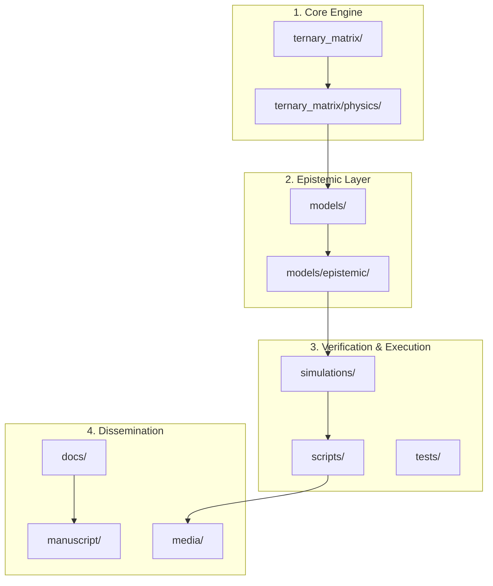

# Project Atlas: Foundational Ternary Dynamics (FTD)

This document serves as a high-level map for AI agents and researchers to navigate the FTD repository. It outlines the project's architecture, directory purposes, and core data flows.

## Architecture Overview

FTD is organized into four primary layers:
1.  **Core Engine**: The fundamental cellular automata simulation.
2.  **Epistemic Layer**: Physical models and axiomatization building on the core.
3.  **Verification & Execution**: Scripts for running experiments and validating results.
4.  **Dissemination**: Documentation, manuscripts, and media assets.

---

## Directory Index

### 📂 Core & Logic
*   [ternary_matrix/](file:///c:/Users/cpaci/Desktop/pbr_pedagogy/dissemination/Foundational-Ternary-Dynamics/ternary_matrix/) - The core C++/Python cellular automata engine.
    *   `physics/` - Implementation of discrete gravity, electromagnetism, and strong/weak interactions.
    *   `model/` - High-level simulation state management.
*   [visualizer/](file:///c:/Users/cpaci/Desktop/pbr_pedagogy/dissemination/Foundational-Ternary-Dynamics/visualizer/) - Real-time 3D OpenGL/Vulkan rendering engine for simulation state.

### 📂 Domain Models
*   [models/](file:///c:/Users/cpaci/Desktop/pbr_pedagogy/dissemination/Foundational-Ternary-Dynamics/models/) - Logical and physical interpretations of the ternary dynamics.
    *   `epistemic/` - Axiomatic definitions (Planck scale, constants, master quadratic).

### 📂 Execution & Verification
*   [simulations/](file:///c:/Users/cpaci/Desktop/pbr_pedagogy/dissemination/Foundational-Ternary-Dynamics/simulations/) - The primary verification suite for SM parameters (masses, mixing, etc.).
*   [scripts/](file:///c:/Users/cpaci/Desktop/pbr_pedagogy/dissemination/Foundational-Ternary-Dynamics/scripts/) - Operational scripts for running the environment.
    *   `runners/` - Production experiment orchestration.
    *   `investigation/` - One-off research and exploratory scripts.
    *   `visualization/` - Scripts for generating Manim scenes and interactive dashboards.
*   [tests/](file:///c:/Users/cpaci/Desktop/pbr_pedagogy/dissemination/Foundational-Ternary-Dynamics/tests/) - Unit and integration tests for code stability.

### 📂 Dissemination & Media
*   [docs/](file:///c:/Users/cpaci/Desktop/pbr_pedagogy/dissemination/Foundational-Ternary-Dynamics/docs/) - Theory papers, internal reports, and technical guides.
    *   `theory/` - Deep dives into FTD physics and math.
    *   `papers/` - Published and archived academic manuscripts.
    *   `internal/` - Configuration guides and operational manuals (e.g., `CLAUDE.md`).
*   [manuscript/](file:///c:/Users/cpaci/Desktop/pbr_pedagogy/dissemination/Foundational-Ternary-Dynamics/manuscript/) - Source for the Quarto-based book and official dissemination materials.
*   [media/](file:///c:/Users/cpaci/Desktop/pbr_pedagogy/dissemination/Foundational-Ternary-Dynamics/media/) - Centralized repository for all non-text assets.
    *   `images/` - PNG figures used in manuscripts and papers.
    *   `videos/` - MP4 renders of simulations and Manim scenes.
    *   `interactive/` - HTML-based Plotly dashboards and web tools.

---

## Technical Guides for AI Agents
*   **Coding Standards**: See [CLAUDE.md](file:///c:/Users/cpaci/Desktop/pbr_pedagogy/dissemination/Foundational-Ternary-Dynamics/docs/internal/CLAUDE.md).
*   **Verification Protocol**: Run `python simulations/run_all.py` to validate all theoretical claims.
*   **History**: See [CHANGELOG.md](file:///c:/Users/cpaci/Desktop/pbr_pedagogy/dissemination/Foundational-Ternary-Dynamics/CHANGELOG.md).
