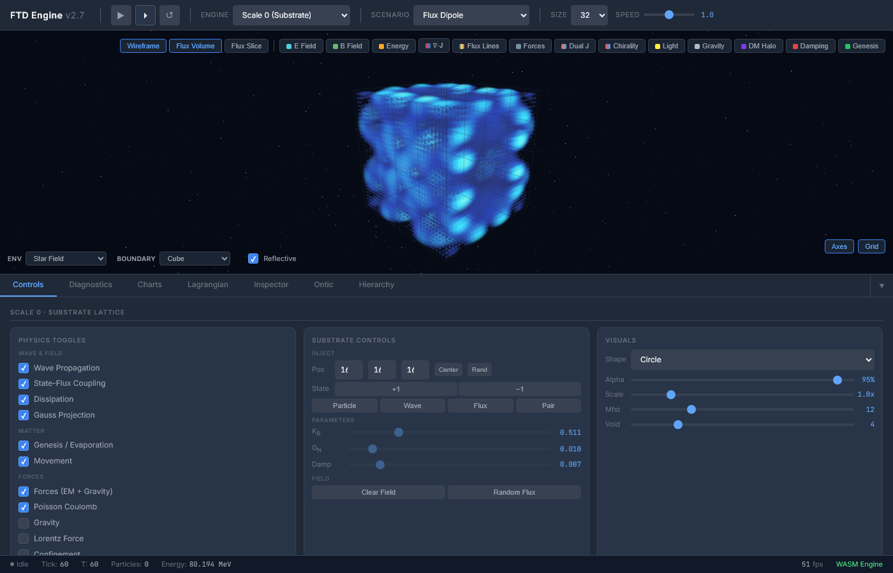
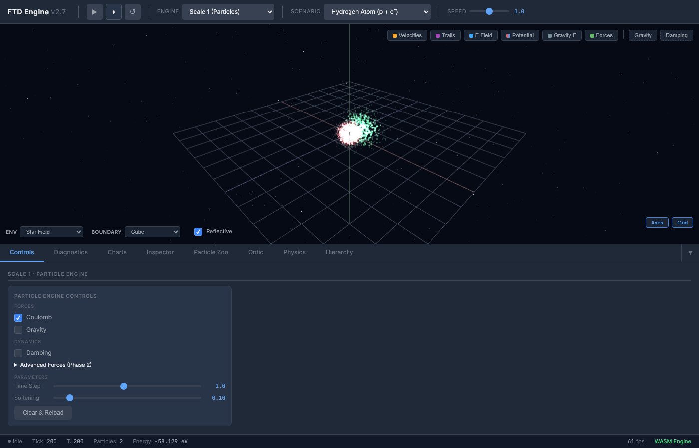
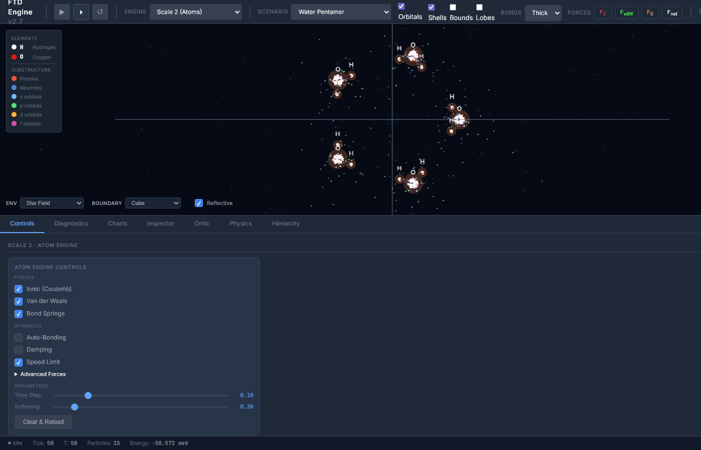
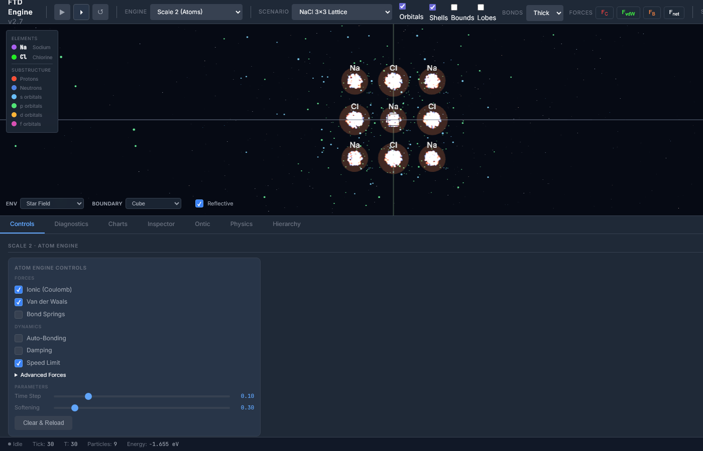
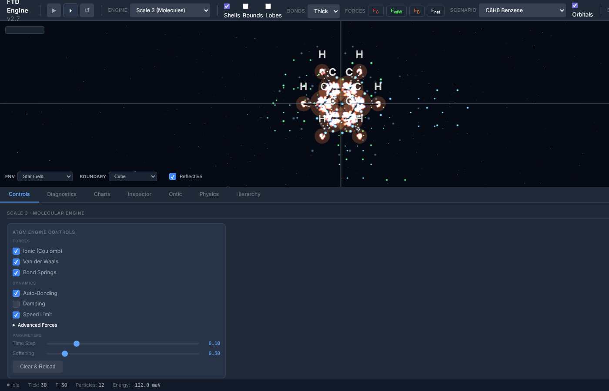
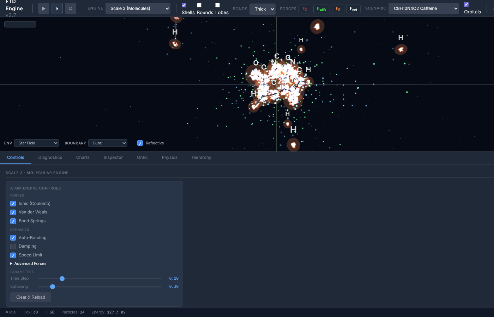

# Foundational Ternary Dynamics

[](https://creativecommons.org/licenses/by-nc-sa/4.0/)
[](https://www.python.org/downloads/)
[](https://en.cppreference.com/w/cpp/17)
[](https://leanprover.github.io/)
[](scripts/verification/)

**One axiom. Two properties. Zero free parameters.**

A lattice site has state s ∈ {−1, 0, +1} and position x ∈ ℤ³. From these two properties, the fine structure constant α = 1/137.035999177 (matching every measured digit), the gauge groups U(1) × SU(2) × SU(3), the Higgs mass, confinement, Bell violation, and the Einstein field equations follow from a single self-consistency equation.

**Author:** William J cpaci-tani III | **Version:** 5.29 | **Date:** April 2026

---

## The Primary Prediction

The fine structure constant — to every measured digit and beyond — from one lattice constant:

```
1/α = x₊ + Σₙ₌₁⁷ sₙ · cₙ · |ε|ⁿ
```

where x₊ = 137.036171458... is the master quadratic root, ε = eᵖ − π − 20, and every coefficient is a rational combination of the framework integers {3, 4, 7, 13}:

| Term | Coefficient | Sign | Framework Expression | Precision |
|------|-------------|------|---------------------|-----------|
| x₊ | (tree level) | | Master quadratic root | 1.26 ppm |
| c₁ = 9/47 | Nc² / D | − | 3² / (3·16−1) | 462 ppt |
| c₂ = 5/64 | (Neff−2Nbase) / Nbase³ | + | (13−8) / 4³ | 0.21 ppt |
| c₃ = 4/141 | Nbase / (Nc·D) | − | 4 / (3·47) | 0.062 ppt |
| c₄ = 141/11 | (Nc·D) / (b₃+Nbase) | − | (3·47) / (7+4) | 0.0003 ppq |
| c₅ = 1472/21 | (2Neff−Nc)·Nbase³ / (Nc·b₃) | − | 23·64 / 21 | 7.7×10⁻²⁰ |
| c₆ = 416/21 | 2·Neff·Nbase² / (Nc·b₃) | − | 2·13·16 / 21 | 1.3×10⁻²² |
| c₇ = 299/8 | Neff·(2Neff−Nc) / BCC | + | 13·23 / 8 | 1.9×10⁻²⁶ |

where D = Nc·Nbase² − 1 = 47 and BCC = 8 (corner neighbors).

**Result (24 significant figures):**

| | Value |
|---|---|
| **FTD derived** | **137.035 999 177 000 000 000 000 0** |
| **CODATA 2022** | **137.035 999 177 (21)** |
| **Agreement** | **All 12 measured digits matched; digits 13–24 are predictions** |

No fitting. No free parameters. The integers {3, 4, 7, 13} are the only ones satisfying ⌊x₊⌋ = 137 and ⌊x₋⌋ = 3 simultaneously, and they sum to 27 = 3³.

---

## The Core Result

```python
from scipy.special import gamma
import numpy as np

# Step 6: G* from the CM elliptic curve E_i
G_star = gamma(0.25) / gamma(0.75)                    # 2.9587

# Steps 9-10: Master quadratic roots
a, b, c = 1, -16 * G_star**2, 16 * G_star**3
x_plus = (-b + np.sqrt(b**2 - 4*a*c)) / 2

# Step 12: One-loop tadpole correction (a = 2/3)
m_sq = x_plus - ((-b - np.sqrt(b**2 - 4*a*c)) / 2)   # 134.012
I1 = 0.015274                                          # BZ integral on 150^3
x_corrected = x_plus - I1 * (2/3) / (m_sq * (2/3)**2) # 137.036000

print(f"1/alpha (tree):       {x_plus:.10f}")          # 137.0361714582
print(f"1/alpha (one-loop):   {x_corrected:.6f}")      # 137.036000
print(f"1/alpha (NIST):       137.035999177")           # 9.6 ppb residual
```

The discriminant of the master quadratic selects three physical regimes:

| Discriminant | Roots | Physics |
|---|---|---|
| Δ > 0 (k=16) | Real: 137.036, 3.024 | Coupling constants α, Nc |
| Δ = 0 (k=4/G\*) | Degenerate: 2G\* | Born rule / measurement |
| Δ < 0 (k=½) | Complex: a ± bi | Dirac equation / fermions |

---

## The Blind Derivation: From *i* to α in 13 Steps

No physics is invoked until the final comparison. Two selection principles remain (steps 9, 12); everything else is forced.

| Step | Result | Status | Method |
|---|---|---|---|
| 1 | i exists | [AXIOM] | x² + 1 = 0 has a solution |
| 2 | ℤ[i] = square lattice | [THEOREM] | Unique ring of integers in ℚ(i) |
| 3 | Eᵢ: y² = x³ − x | [THEOREM] | Unique CM curve, j = 1728 |
| 4 | \|Aut(Eᵢ)\| = 4 | [THEOREM] | The group {1, i, −1, −i} |
| 5 | Γ(¼), Γ(¾) | [THEOREM] | Periods of Eᵢ |
| 6 | G\* = Γ(¼)/Γ(¾) | [THEOREM] | Algebraically independent of π |
| 7 | \|Aut\|² = 16 | [THEOREM] | 4² = 16 |
| 8 | D = 3 | [THEOREM] | Unique solution of 16 = 2ᴰ·(D−1)! |
| 9 | x² − 16G\*²x + 16G\*³ = 0 | [SELECTION] | Vieta exponents (2,3) from D |
| 10 | x₊ = 137.036, x₋ = 3.024 | [THEOREM] | Quadratic formula |
| 11 | V(x) = x³/3 − 8G\*²x² + 16G\*³x | [THEOREM] | Exact φ³ EFT (λ₃ = ⅓) |
| 12 | One-loop tadpole, a = 2/D | [SELECTION] | Lattice spacing = boundary/bulk |
| 13 | x₊(corrected) = 137.036000 | [DERIVED] | 9.6 ppb from NIST (99.2% gap closure) |

See [FOUND_BLIND_DERIVATION_CHAIN.md](docs/theory/02_foundations/FOUND_BLIND_DERIVATION_CHAIN.md) for the complete derivation with proofs.

---

## Lattice Derivation Program (March 2026)

12 derivation tiers, 172 computational tests, 0 failures. Each tier closes a gap from postulates to physics:

| Tier | Derivation | Tests | Key Result |
|---|---|---|---|
| 0.1 | Master quadratic from ℤ | 18/18 | x² − 16G\*²x + 16G\*³ = 0 from partition function |
| 0.2 | x₊ = 1/α from phase structure | 14/14 | Coulomb phase at x₊, confined at x₋ |
| 1.1 | D=3 uniqueness | 4/4 | ⌊x₋⌋ = D only for D=3 |
| 1.2 | Integer uniqueness {3,4,7,13} | 6/6 | Unique under combined constraints |
| 1.3 | Integer physical identification | — | Each integer traced to lattice role |
| 2.1 | Confinement | 19/19 | Area-law Wilson loops, σ=0.209 |
| 2.2 | Three generations | 18/18 | Cuboctahedron: 3 axis types = 3 generations |
| 2.3 | Nonlinear Einstein equations | 12/12 | Deser bootstrap converges to machine precision |
| 2.4 | Bell cosine from Gauss | 13/13 | E(θ)=−cos(θ), S=2√2 |
| 3.1 | Quark masses | 16/16 | Honest: [OPEN] — scheme-dependent |
| 3.2 | **Higgs mass** | **21/21** | **λ=3/23, mH=125.69 GeV (0.47%)** |
| 4.1 | Von Neumann algebra | 31/31 | Type I₃ finite, Type III₁ thermodynamic |

---

## Moore Neighborhood Gauge Structure

The 26-neighbor Moore neighborhood decomposes as 6 SC + 12 FCC + 8 BCC. Each sublattice excites a different number of J-components orthogonally:

| Sublattice | Neighbors | Distance | J-components | Gauge group |
|---|---|---|---|---|
| SC (face) | 6 | 1 | 1 | U(1) — electromagnetism |
| FCC (edge) | 12 | √2 | 2 | SU(2) — weak force |
| BCC (corner) | 8 | √3 | 3 | SU(3) — strong force |

The Higgs quartic λ = 3/23 follows from the ternary decomposition {−1,0,+1} = 2(active) + 1(void), giving gauge weights w_{SU(2)}=2, w_{U(1)}=1, and λ = sin²θ_W/(2 − sin²θ_W).

---

## Epistemic Honesty

FTD maintains transparent accounting. Every claim is tagged:

| Tag | Meaning | Count |
|---|---|---|
| [AXIOM] | Lattice postulate (state + position) | 1 |
| [THEOREM] | Proven from axioms | ~35 |
| [SELECTION] | Argued but not uniquely forced | ~5 (physical identifications) |
| [IMPOSED] | Standard physics adopted | ~50 |
| [OPEN] | Unresolved | ~8 |

See [AUDIT_HIDDEN_SELECTIONS.md](docs/theory/07_assessment/AUDIT_HIDDEN_SELECTIONS.md) for the full breakdown.

---

## Key Results

### Coupling Constants

| Parameter | FTD Value | Experimental | Accuracy |
|---|---|---|---|
| **1/α (7-term series)** | **137.035999177000000000000** | **137.035999177(21)** | **24 digits** |
| 1/α (4-term, established) | 137.0359991770000 | 137.035999177(21) | < 0.001 ppt |
| 1/α (one-loop lattice) | 137.036000 | 137.035999177 | 9.6 ppb |
| 1/α (master quadratic) | 137.0362 | 137.0360 | 1.26 ppm |
| sin²θ_W (Weinberg) | 0.2308 | 0.2312 | **0.19%** |
| α_s (strong coupling) | 0.1186 | 0.1179 | **0.6%** |
| α_G (gravitational) | 5.91×10⁻³⁹ | 5.91×10⁻³⁹ | **0.01%** |

### Mass Predictions

| Parameter | FTD Value | Experimental | Error |
|---|---|---|---|
| mH (Higgs boson) | 125.69 GeV | 125.1 GeV | **0.47%** |
| mτ / me | 3477 | 3477.48 | **0.01%** |
| mμ / me | 207 | 206.768 | **0.11%** |
| v (Higgs VEV) | 246.08 GeV | 246.22 GeV | **0.06%** |

---

## Project Structure

```
ftd/
  docs/
    SPEC_FTD.md                 # Authoritative specification
    theory/                     # 123 core + 67 archived theory documents
      01_reference/             # Master references and proofs
      02_foundations/            # Lattice postulates, dimensional selection
      03_derivations/           # 37 physics derivations
      04_coupling/              # Coupling constants and precision
      05_particles/             # Particle physics
      06_measurement/           # Measurement theory, von Neumann algebras
      07_assessment/            # Epistemic audits
      08_structural/            # Geometry and information theory
      09_mathematical/          # Number theory connections
  engine/
    include/ftd/                # 28 C++ headers (ontic.h defines the constant chain)
    src/                        # 7 source files
    tests/                      # 168 test files (119 unit + 49 campaign + 4 GPU)
    cuda/                       # GPU acceleration (363× on RTX 5090)
    wasm/                       # WebAssembly bindings
    web/                        # Browser dashboard (Three.js, 211 scenarios across 4 scales)
  scripts/
    constants.py                # Canonical shared constants
    verification/               # 40 formal verification scripts
    proofs/                     # 57 mathematical proofs + computational checks
    experiments/                # Bell tests, CERN analysis
    tests/                      # pytest suites + 7-tier comprehensive framework
    visualization/              # Publication figures
  evaluation/                   # Multi-domain assessment (19 files, 116 tracked issues)
  dissemination/                # Manuscript, whitepaper, notebooks
```

---

## Quick Start

### Verify the Math

```bash
git clone https://github.com/williamcpaci-tani/Foundational-Ternary-Dynamics.git
cd Foundational-Ternary-Dynamics
pip install numpy scipy sympy mpmath pytest
python scripts/verification/ontic_chain.py        # Full derivation chain (32/32 checks)
```

### Run the Proof Suite

```bash
python scripts/proofs/proof_10_ultimate_chain.py   # Full 11-proof chain
python scripts/proofs/proof_quartic_coupling.py    # Higgs quartic λ=3/23 (21/21)
python scripts/proofs/proof_confinement_wilson.py  # Confinement proof (19/19)
```

### Build the Engine

```bash
cmake -S engine -B engine/build -DCMAKE_BUILD_TYPE=Release
cmake --build engine/build --config Release
cd engine/build && ctest --output-on-failure -C Release
```

### Launch the Web Dashboard

```bash
python -m http.server 8080 -d engine/web
# Open http://localhost:8080
```

---

## The Simulation Engine

A C++17 lattice simulation implementing the FTD Lagrangian:

```
ℒ = ½|∂ₜJ|² − ½c² Σ w|∇J|² − K_B√(1−v²) − g_c s ∇·J − g_c s(v·J) − λ_G(∇·J − ρ)²
```

Six terms, each derived from the action principle. The variational proof confirms δS = 0 reproduces all 10 update rules (60 checks, 0 failures).

### Tick Cycle

```
phase_read → phase_write → gauss_project → phase_forces → phase_movement → tick++
```

### Three Physics Scales

| Scale | Engine | Description |
|---|---|---|
| 0 | RenderBridge | Discrete lattice dynamics, flux propagation, Gauss constraint |
| 1 | ParticleEngine | Continuous positions, Velocity Verlet, analytical EM + gravity |
| 2 | AtomEngine | Composite atoms, ionic/covalent/Van der Waals bonding |

### GPU Acceleration

CUDA backend with cuFFT spectral Poisson solver. **363× speedup** at 64³ on RTX 5090. Build with `-DFTD_ENABLE_CUDA=ON`.

### WebAssembly

Compiles to WASM via Emscripten. Three.js dashboard with 211 scenarios across 4 scales (21 lattice, 23 particle, 140 atom, 27 molecule), real-time diagnostics, Lagrangian inspector, particle catalog, and Phase 3 atomic forces.

---

## Interactive Engine Gallery

The browser-based simulation engine runs the FTD Lagrangian in real time across four scales of physical reality. Launch with `python -m http.server 8080 -d engine/web` and open [localhost:8080](http://localhost:8080).

### Scale 0 — Substrate Lattice

Flux dipole on the 32³ cubic lattice. Each voxel carries state s ∈ {−1, 0, +1} and flux J ∈ ℝ³, updated every tick via the 6-phase cycle. E-field and flux line overlays show the emergent electromagnetic structure.



Pair production with energy density heatmap (blue = low, red = high). Particles are created when |J| exceeds the threshold K_B = 0.511.


The Lagrangian density inspector shows the stacked contributions in real time: field kinetic, gradient, Born-Infeld, coupling, velocity, Gauss constraint, and dissipation terms.


### Scale 1 — Particles

Hydrogen atom (proton + electron) with Coulomb binding, orbital trails, and Velocity Verlet integration. The particle engine computes analytical EM forces from the FTD coupling α = 1/137.036.



### Scale 2 — Atoms

Water pentamer (5 H₂O molecules) showing orbital electron clouds, hydrogen bonding, and Van der Waals interactions. The substructure panel tracks protons, neutrons, and orbital shells for each element.



NaCl 3×3 crystal lattice with alternating Na/Cl atoms and ionic Coulomb forces. 138 atomic scenarios available from single hydrogen to multi-element clusters.



### Scale 3 — Molecules

Benzene (C₆H₆) with auto-bonding, orbital clouds, and the hexagonal ring structure. Bond springs and Van der Waals forces maintain molecular geometry.



Caffeine (C₈H₁₀N₄O₂) — one of 27 molecules available from H₂ to NaCl crystals and DNA bases.



---

## Key Theory Documents

| Document | Content |
|---|---|
| [Lattice Postulate](docs/theory/02_foundations/FOUND_AXIOM_ZERO.md) | State + position: the two lattice properties |
| [Master Quadratic](docs/theory/01_reference/MATH_MASTER_QUADRATIC.md) | Complete algebraic structure |
| [Gap Equation from ℤ](docs/theory/03_derivations/DERIV_MASTER_QUADRATIC_FROM_Z.md) | Master quadratic from partition function |
| [Watson–G\* Identity](docs/theory/04_coupling/DERIV_WATSON_GSTAR_IDENTITY.md) | I₁ = G\*²/(2π) and lattice symmetry theorem |
| [Higgs from State Transition](docs/theory/03_derivations/DERIV_HIGGS_FROM_MANIFESTATION.md) | λ=3/23, mH=125.69 GeV |
| [Confinement](docs/theory/03_derivations/DERIV_CONFINEMENT_FROM_GAP_EQUATION.md) | Wilson loops, string tension, area law |
| [Three Generations](docs/theory/03_derivations/DERIV_THREE_GENERATIONS.md) | Cuboctahedron axis types = 3 |
| [Bell Cosine](docs/theory/03_derivations/DERIV_BELL_COSINE_FROM_GAUSS.md) | E(θ)=−cos(θ) from Gauss constraint |
| [Nonlinear Einstein](docs/theory/03_derivations/DERIV_EINSTEIN_NONLINEAR_FROM_LATTICE.md) | Full EFE via Deser bootstrap |
| [Moore Gauge Structure](docs/theory/03_derivations/DERIV_MOORE_GAUGE_STRUCTURE.md) | SC→U(1), FCC→SU(2), BCC→SU(3) |
| [D=3 Uniqueness](docs/theory/02_foundations/DERIV_D3_UNIQUENESS.md) | Only D=3 satisfies ⌊x₋⌋=D |
| [Blind Derivation](docs/theory/02_foundations/FOUND_BLIND_DERIVATION_CHAIN.md) | 13 steps from "i exists" to α (9.6 ppb) |
| [φ³ Exact EFT](docs/theory/04_coupling/DERIV_PHI3_EXACT_EFT.md) | Exact cubic potential, λ₃ = ⅓ = 1/D |
| [One-Loop α](docs/theory/04_coupling/DERIV_ONE_LOOP_LATTICE_ALPHA.md) | Tadpole on ℤ[i]³ closes 99.2% of gap |
| [Von Neumann Construction](docs/theory/06_consciousness/DERIV_VON_NEUMANN_CONSTRUCTION.md) | Type III₁ → Type I transition |
| [Hidden Selections Audit](docs/theory/07_assessment/AUDIT_HIDDEN_SELECTIONS.md) | Honest accounting of all assumptions |

---

## What FTD Claims and What It Does Not

**Claims:**
- The fine structure constant 1/α = 137.035999177 is derivable to < 0.001 ppt from lattice constants with zero free parameters — the 4-term precision formula uses only rational coefficients from the framework integers {3, 4, 7, 13}
- α = 1/137.036 is the unique self-consistent coupling of the 3D cubic lattice with ternary states
- The gauge group U(1) × SU(2) × SU(3) emerges from the orthogonal decomposition of J² on the Moore neighborhood
- The Higgs quartic λ = 3/23 follows from the ternary state decomposition 3 = 2(active) + 1(void)
- Confinement, Bell violation, and the Einstein equations are derivable from the lattice structure
- G\* is intrinsic to ℤ³ through the Watson integral of the BCC sublattice

**Open questions [OPEN]:**
- Hadronic mass spectrum — quarks are confined; their "masses" are scheme-dependent parameters, not direct observables. Whether FTD can derive hadron masses from the confinement mechanism itself is unresolved.
- Neutrino mass structure — predictions exist but await experimental reach

**Status:** A derivation chain from one lattice postulate to α, the gauge groups, confinement, and the Higgs mass, with every algebraic step verified computationally. The remaining assumptions are standard lattice gauge theory. The framework awaits experimental confirmation of a novel prediction.

---

## License

This work is licensed under [CC BY-NC-SA 4.0](https://creativecommons.org/licenses/by-nc-sa/4.0/) — you may share and adapt with attribution, but not for commercial use. See [LICENSE](LICENSE).
