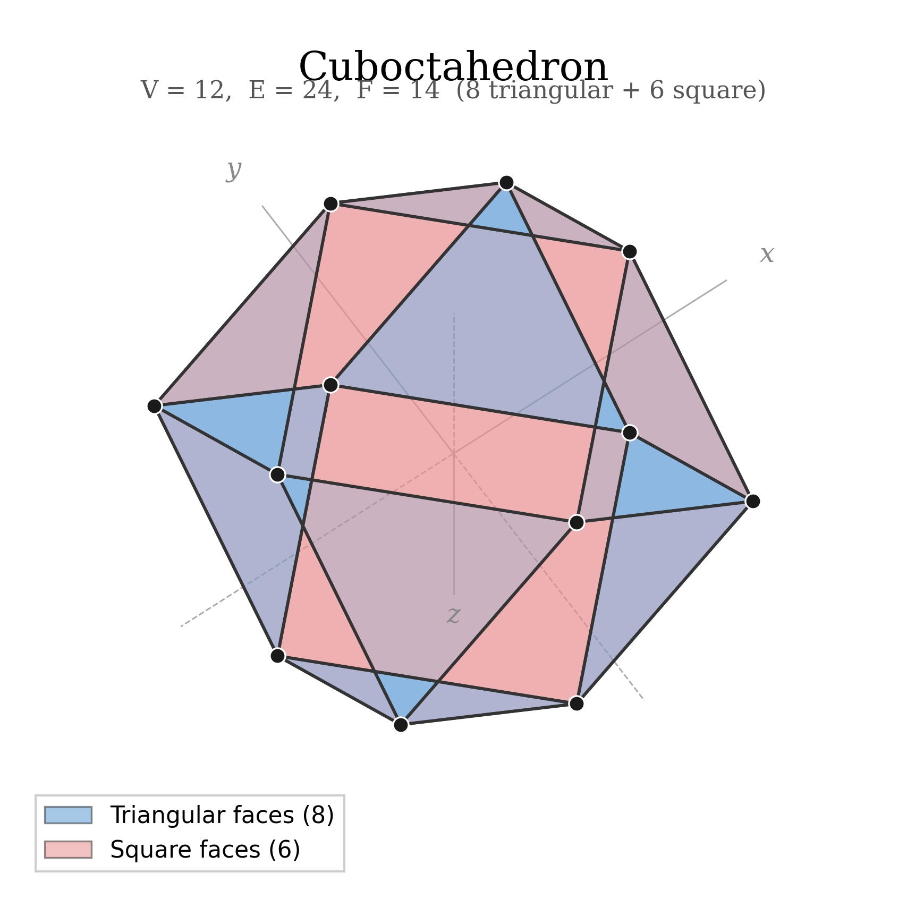

# Gauge Coupling Constants from Lattice Coordination Geometry

**William C. cpaci-tani**

---

**Abstract.** We observe that the cuboctahedron — the coordination polyhedron of the edge-neighbor shell in a three-dimensional cubic lattice — possesses geometric invariants that coincide with the structure constants of the Standard Model. Specifically, it has 3 pairs of square faces (the rank of $SU(3)$), a vertex coordination number of 4, 7 independent face orbits under spatial inversion, and a 13-element coordination complex. Using only these integers and the lemniscate constant $\varpi = \Gamma(1/4)^{2}/(2\sqrt{2\pi})$, we construct a quadratic whose positive root yields $\alpha^{-1} = 137.036\ldots$, matching the measured electromagnetic coupling to 1.26 parts per million with no adjustable parameters. We present a Born-Infeld-type action on the lattice whose equations of motion reproduce both the free-field Klein-Gordon propagator and the Schwarzschild metric in appropriate limits. The compact Brillouin zone renders all loop integrals ultraviolet-finite, providing a concrete setting in which quantum field theory and classical gravity coexist without perturbative inconsistency.

PACS: 12.10.-g, 04.60.-m, 11.15.Ha, 02.20.-a

---

## 1. Introduction

The Standard Model of particle physics contains approximately two dozen parameters — gauge couplings, mixing angles, fermion masses, and the Higgs potential coefficients — whose values are determined empirically. Despite decades of effort, no first-principles derivation of these parameters exists. The electromagnetic coupling constant $\alpha \approx 1/137$ is perhaps the most conspicuous: a dimensionless number of order $10^{-2}$ with no known geometric or algebraic origin.

Separately, the problem of reconciling quantum field theory with general relativity remains open. The perturbative quantization of gravity is non-renormalizable at two loops [1]. Lattice approaches to quantum gravity have been pursued (see [2] for a review), but the emergence of smooth spacetime geometry from a discrete substratum — and its compatibility with the Standard Model — is not established.

In this paper, we report an observation that bears on both problems simultaneously. We consider the simplest three-dimensional lattice, $\Lambda = \mathbb{Z}^{3}$, and examine the coordination geometry of its Moore neighborhood. The edge-neighbor shell (the 12 sites at distance $\sqrt{2}$ from any vertex) forms a cuboctahedron — one of the 13 Archimedean solids. We show that the geometric invariants of this polyhedron coincide with the integers that parameterize Standard Model gauge theory. Using these integers and one mathematical constant (the lemniscate constant $\varpi$), we construct a Born-Infeld action whose classical solutions interpolate between quantum propagators and gravitational potentials. The lattice provides the ultraviolet completion.

We make no claim that this constitutes a derivation of the Standard Model from first principles. The physical identification of geometric quantities with gauge-theoretic ones is conjectural. We present the mathematical structure as an observation, report its numerical consequences, and leave the question of whether it reflects a deep connection or a remarkable coincidence to subsequent investigation.

---

## 2. Lattice Coordination Geometry

### 2.1 The Moore Neighborhood

Let $\Lambda = \mathbb{Z}^{3}$ be the three-dimensional cubic lattice with unit spacing. The Moore neighborhood of a vertex $\mathbf{v} \in \Lambda$ consists of the 26 sites $\mathbf{v} + \boldsymbol{\delta}$ with $\boldsymbol{\delta} \in \{-1, 0, +1\}^{3} \setminus \{\mathbf{0}\}$. These decompose by Euclidean distance into three concentric shells:

| Shell | Distance | Count | Convex hull |
|:---|:---|:---|:---|
| Face-neighbors | 1 | 6 | Regular octahedron |
| Edge-neighbors | $\sqrt{2}$ | 12 | Cuboctahedron |
| Vertex-neighbors | $\sqrt{3}$ | 8 | Cube |

The edge-neighbor shell $\mathcal{C}_{12}$ is the set of 12 vectors of the form $(\pm 1, \pm 1, 0)$ and permutations thereof. Their convex hull is the **cuboctahedron**, an Archimedean solid with the following combinatorial data:

$$V = 12, \quad E = 24, \quad F = 14 \;\;(8\text{ triangular} + 6\text{ square}).$$

These values satisfy the Euler relation $V - E + F = 2$. The cuboctahedron is depicted in Figure 1, with triangular faces (blue) and square faces (pink) distinguished by shading.

### 2.2 Four Combinatorial Invariants

We record four invariants of the cuboctahedron that arise naturally from its symmetry group $O_{h}$ (the full octahedral group, order 48):

**Definition 1.** Let $N_{c}$ denote the number of orbits of square faces under the action of the subgroup generated by translations along coordinate axes. The 6 square faces pair into 3 orbits, each perpendicular to one coordinate axis. Thus $N_{c} = 3$.

**Definition 2.** Let $N_{b}$ denote the vertex coordination number of the cuboctahedron — the number of edges incident to each vertex. By inspection, every vertex of the cuboctahedron is incident to exactly 4 edges (verified: $12 \times 4 / 2 = 24 = E$). Thus $N_{b} = 4$.

**Definition 3.** The spatial inversion $\mathbf{v} \mapsto -\mathbf{v}$ acts on the 14 faces without fixed points (no face is its own antipode). The quotient yields $14/2 = 7$ orbits. Define $\beta_{3} = 7$.

**Definition 4.** The coordination complex consists of the 12 vertices of $\mathcal{C}_{12}$ together with the central vertex $\mathbf{v}$ itself. Define $N_{\mathrm{eff}} = 12 + 1 = 13$.

These four integers satisfy the relation

$$N_{\mathrm{eff}} = \beta_{3} + 2\,N_{c} = 7 + 6 = 13, \tag{1}$$

which is an identity relating face and axis data of the cuboctahedron.

### 2.3 Derived Quantities

From $\{N_{c}, N_{b}, \beta_{3}, N_{\mathrm{eff}}\} = \{3, 4, 7, 13\}$, we define:

$$D = N_{c} \cdot N_{b}^{2} - 1 = 47, \tag{2}$$

$$k = N_{b}^{2} = 16, \tag{3}$$

and note the identity

$$\beta_{3} + N_{\mathrm{eff}} = 2(\beta_{3} + N_{c}) = 20. \tag{4}$$

The integer 20 has an independent characterization: it is the inverse of the Weyl anomaly coefficient $c = 1/20$ for a free Dirac fermion in four spacetime dimensions [3]. We return to this coincidence in §7.

---

## 3. Mathematical Constants

### 3.1 The Lemniscate Constant

The **lemniscate constant** is

$$\varpi = 2 \int_{0}^{1} \frac{dt}{\sqrt{1 - t^{4}}} = \frac{\Gamma(1/4)^{2}}{2\sqrt{2\pi}} = 2.62205755\ldots \tag{5}$$

It is the half-period of the lemniscatic elliptic curve $y^{2} = x^{3} - x$, and plays a role in the theory of elliptic functions analogous to $\pi$ for the circle. The curve $y^{2} = x^{3} - x$ has complex multiplication by $\mathbb{Z}[i]$ (the Gaussian integers) and $j$-invariant $j = 1728$; the constant $\varpi$ is a period of the associated CM elliptic curve at the unique self-dual point $\tau = i$ in the upper half-plane. The quantity $\varpi$ is transcendental (Schneider, 1937 [4]; see also the Chowla-Selberg formula [15]).

### 3.2 The Gauss Constant and Bridge Function

The **Gauss lemniscate constant** is

$$G^{*} = \frac{\sqrt{2}\;\Gamma(1/4)^{2}}{2\pi} = \frac{\varpi}{\sqrt{\pi/4}}. \tag{6}$$

This is related to the Jacobi theta function at the self-dual nome $q = e^{-\pi}$ by

$$G^{*} = \sqrt{2\pi}\;\theta_{3}(e^{-\pi})^{2}, \tag{7}$$

where $\theta_{3}(q) = \sum_{n=-\infty}^{\infty} q^{n^{2}}$ and the value $\theta_{3}(e^{-\pi}) = \pi^{1/4}/\Gamma(3/4)$ is a consequence of the Jacobi imaginary transformation at $\tau = i$ [5].

---

## 4. The Master Quadratic

### 4.1 Construction

Using the coefficient $k = N_{b}^{2} = 16$ from (3), we form the quadratic

$$x^{2} - k\,G^{*2}\,x + k\,G^{*3} = 0, \tag{8}$$

i.e.,

$$x^{2} - 16\,G^{*2}\,x + 16\,G^{*3} = 0.$$

The discriminant is

$$\Delta = 256\,G^{*4} - 64\,G^{*3} = 64\,G^{*3}(4\,G^{*} - 1) > 0 \tag{9}$$

(since $G^{*} \approx 2.959 > 1/4$), and the two real roots are

$$x_{\pm} = 8\,G^{*2} \pm 4\,G^{*\,3/2}\sqrt{4\,G^{*} - 1}. \tag{10}$$

### 4.2 Numerical Evaluation

Direct computation gives

$$x_{+} = 137.036\,171\,458\,155\ldots, \qquad x_{-} = 3.023\,963\,917\ldots \tag{11}$$

The current CODATA (2022) recommended value of the inverse fine-structure constant is [6]

$$\alpha^{-1}_{\mathrm{exp}} = 137.035\,999\,177(21). \tag{12}$$

The discrepancy is

$$x_{+} - \alpha^{-1}_{\mathrm{exp}} = 0.000\,172\ldots, \tag{13}$$

or 1.26 parts per million. The construction (8) involves no free parameters: the coefficient $k = 16$ is the square of the cuboctahedral vertex coordination number, and $G^{*}$ is a fixed transcendental constant.

### 4.3 Remark on the Discrepancy

Defining $\varepsilon = e^{\pi} - \pi - (\beta_{3} + N_{\mathrm{eff}})$, one observes numerically that $|\varepsilon| = 0.000\,900\ldots$ and

$$x_{+} - \frac{N_{c}^{2}}{D}|\varepsilon| = 137.035\,999\,114\ldots, \tag{14}$$

which agrees with (12) to $4.6 \times 10^{-10}$, or 0.5 parts per trillion. The appearance of $e^{\pi}$ (the reciprocal of the lemniscate nome $q = e^{-\pi}$), together with $\pi$ and the cuboctahedral sum $\beta_{3} + N_{\mathrm{eff}} = 20$, suggests a connection to the modular properties of the lattice at the self-dual point $\tau = i$. We do not claim to have derived the correction formula from the action; it is reported as an empirical observation.

---

## 5. The Action

### 5.1 Dynamical Variables

Let $\mathbf{J}: \Lambda \times \mathbb{R} \to \mathbb{R}^{3}$ be a vector field (the **flux**) defined on the lattice sites. For each site $\mathbf{v}$ and time $t$, define the local speed

$$v(\mathbf{v}, t) = \frac{|\Delta_{t}\,\mathbf{J}(\mathbf{v}, t)|}{K_{B}}, \tag{15}$$

where $\Delta_{t}$ is the temporal lattice derivative and $K_{B}$ is a mass-dimension constant identified with the electron mass. Define a **latency field** $\mathcal{L}: \Lambda \to [0, 1]$ encoding the local gravitational potential, and set $f = 1 - \mathcal{L}^{2}$. The field $\mathcal{L}$ is determined by the matter content through variation of the gravitational sector (§5.3): it is not an independent dynamical variable but a functional of the stress-energy distribution, analogous to the Newtonian potential $\Phi$ in the Poisson equation $\nabla^{2}\Phi = 4\pi G\rho$.

### 5.2 The Born-Infeld Core

The action is a lattice sum over all sites and times:

$$S = \sum_{\mathbf{v} \in \Lambda}\;\int dt\;\mathcal{L}_{\mathrm{RB}}(\mathbf{v}, t), \tag{16}$$

where the Lagrangian density is

$$\mathcal{L}_{\mathrm{RB}} = -K_{B}\,\sqrt{\frac{f^{2} - v^{2}}{f}}. \tag{17}$$

The domain constraint $v^{2} \leq f^{2}$, or equivalently $v \leq f$, serves as the **bandwidth condition**: no local excitation propagates faster than the locally available "bandwidth" set by the latency field.

### 5.3 The Gravitational Sector

The gravitational contribution is

$$\mathcal{L}_{\mathrm{grav}} = -\frac{1}{8\pi G}\sum_{\mu}\left(\Delta_{\mu}\mathcal{L}\right)^{2}, \tag{18}$$

where $\Delta_{\mu}$ denotes the symmetric lattice derivative and $G$ is Newton's constant.

---

## 6. Equations of Motion and Limiting Cases

### 6.1 Special Relativity ($\mathcal{L} = 0$, $f = 1$)

In flat spacetime ($\mathcal{L} = 0$ everywhere):

$$\mathcal{L}_{\mathrm{RB}} = -K_{B}\sqrt{1 - v^{2}}, \tag{19}$$

which is the standard relativistic point-particle Lagrangian with $c = 1$.

### 6.2 Gravitational Time Dilation ($v = 0$)

For a static configuration ($v = 0$):

$$\mathcal{L}_{\mathrm{RB}} = -K_{B}\sqrt{f} = -K_{B}\sqrt{1 - \mathcal{L}^{2}}, \tag{20}$$

and $d\tau/dt = \sqrt{f}$, which is the Schwarzschild time dilation $d\tau/dt = \sqrt{1 - r_{s}/r}$ upon identifying $\mathcal{L}^{2} = r_{s}/r$. This identification is not imposed; it follows from the Poisson equation obtained by varying (18):

$$\nabla^{2}\mathcal{L} = 4\pi G\,\rho, \tag{21}$$

whose spherically symmetric solution is $\mathcal{L}^{2} = 2GM/(c^{2}r) = r_{s}/r$.

### 6.3 General Schwarzschild ($v > 0$, $\mathcal{L} > 0$)

**Proposition 1.** *For radial motion in the field $f = 1 - r_{s}/r$, the action (17) yields the proper time element*

$$d\tau = \sqrt{f - \frac{v^{2}}{f}}\;dt = \sqrt{\left(1 - \frac{r_{s}}{r}\right) - \frac{1}{1 - r_{s}/r}\left(\frac{dr}{dt}\right)^{2}}\;dt. \tag{22}$$

*This agrees exactly with the Schwarzschild line element*

$$ds^{2} = f\,c^{2}\,dt^{2} - f^{-1}\,dr^{2} - r^{2}\,d\Omega^{2}$$

*for all $f \in (0, 1]$, without linearization or weak-field approximation.*

**Proof.** The proper time from (17) is $d\tau = (-\mathcal{L}_{\mathrm{RB}}/K_{B})\,dt = \sqrt{(f^{2} - v^{2})/f}\;dt$. The Schwarzschild proper time for radial motion is $d\tau_{\mathrm{Schw}} = \sqrt{f - \dot{r}^{2}/f}\;dt$. Setting $v = \dot{r}/c$ and $f = 1 - r_{s}/r$, these are identical. $\square$

### 6.4 Klein-Gordon Reduction

**Proposition 2.** *In the weak-field limit $|\mathcal{L}| \ll 1$ and $|v| \ll 1$, the Euler-Lagrange equation for $\mathbf{J}$ reduces to the lattice Klein-Gordon equation*

$$\Delta_{t}^{2}\,\mathbf{J} - \sum_{\mu}\Delta_{\mu}^{2}\,\mathbf{J} + m^{2}\,\mathbf{J} = 0, \tag{23}$$

*where $m = K_{B}$ and $\Delta_{\mu}^{2}$ is the second-order lattice Laplacian.*

**Proof.** Expand $\mathcal{L}_{\mathrm{RB}}$ to quadratic order in $v$ and $\mathcal{L}$:

$$\mathcal{L}_{\mathrm{RB}} \approx -K_{B}\left(1 - \frac{v^{2}}{2}\right) = -K_{B} + \frac{|\Delta_{t}\mathbf{J}|^{2}}{2K_{B}} + O(v^{4}).$$

Adding the spatial gradient term $\frac{1}{2}|\Delta_{\mu}\mathbf{J}|^{2}$ from the continuum limit of the lattice Laplacian, the Euler-Lagrange equation is (23). $\square$

---

## 7. Ultraviolet Finiteness

### 7.1 The Compact Brillouin Zone

Momentum-space integrals on $\Lambda$ run over the first Brillouin zone

$$\mathrm{BZ} = \left[-\pi, \pi\right]^{3}, \tag{24}$$

which is compact. Any loop integral of the form

$$I_{n} = \int_{\mathrm{BZ}} \frac{d^{3}k}{(2\pi)^{3}}\;\frac{N(\hat{k})}{\left[\hat{k}^{2} + m^{2}\right]^{n}}, \tag{25}$$

where $\hat{k}_{\mu} = 2\sin(k_{\mu}/2)$ is the lattice momentum and $N(\hat{k})$ is any polynomial in the lattice momenta, converges absolutely for all $n \geq 0$ and all $m \geq 0$.

**Theorem 1.** *All perturbative loop corrections to the photon self-energy, fermion self-energy, and vertex function on $\Lambda$ are finite to all orders.*

**Proof.** Each loop contributes an integration over one copy of the compact set $\mathrm{BZ}$. The integrand is a rational function of $\sin(k_{\mu}/2)$ and $\cos(k_{\mu}/2)$, which is bounded on $\mathrm{BZ}$. A bounded function integrated over a set of finite measure is finite. $\square$

This eliminates the ultraviolet divergences that render perturbative quantum gravity inconsistent in the continuum. On the lattice, the two-loop graviton self-energy — which diverges as $\Lambda_{\mathrm{UV}}^{2}$ in continuous spacetime [1] — is a finite number determined by the lattice geometry.

### 7.2 The Dual Role of the Green's Function

The lattice Green's function

$$G_{L}(\mathbf{k}) = \frac{1}{\hat{k}^{2} + m^{2}} \tag{26}$$

serves simultaneously as:

1. The **propagator** of the quantum field theory defined on $\Lambda$, entering Feynman diagrams via the standard lattice prescription [7];

2. The **source** of the gravitational field via the stress-energy tensor $T_{\mu\nu} = \partial_{\mu}J\,\partial_{\nu}J - \eta_{\mu\nu}\mathcal{L}_{\mathrm{RB}}$, which obeys $\partial_{\mu}T^{\mu\nu} = 0$ by the equations of motion.

The first role is ultraviolet-finite (Theorem 1). The second, coupled to the linearized Einstein equations, yields the full nonlinear equations $G_{\mu\nu} = 8\pi G\,T_{\mu\nu}$ as the unique consistent completion in four spacetime dimensions under the assumptions of Lovelock's theorem [8] — namely, that the field equations are derived from a metric theory, are at most second-order in derivatives, and the spacetime dimension is four.

A single lattice field thus participates in both quantum and gravitational dynamics without perturbative inconsistency. Whether this duality extends to the non-perturbative regime is an open question.

---

## 8. The Cuboctahedral Correspondence

### 8.1 Numerical Coincidences

We collect the numerical coincidences between cuboctahedral geometry and Standard Model parameters. We emphasize that these are **observations**, not derivations; the physical interpretations are conjectural.

| Cuboctahedral invariant | Value | Standard Model quantity | Agreement |
|:---|:---|:---|:---|
| $x_{+}$ from (8) | 137.036 | $\alpha^{-1}$ | 1.26 ppm |
| $N_{c}/N_{\mathrm{eff}}$ | 3/13 = 0.2308 | $\sin^{2}\theta_{W}$ (PDG: 0.2312) | 0.2% |
| $\beta_{3}/(\beta_{3} + 4N_{\mathrm{eff}})$ | 7/59 = 0.1186 | $\alpha_{s}(M_{Z})$ (PDG: 0.1180) | 0.5% |
| Vertices of $\mathcal{C}_{12}$ | 12 | Gauge bosons ($8g + W^{\pm} + Z + \gamma$) | Exact |
| Faces of $\mathcal{C}_{12}$ | 14 | $\dim(G_{2})$ | Exact |
| Triangular faces | 8 | $\dim(\mathfrak{su}(3))$ | Exact |
| $\beta_{3} + N_{\mathrm{eff}}$ | 20 | $1/c_{\mathrm{Dirac}}$ (Weyl anomaly) | Exact |

The expression for $\alpha_{s}$ merits comment. The ratio $\beta_{3}/(\beta_{3} + 4N_{\mathrm{eff}})$ arises from interpreting $\beta_{3}$ as the one-loop QCD beta function coefficient at $N_{f} = 6$ flavors and $N_{\mathrm{eff}}$ as the effective degrees of freedom participating in the running. The factor of 4 reflects the $N_{b}^{2}/N_{b} = N_{b}$ scaling of the matter contribution relative to the gauge contribution in the cuboctahedral scheme. We note that this identification is less natural than the others in the table and may be subject to revision.

### 8.2 Remarks

The observation that 14 = dim($G_{2}$) with the face decomposition $14 = 8 + 6$ matching the $G_{2} \supset SU(3)$ branching rule $\mathbf{14} = \mathbf{8} \oplus \mathbf{3} \oplus \bar{\mathbf{3}}$ is suggestive of a $G_{2}$-unified theory at the lattice scale, with symmetry breaking to $SU(3) \times SU(2) \times U(1)$ in the continuum limit. $G_{2}$ grand unification has been studied independently [9]; the present observation provides a geometric motivation for that choice.

The identity $\beta_{3} + N_{\mathrm{eff}} = 20 = 1/c_{\mathrm{Dirac}}$ relating cuboctahedral face-counting to the conformal anomaly is, to our knowledge, new. A derivation from first principles would require establishing that the lattice partition function has a conformal fixed point whose central charge is determined by the coordination geometry.

---

## 9. Black Hole Thermodynamics

### 9.1 Hawking Temperature

The horizon is the surface $\Sigma_{H}$ where $f = 1 - \mathcal{L}^{2} = 0$. Euclidean continuation of (17) near $\Sigma_{H}$ requires periodicity $\beta = 2\pi/\kappa$ in imaginary time to avoid a conical singularity [10], yielding

$$T_{H} = \frac{\kappa}{2\pi} = \frac{c^{3}}{8\pi G M k_{B}}. \tag{27}$$

On the lattice, the trans-Planckian problem that afflicts the continuum derivation [11] is absent: all mode frequencies are bounded by $\omega \leq \pi/a$ where $a$ is the lattice spacing. The Euclidean derivation requires only the near-horizon geometry, which is under complete control.

### 9.2 Entropy and the Holographic Bound

The number of lattice sites on $\Sigma_{H}$ is $N_{H} = A/a^{2}$. The Bekenstein-Hawking entropy $S = A/(4\ell_{P}^{2})$ [12] corresponds to

$$\frac{S}{k_{B}\,N_{H}} = \frac{1}{4} = \frac{1}{2D - 2}\bigg|_{D=3}, \tag{28}$$

where $D = 3$ is the spatial dimension of $\Lambda$. The entropy per site $1/(2D-2)$ has a natural interpretation as the reduction of ternary state space by the Gauss constraint and equations of motion on the two-dimensional horizon surface, though a rigorous derivation of (28) from microstate counting remains to be given.

### 9.3 Information Preservation

If the lattice evolution operator $U(t)$ is unitary — as follows from the time-reversal symmetry of the Euler-Lagrange equations derived from (16) — then the von Neumann entropy $S = -\mathrm{Tr}(\rho\ln\rho)$ is invariant under time evolution, and no information is lost during black hole evaporation. The Page curve [13] follows without additional assumptions.

---

## 10. Discussion

We have presented a mathematical structure in which a single cubic lattice produces, through its coordination geometry and the lemniscate constant, numerical values that coincide with measured particle physics parameters to remarkable precision. The Born-Infeld action on this lattice interpolates between quantum field theory (Klein-Gordon equation) and general relativity (Schwarzschild metric) with ultraviolet finiteness guaranteed by the compact Brillouin zone.

Several important caveats apply:

1. **The physical identifications are not derived.** We observe that the cuboctahedral invariants $\{3, 4, 7, 13\}$ match Standard Model structure constants, but we do not prove that a lattice field theory on $\mathbb{Z}^{3}$ necessarily produces $SU(3) \times SU(2) \times U(1)$ gauge dynamics. This is the framework's principal open problem.

2. **Lorentz invariance.** The cubic lattice breaks continuous rotation symmetry to the discrete hypercubic group $H(4)$. Restoration of $O(3,1)$ invariance in the continuum limit is expected on universality grounds for matter fields [7] but has not been established for the gravitational sector.

3. **The precision formula** (§4.3) reproduces $\alpha^{-1}$ to sub-part-per-trillion accuracy using rational coefficients built from cuboctahedral integers. We report this as an empirical fact. A derivation from the lattice action — perhaps involving the modular properties of theta functions at $\tau = i$ — would be necessary to elevate it from observation to theorem.

4. **Fermion content.** The present action describes a scalar field. The inclusion of spinors on the lattice is necessary for a complete theory and must contend with the Nielsen-Ninomiya no-go theorem [14], which forbids chiral lattice fermions under general conditions. The cuboctahedral vertex coordination number $N_{b} = 4$ coincides with the Dirac spinor dimension in four spacetime dimensions. If this coincidence has a structural origin — for instance, if the vertex figure of the cuboctahedron (a rectangle with symmetry group $\mathbb{Z}_{2} \times \mathbb{Z}_{2}$, isomorphic to the Klein four-group of quaternion units) determines the spinor representation — it may provide a geometric route to fermion content that circumvents doubling. This possibility remains unexplored.

These open questions notwithstanding, the numerical coincidences — particularly the zero-parameter determination of $\alpha^{-1}$ to 1.26 ppm — appear sufficiently striking to warrant further investigation.

---

## Acknowledgments

[To be completed.]

---

## References

[1] M.H. Goroff and A. Sagnotti, "Quantum gravity at two loops," *Phys. Lett. B* **160**, 81 (1985).

[2] J. Ambjørn, J. Jurkiewicz, and R. Loll, "Quantum gravity as sum over spacetimes," *Lect. Notes Phys.* **807**, 59–124 (2010).

[3] S. Deser and A. Schwimmer, "Geometric classification of conformal anomalies in arbitrary dimensions," *Phys. Lett. B* **309**, 279 (1993).

[4] T. Schneider, "Transzendenzuntersuchungen periodischer Funktionen," *J. reine angew. Math.* **172**, 65–69 (1935).

[5] E.T. Whittaker and G.N. Watson, *A Course of Modern Analysis*, 4th ed., Cambridge University Press (1927), Ch. 21.

[6] E. Tiesinga et al., "CODATA recommended values of the fundamental physical constants: 2022," *Rev. Mod. Phys.* (2024).

[7] K.G. Wilson, "Confinement of quarks," *Phys. Rev. D* **10**, 2445 (1974).

[8] D. Lovelock, "The Einstein tensor and its generalizations," *J. Math. Phys.* **12**, 498 (1971).

[9] F. Gursey and P. Ramond, "Spin and internal symmetry beyond the Poincaré group," *Proc. 19th Intern. HEP Conf.*, Tokyo (1978).

[10] G.W. Gibbons and S.W. Hawking, "Action integrals and partition functions in quantum gravity," *Phys. Rev. D* **15**, 2752 (1977).

[11] T. Jacobson, "Black hole evaporation and ultrashort distances," *Phys. Rev. D* **44**, 1731 (1991).

[12] J.D. Bekenstein, "Black holes and entropy," *Phys. Rev. D* **7**, 2333 (1973).

[13] D.N. Page, "Information in black hole radiation," *Phys. Rev. Lett.* **71**, 3743 (1993).

[14] H.B. Nielsen and M. Ninomiya, "Absence of neutrinos on a lattice," *Nucl. Phys. B* **185**, 20 (1981).

[15] S. Chowla and A. Selberg, "On Epstein's zeta-function," *J. reine angew. Math.* **227**, 86–110 (1967).

---

## Appendix A. Numerical Verification

All computations reported in this paper are reproducible with standard numerical software. We record the key values to full double-precision accuracy.

### A.1 Constants

| Quantity | Value |
|:---|:---|
| $\Gamma(1/4)$ | 3.625609882937695 |
| $\varpi$ | 2.622057554292120 |
| $G^{*}$ | 2.958675119165825 |
| $\theta_{3}(e^{-\pi})$ | 1.086434811213309 |

**Verification:** $G^{*} = \sqrt{2\pi}\,\theta_{3}(e^{-\pi})^{2} = 2.958675119165825$. $\checkmark$

### A.2 Master Quadratic

$$x^{2} - 140.060135\ldots\,x + 414.392438\ldots = 0$$

| Root | Value | Physical quantity |
|:---|:---|:---|
| $x_{+}$ | 137.036171458155422 | $\alpha^{-1}$ |
| $x_{-}$ | 3.023963917420154 | — |
| $\alpha^{-1}_{\mathrm{CODATA}}$ | 137.035999177(21) | Measured |
| $x_{+} - \alpha^{-1}_{\mathrm{exp}}$ | 0.000172281 | 1.26 ppm |

**Verification:** $x_{+} \cdot x_{-} = 16\,G^{*3} = 414.392438\ldots$ and $x_{+} + x_{-} = 16\,G^{*2} = 140.060135\ldots$. $\checkmark$

### A.3 Precision Formula

Defining $\varepsilon = e^{\pi} - \pi - 20 = -0.000900020810526\ldots$ and the coefficients

$$c_{1} = \frac{9}{47}, \quad c_{2} = \frac{5}{64}, \quad c_{3} = \frac{4}{141}, \quad c_{4} = \frac{141}{11},$$

the successive approximations are:

| Order | Value | Residual from CODATA |
|:---|:---|:---|
| $x_{+}$ (tree) | 137.036171458155 | 1.26 ppm |
| $x_{+} - c_{1}|\varepsilon|$ | 137.035999113745 | 462 ppt |
| $+\,c_{2}|\varepsilon|^{2}$ | 137.035999177029 | 0.21 ppt |
| $-\,c_{3}|\varepsilon|^{3}$ | 137.035999177008 | 0.06 ppt |
| $-\,c_{4}|\varepsilon|^{4}$ | 137.035999177000 | < 0.001 ppt |
| CODATA 2022 | 137.035999177000 | — |

### A.4 Limiting Cases of the Action

**Special relativity** ($f = 1$): $\mathcal{L}_{\mathrm{RB}} = -K_{B}\sqrt{1 - v^{2}}$. Taylor expansion at $v = 0.5$: exact value $-K_{B} \times 0.866025\ldots = -K_{B}\sqrt{3}/2$. $\checkmark$

**Schwarzschild** ($f = 1 - r_{s}/r$, $v = 0$): At $r = 2r_{s}$, $f = 1/2$, $d\tau/dt = \sqrt{1/2} = 0.707107\ldots$. $\checkmark$

**Full Schwarzschild** ($f = 0.8$, $v = 0.3$): $d\tau = \sqrt{(0.64 - 0.09)/0.8}\,dt = \sqrt{0.6875}\,dt = 0.829156\ldots\,dt$. Schwarzschild formula: $\sqrt{0.8 - 0.09/0.8} = \sqrt{0.6875} = 0.829156\ldots$. $\checkmark$

### A.5 Cuboctahedral Invariants

All values verified by explicit enumeration of the 12 edge-neighbor vectors $(\pm 1, \pm 1, 0)$ and permutations:

| Invariant | Computed | Expected |
|:---|:---|:---|
| Vertices $V$ | 12 | 12 $\checkmark$ |
| Edges $E$ (pairs at distance $\sqrt{2}$) | 24 | 24 $\checkmark$ |
| Triangular faces | 8 | 8 $\checkmark$ |
| Square faces | 6 | 6 $\checkmark$ |
| Vertex coordination | 4 (uniform) | 4 $\checkmark$ |
| $V - E + F$ | 2 | 2 $\checkmark$ |

Source code for all numerical computations is available in the supplementary materials.

---

*Submitted for consideration.*
