# The FTD Mathematical Ecosystem: A High-Density Mindmap

This document serves as the definitive conceptual guide and "road map" for the entire mathematical-physical framework of Foundational Ternary Dynamics (FTD). It bridges the gap between advanced number theory (Complex Multiplication, modular forms, Galois period relations, and Deligne $L$-functions) and physical manifestation, transforming dense algebraic-geometric machinery into an intuitive, high-density, and human-friendly narrative.

---

## 1. The High-Density Mathematical-Physical Network

The entire FTD mathematical ecosystem is represented by a single, authoritative, multi-branched network. This ecosystem can be explored interactively via our **[Interactive Math Master Map Dashboard](file:///c:/Users/cpaci/Desktop/ftd/dissemination/interactive/math_node_map.html)**.

```mermaid
flowchart TD
    %% Sector 1: Complex Bedrock
    subgraph S1["Sector 1: Complex Bedrock"]
        Bedrock["Ontological Bedrock: i² = -1
        Unique magnitude-preserving 90-degree rotation"]
        
        Units["Unit Group ⟨i⟩ = {1, i, -1, -i}
        Card: |⟨i⟩| = 4, Prefactor: |⟨i⟩|² = 16"]
        
        Alphabet["Ternary Voxel Alphabet: {-1, 0, +1}
        Imaginary-part trace: Im(i^k)"]
        
        Bedrock --> Units
        Units --> Alphabet
    end
    style S1 fill:#08080f,stroke:#22223b,stroke-width:1px
    style Bedrock fill:#110f22,stroke:#d500f9,stroke-width:2.5px,color:#ffffff
    style Alphabet fill:#0d0a14,stroke:#ff1744,stroke-width:2px,color:#ff1744

    %% Sector 2: CM Torus Geometry
    subgraph S2["Sector 2: CM Torus Geometry"]
        CM_Field["CM Field Q(i)
        Discriminant d = -4, Class Number 1"]
        
        Elliptic["Lemniscate Elliptic Curve E_lemn
        y² = x³ - x, CM by Z[i], j-invariant = 1728"]
        
        Period["Lemniscate period ϖ = Γ(1/4)² / (2√(2π))
        Torus real half-period: Ω_0 = 2 K(1/√2) = ϖ/2"]
        
        CM_Field --> Elliptic
        Elliptic --> Period
    end
    style S2 fill:#08080f,stroke:#22223b,stroke-width:1px
    style Elliptic fill:#110f22,stroke:#d500f9,stroke-width:2px,color:#ffffff
    style Period fill:#1c1705,stroke:#ffb300,stroke-width:2px,color:#ffb300

    %% Sector 3: D=3 Symmetries
    subgraph S3["Sector 3: D=3 Dimensional Symmetries"]
        Cubic_Space["3D Cubic Lattice space Z³
        Dimensional degree D = 3"]
        
        Octahedral["Octahedral Symmetry Group O_h
        Card: |O_h| = 48 elements"]
        
        Crystal_Ratio["Normalized Crystal symmetry
        |O_h|/D = 48/3 = 16"]
        
        Lattice_DOF["Lattice degrees of freedom (k_phys)
        2^(D+1) = 16 components on minimal cell"]
        
        Cubic_Space --> Octahedral
        Octahedral --> Crystal_Ratio
        Cubic_Space --> Lattice_DOF
    end
    style S3 fill:#08080f,stroke:#22223b,stroke-width:1px
    style Crystal_Ratio fill:#121224,stroke:#e0e0f0,stroke-width:2px,color:#ffffff
    style Lattice_DOF fill:#121224,stroke:#e0e0f0,stroke-width:2px,color:#ffffff

    %% Sector 4: Dual Towers
    subgraph S4["Sector 4: Dual Towers & Euler Reflection"]
        Reflection["Euler Reflection Formula (s=1/4)
        Γ(1/4) Γ(3/4) = π √2"]
        
        Symmetric_Product["Symmetric Product: Γ(1/4) Γ(3/4)
        Epistemology (Reversible QM / Wave conservation)"]
        
        Asymmetric_Ratio["Asymmetric Ratio: Γ(1/4) / Γ(3/4) = G*
        Ontology (Irreversible Physics / Arrow of time)"]
        
        Floor["The Analytic Floor (Cyan)
        Eisenstein E_k, eta tower η(i), BCC walks W_3
        No transcendental factors of π"]
        
        Ceiling["The Algebraic Ceiling (Gold)
        Torus period loops, Beta & Gamma integrals
        Fractional powers of π"]
        
        Bridge["Unified singular Bridge: G* = 2√π GG
        Galois translation ladder between Floor & Ceiling"]
        
        Reflection --> Symmetric_Product
        Reflection --> Asymmetric_Ratio
        Asymmetric_Ratio --> Floor
        Asymmetric_Ratio --> Ceiling
        Floor <--> Bridge
        Ceiling <--> Bridge
    end
    style S4 fill:#08080f,stroke:#22223b,stroke-width:1px
    style Symmetric_Product fill:#05141c,stroke:#00e5ff,stroke-width:2px,color:#00e5ff
    style Asymmetric_Ratio fill:#1c1705,stroke:#ffb300,stroke-width:2px,color:#ffb300
    style Bridge fill:#110f22,stroke:#d500f9,stroke-width:2.5px,color:#d500f9

    %% Connections to Prefactor
    Alphabet --> Symmetries_Merge
    Crystal_Ratio --> Symmetries_Merge
    Lattice_DOF --> Symmetries_Merge
    Symmetries_Merge["Prefactor Assembly: K = 16
    Converges (|Aut(E)|² = |O_h|/D = 2^(D+1) = 16)"]
    style Symmetries_Merge fill:#110f22,stroke:#ffffff,stroke-width:2px,color:#ffffff

    %% Sector 5: L-Functions
    subgraph S5["Sector 5: Motive L-Functions"]
        Deligne["Deligne L-Value (Sum): 16G*²
        2⁹ · L(Sym² E_lemn, 1) (Shimura-Damerell)"]
        
        BSD["BSD Period Product (Product): 16G*³
        2¹³ · L(E_lemn, 1)³ · π^(-3/2) (BSD rank-0)"]
        
        Dirichlet["Dirichlet L-Function Euler product
        L(1, χ_-4) = π/4 = prod_p 1/(1 - χ_-4(p)/p)"]
        
        Master_Quadratic["Master Quadratic Equation
        x² - 16 G*² x + 16 G*³ = 0"]
        
        Bridge --> Deligne
        Bridge --> BSD
        Period --> Dirichlet
        Deligne --> Master_Quadratic
        BSD --> Master_Quadratic
    end
    style S5 fill:#08080f,stroke:#22223b,stroke-width:1px
    style Deligne fill:#121224,stroke:#e0e0f0,stroke-width:2px,color:#ffffff
    style BSD fill:#121224,stroke:#e0e0f0,stroke-width:2px,color:#ffffff
    style Master_Quadratic fill:#110f22,stroke:#d500f9,stroke-width:2.5px,color:#d500f9

    %% Sector 6: Galois Split
    subgraph S6["Sector 6: Motive Prism & Galois Classes"]
        Root_Split["Motive Prism Root Split
        Discriminant Δ_G* deforms roots"]
        
        EM_Ray["Electromagnetic Ray: x₊ ≈ 137.036
        Nearest prime (137) is SPLIT in Z[i]:
        137 = 4² + 11² = (4+11i)(4-11i)"]
        
        Confinement_Ray["Strong Confinement Ray: x₋ ≈ 3.024
        Nearest prime (3) is INERT in Z[i]:
        3 stays prime (QCD charge rigidity)"]
        
        Alpha_Coupling["Conjectured Vacuum Coupling
        g_c² = α [CONJECTURE]"]
        
        Nc_Quantization["QCD Color Quantization
        floor(x₋) = N_c = 3 [SELECTION]"]
        
        Master_Quadratic --> Root_Split
        Root_Split --> EM_Ray
        Root_Split --> Confinement_Ray
        EM_Ray --> Alpha_Coupling
        Confinement_Ray --> Nc_Quantization
    end
    style S6 fill:#08080f,stroke:#22223b,stroke-width:1px
    style EM_Ray fill:#05141c,stroke:#00e5ff,stroke-width:2px,color:#00e5ff
    style Confinement_Ray fill:#1c1705,stroke:#ffb300,stroke-width:2px,color:#ffb300

    %% Sector 7: Nuclear scale
    subgraph S7["Sector 7: Nuclear Scale Projections"]
        Manifestation["Electron mass manifestation constant
        K_B ≈ 0.511 MeV [IMPOSED]"]
        
        Weizsacker["Weizsäcker Nuclear volume binding energy
        a_v = K_B G*² b_3 N_c / 6 ≈ 15.66 MeV
        (Experiment: 15.56 MeV, 0.6% deviation)"]
        
        Manifestation --> Weizsacker
        Alpha_Coupling --> Weizsacker
        Nc_Quantization --> Weizsacker
    end
    style S7 fill:#08080f,stroke:#22223b,stroke-width:1px
    style Weizsacker fill:#0d0a14,stroke:#ff1744,stroke-width:2px,color:#ff1744

    %% Sector 8: Reversible QM
    subgraph S8["Sector 8: Reversible QM & Bell Violations"]
        Complexified_Flux["Complexified flux wave equation
        Schrödinger limit at fine spacing [THEOREM]"]
        
        Parseval_Energy["Parseval Wave energy conservation
        E ~ |J|² (Fourier energy conservation)"]
        
        Born_Rule["Born Rule Probability Density
        P ~ |ψ|² (Probability = normalized density) [SELECTION]"]
        
        Bell_Violation["Quantum Bell Violation: S = 2√2
        Tsirelson's bound from emergent QM Hilbert space
        Simultaneous substrate local realism S <= 2"]
        
        CHSH_Angle["Optimal CHSH Precession Angle
        θ_Bell = 360/16 = 22.5° (Automorphism half-sector)"]
        
        Symmetric_Product --> Complexified_Flux
        Complexified_Flux --> Parseval_Energy
        Parseval_Energy --> Born_Rule
        Born_Rule --> Bell_Violation
        Crystal_Ratio --> CHSH_Angle
    end
    style S8 fill:#08080f,stroke:#22223b,stroke-width:1px
    style Complexified_Flux fill:#05141c,stroke:#00e5ff,stroke-width:2px,color:#00e5ff
    style Bell_Violation fill:#0d0a14,stroke:#d500f9,stroke-width:2px,color:#d500f9
    style CHSH_Angle fill:#121224,stroke:#e0e0f0,stroke-width:2px,color:#ffffff
```

---

## 2. The Unified Explorer Dashboard

To explore this high-density mathematical network interactively, open the **[Unified Math Master Map Dashboard](file:///c:/Users/cpaci/Desktop/ftd/dissemination/interactive/math_node_map.html)** in any web browser.

The dashboard integrates:
* **The 3D Symmetries & Theorems Graph (Three.js)**: Reconstructs 1,184 nodes and 1,235 edges, allowing dynamic orbital rotation, zoom, and real-time category filtering. Selecting any node displays its rigorous algebraic properties and verifications instantly.
* **The Motive Parameter Sweep**: An interactive slider to deform the Lemniscatic ratio $G^*$ from $2.0$ to $4.0$. It dynamically recalculates Deligne Symmetric Square values, BSD central products, Galois prime classes ($137 \leftrightarrow 3$ split-inert deforms), and Weizsäcker SEMF nuclear volume binding limits in real-time.
* **The 24 Canonical Identities Registry**: A searchable, filterable spreadsheet containing 24 load-bearing mathematical identities. Clicking any identity focuses the 3D graph camera directly onto the corresponding node, highlighting the connections.
* **Epistemic safety boundaries**: Direct, clear visual boundaries between proven theorems, topological calibrations, and phenomenological conjectures.
