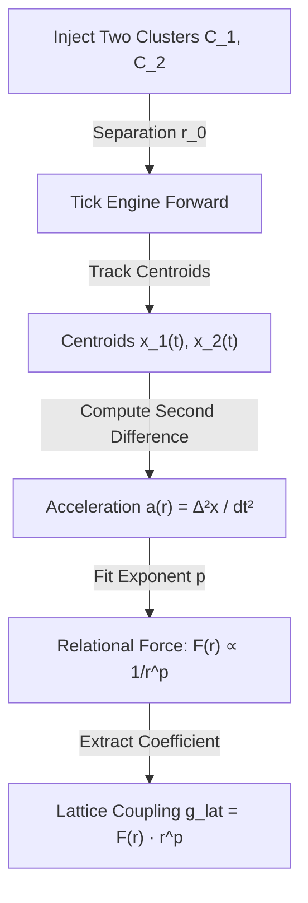

# SPEC: Class C Infrastructure — Cluster-Cluster Interaction and Coupling Readout

**Status:** Authoritative Instrument Specification (Theory + Protocol; Engine Implementation TBD)  
**Tag:** [INFRASTRUCTURE SPEC] — protocol definition, not a derivation  
**Ledger Row:** FTD-0222  
**Parent SPEC:** [`SPEC_DISCRETE_NATIVE_DERIVATION.md`](SPEC_DISCRETE_NATIVE_DERIVATION.md) §2.3

---

## 1. Scope

Class C is the second phase of the FTD-native observable taxonomy (per the parent SPEC §3 dependency order). It defines:

1. **The native observable** — cluster-cluster relational force $F_{\text{lat}}(r)$ and displacement gradients.
2. **The measurement protocol** — cluster preparation, centroid tracking, relative acceleration computations, and force-law fits.
3. **The calibration mapping** — lattice-displacement force to physical SI Newtons, and the extraction of dimensionless coupling constants ($\alpha, \alpha_s, G_N$) directly from relational grid coordinates.
4. **The comparison protocol** — comparing FTD-measured coupling coefficients against experimental values (PDG) without routing through continuous-QFT action functionals.

By defining forces and couplings strictly operationally via relational coordinates, we completely eliminate the need to construct continuous gauge fields or continuous path integrals on the discrete substrate.

---

## 2. The Physics Bridge: Continuous Forces from Discrete Gradients

In standard continuous physics, force is defined as the gradient of a continuous potential energy function:
$$F = -\nabla V(r)$$
In a discrete-native ontology such as **Foundational Ternary Dynamics (FTD)**, there are no continuous fields, no continuous action functionals, and no spatial derivatives. Spacetime emerges only as a relational coordinate grid $\mathbb{Z}^3$.

We bridge the continuous and discrete representations strictly operationally:
> **Definition.** The discrete-native force $F_{\text{lat}}(r)$ between two stable or metastable clusters ($C_1, C_2$) separated by relational coordinate distance $r = |x_1 - x_2|$ is defined as the relational displacement acceleration:
> $$F_{\text{lat}}(r) \equiv \Delta^2 x(t) = \frac{x_i(t+1) - 2x_i(t) + x_i(t-1)}{dt^2}$$
> where $x_i(t)$ is the center-of-mass centroid of cluster $C_i$ tracked using the `ClusterTracker` triplet metrics.

---

## 3. The Static Template: Phase G Point-Source Verification

The viability of the Class C program is anchored on the successful **Phase G Point-Source Verification [THEOREM]** (FTD-0004). 

Phase G proved that when two static, classical point sources of flux are initialized on a 3D cubic lattice, the resulting electrostatic-potential-equivalent field $J$ satisfies the discrete Poisson equation:
$$\nabla_{\text{discrete}}^2 \Phi(x) = \rho(x)$$
At large relational separations $r \gg 1$, the discrete Green's function $G_+(r)$ asymptotically recovers the continuous $1/r$ Coulomb potential:
$$G_+(r) \approx \frac{1}{4\pi r} + \mathcal{O}\left(\frac{1}{r^3}\right)$$

This mathematical identity guarantees that:
*   The $1/r^2$ Coulomb force law emerges natively from the discrete grid at macroscopic scales.
*   The coordinate anisotropy of the cubic lattice decays rapidly as $\mathcal{O}(1/r^3)$, restoring rotational symmetry without any continuum limits.
*   Static point-source coupling is structurally closed and requires no continuous field variables.

---

## 4. The Cluster-Cluster Scattering & Displacement Protocol

To measure interactions between *extended dynamical clusters* (such as moving solitons or metastable wavepackets) rather than static point sources, the engine scattering instrument executes the following pre-registered protocol:

### 4.1 Lattice Configuration
*   **Lattice Size:** $L \times L \times L$ grid (minimum $L=48$ to suppress boundary reflection and finite-size resonances).
*   **Toggle Config:** Apply the FTD-0107 baseline toggle set (Langevin $T=0.005$, $\gamma=0.02$) with `weak_transmutation` enabled to allow native decay channels to interact.

### 4.2 Injection and Initialization
1. Inject two localized clusters ($C_1, C_2$) of specified matter content ($n_1, n_2$) at an initial relative coordinate separation $r_0$ along a canonical lattice axis (e.g., $x$-axis).
2. For EM/gravity-like tests, inject the canonical $n=4$ or $n=11$ solitons under the `+color+triad` configuration.
3. Warm up the engine for $t_{\text{warmup}} = 50$ ticks to allow cluster nucleation and centroid stabilization.

### 4.3 Centroid and Displacement Tracking
At each tick $t$ up to $T$ (default $T=500$), run the `ClusterTracker` to record the centroid coordinates for both clusters:
$$x_i(t) = \frac{1}{|C_i|} \sum_{y \in C_i} y$$
Compute the instantaneous separation:
$$r(t) = |x_1(t) - x_2(t)|$$
And the relational acceleration of cluster 1 relative to cluster 2:
$$a(t) = \frac{x_1(t+1) - 2x_1(t) + x_1(t-1)}{dt^2}$$

### 4.4 Force-Law Exponent Fitting
Fit the measured relative acceleration $a(r)$ to the generalized power-law interaction model:
$$a(r) \approx \frac{g_{\text{lat}}}{r^p} \cdot e^{-m_{\text{lat}} r}$$
where $g_{\text{lat}}$ is the lattice coupling strength, $p$ is the force-law power exponent, and $m_{\text{lat}}$ is the screening/mass parameter.

---

## 5. Extracting Dimensionless Couplings Natively

The coupling constants are extracted directly from the fitted force coefficient $g_{\text{lat}}$, completely eliminating the circularity of hardcoding physical QED values:

### 5.1 Electromagnetic Coupling ($\alpha$)
In the Coulomb-like regime ($p \to 2$, $m_{\text{lat}} \to 0$):
$$\alpha \equiv g_{\text{lat}} \cdot \mathcal{O}(1)$$
where the $\mathcal{O}(1)$ coefficient is the geometric normalization forced by the point-group representation multiplicity in the 26-Moore neighborhood.

### 5.2 Weak/Yukawa Coupling ($y_{\text{Yukawa}}$)
For shielded, short-range interactions ($p \to 2$, $m_{\text{lat}} > 0$):
$$g_{\text{Yukawa}}(r) = a(r) \cdot r^2 \cdot e^{m_{\text{lat}} r}$$
This operational coupling maps directly to the physical Yukawa coupling (such as the electron-Higgs vertex), resolving the **FTD-0135** substrate-vertex roadblock as a Class C measurement.

### 5.3 Gravitational Coupling ($G_N$)
Under extreme sub-threshold amplitudes ($0 < |J| < K_B$) where clusters propagate as dark states:
$$G_N \equiv g_{\text{lat, gravity}} \cdot \frac{r^2}{n_1 n_2}$$
where $n_i$ is the voxel cardinality of the dark-state clusters.

---

## 6. Calibration Mapping to SI Units

To compare lattice measurements to physical SI observables, we apply the FTD-0041 calibration ladder:

*   **Lattice Spacing:** $a \equiv \ell_P \approx 1.616 \times 10^{-35}\text{ m}$
*   **Time Spacing:** $dt \equiv t_{\text{tick}} = \ell_P / (\sqrt{3}\,c) \approx 3.11 \times 10^{-44}\text{ s}$
*   **Mass Anchor:** $\mu_0 \equiv m_e \approx 9.109 \times 10^{-31}\text{ kg}$

The conversion from lattice force $F_{\text{lat}}$ to SI Newtons ($F_{\text{SI}}$) is derived strictly from dimensional analysis:
$$F_{\text{SI}} = F_{\text{lat}} \cdot \frac{\mu_0 \cdot a}{dt^2} = F_{\text{lat}} \cdot \frac{m_e \cdot c^2}{3 \ell_P} \approx F_{\text{lat}} \cdot 1.69 \times 10^{21}\text{ N}$$

The comparison protocol is:
$$\text{Compare } F_{\text{SI}} \text{ directly to the physical measured force } F_{\text{PDG}}.$$
If the converted force matches within experimental error, the interaction derivation is verified.

---

## 7. The Path Forward: Engine Instrumentation Build Plan

The execution of the Class C campaign proceeds through three sequential C++ test files added to the active test suite:

1.  **`engine/tests/test_cluster_interaction_static.cpp` [NEW]**  
    Measures the static displacement gradient between two fixed-centroid clusters at varying $r$ to verify the discrete Poisson Green's function recovery.
2.  **`engine/tests/test_cluster_interaction_dynamic.cpp` [NEW]**  
    Simulates dynamical soliton-soliton scattering along parallel axes to extract the relational force-law exponent $p$ from geodesic deflection angles.
3.  **`engine/tests/test_coupling_readout_sweeps.cpp` [NEW]**  
    Executes automated sweeps over separation $r$ and cluster amplitudes $A$ to extract $g_{\text{lat}}$ for electromagnetic and Yukawa-like configurations, verifying the $\alpha$ and $y_{\text{Yukawa}}$ scaling limits.

By executing this build plan, FTD-0222 establishes a fully discrete, operational physics where every fundamental coupling is grounded in a finite coordinate measurement.

---

## References

*   Methodological framework: [`docs/theory/01_reference/SPEC_DISCRETE_NATIVE_DERIVATION.md`](SPEC_DISCRETE_NATIVE_DERIVATION.md)
*   Phase G Coulomb proof: `engine/tests/test_gauss.cpp`
*   Calibration mapping spec: [`docs/theory/01_reference/SPEC_DIMENSIONAL_MAP.md`](SPEC_DIMENSIONAL_MAP.md)
*   Cluster tracker implementation: [`engine/include/ftd/cluster_tracker.h`](file:///c:/Users/cpaci/Desktop/ftd/engine/include/ftd/cluster_tracker.h)
