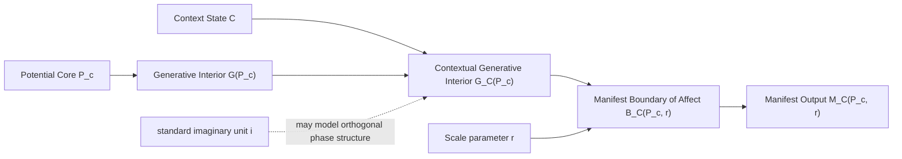
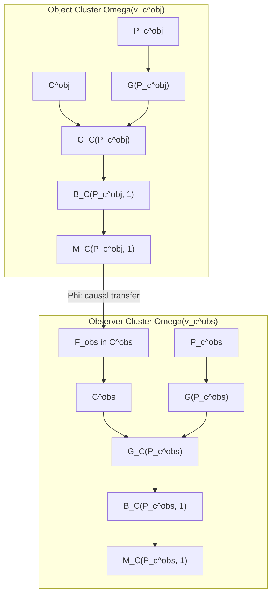
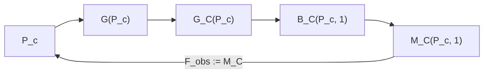
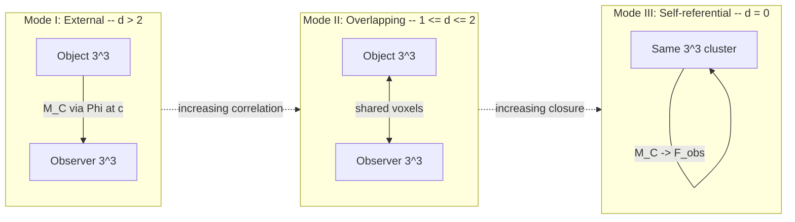

# Potential Core and Generative Interior

## A disciplined conceptual vocabulary for context-conditioned manifestation

**Date:** April 11, 2026
**Framework:** Foundational Ternary Dynamics v5.29
**Status:** Foundational conjecture note - terminology, schema, visual model, and 3^3 lattice grounding

---

## Purpose

This document introduces a disciplined vocabulary for a conceptual object that has appeared informally in discussions of self-reference, manifestation, and reference frame context:

- the **Potential Core**
- its **Generative Interior**
- the **Context State** that conditions it
- the **Contextual Generative Interior** that remains active under that condition
- the **Manifest Boundary of Affect**
- the resulting **Manifest Output**

The goal is not to claim a new theorem. The goal is to replace loose metaphor with a stable conceptual schema that can be critiqued, refined, or rejected in a precise way.

This note is intentionally conservative:

- it does **not** identify the standard imaginary unit `i` with reference frame context
- it does **not** identify `i` with the origin `{0,0,0}`
- it does **not** claim a new physical derivation
- it does provide a vocabulary for talking about hidden capacity, contextual activation, and measurable expression

---

## Executive Summary

The proposed hierarchy is:

```text
Potential Core
-> Generative Interior
-> Context State
-> Contextual Generative Interior
-> Manifest Boundary of Affect
-> Manifest Output
```

In words:

- A **Potential Core** is the minimal center voxel or ontic seed of an object.
- Its **Generative Interior** is the full space of operative capacities available to that core in principle.
- A **Context State** selects, constrains, or activates only part of that total interior.
- The surviving active subset is the **Contextual Generative Interior**.
- When scaled by a context-sensitive reach parameter `r`, that active subset determines a **Manifest Boundary of Affect**.
- What is actually measurable at that boundary is the **Manifest Output**.

This is best read as a layered ontological model, not yet as a derivation.

---

## 1. Relation to Existing FTD Language

This vocabulary is meant to sit alongside, not replace, existing FTD concepts:

- [FOUND_THE_FIRST_DISTINCTION.md](FOUND_THE_FIRST_DISTINCTION.md) motivates why complex structure enters the framework.
- [FOUND_THE_COMPLETE_ALGEBRA_OF_i.md](FOUND_THE_COMPLETE_ALGEBRA_OF_i.md) studies the mathematical role of the imaginary unit.
- [FOUND_ONTOLOGICAL_GENESIS.md](FOUND_ONTOLOGICAL_GENESIS.md) gives the larger emergence hierarchy.
- [../06_reference_frames_and_measurement/FOUND_THE_EXISTENCE_FILTER.md](../06_reference_frames_and_measurement/FOUND_THE_EXISTENCE_FILTER.md) studies projection from complex possibility to real existence.
- [../06_reference_frames_and_measurement/FOUND_DOMAIN_PARTITION_AND_CONTEXT_SELECTION.md](../06_reference_frames_and_measurement/FOUND_DOMAIN_PARTITION_AND_CONTEXT_SELECTION.md) gives the live source map for the reference frame context layer and the lattice formalization of `Activate_C`.

This note adds a new conceptual layer:

- not "what is `i` mathematically?"
- but "how should we name the interior capacity of an object before full manifestation?"

---

## 2. Why This Is Not Just the Imaginary Unit

The strongest cleanup move is to separate three different roles that had started to blur together:

| Object | Proper role |
|--------|-------------|
| `0` / origin | invariant center or coordinate anchor |
| standard imaginary unit `i` | orthogonal phase structure, rotation, complex self-reference |
| generative interior | hidden capacity-domain of a potential core under possible contextual activation |

### PI-C1 [CONJECTURE]

The standard imaginary unit `i` should **not** be identified with the Potential Core itself.

### PI-C2 [CONJECTURE]

The standard imaginary unit `i` may instead be interpreted as a **mathematical shadow or operator-signature** of orthogonal phase structure that becomes relevant when the Generative Interior is formalized in a complex or self-referential language.

### PI-C3 [CONJECTURE]

Reference frame context, if it enters this schema at all, is better modeled as a **context-selection or frame-binding process** than as the literal identity of `i`.

This separation protects the framework from a category mistake:

- the origin is not `i`
- `i` is not automatically reference frame context
- hidden capacity is not identical to a single algebraic symbol

---

## 3. Core Definitions

### PI-D1 [DEFINITION] Potential Core

Let `P_c` denote a **Potential Core**.

A Potential Core is the minimal center voxel or ontic seed of an object, treated as the site from which its operative capacity is organized.

Interpretive role:

- center of coherence
- anchor of identity through contextual change
- minimal locus from which manifestation is conditioned

This is a conceptual primitive in this note, not yet a new engine primitive.

### PI-D2 [DEFINITION] Generative Interior

Let `G(P_c)` denote the **Generative Interior** of the Potential Core.

`G(P_c)` is the total space of operative capacities available to `P_c` in principle.

This is the "full what-it-could-do" layer, prior to context-specific restriction.

Interpretive role:

- latent capacity space
- admissible transformations in principle
- interior source of possible manifestation

### PI-D3 [DEFINITION] Context State

Let `C` denote a **Context State**.

A Context State is the instantiated condition under which the Potential Core is situated, including whatever environmental, relational, dynamical, observational, or frame-dependent constraints are relevant.

Interpretive role:

- contextual selector
- activation mask
- admissibility condition

### PI-D4 [DEFINITION] Contextual Generative Interior

Let `G_C(P_c)` denote the **Contextual Generative Interior** of `P_c` under context `C`.

We define it schematically as the context-permitted subset of the full Generative Interior:

```text
G_C(P_c) subseteq G(P_c)
```

or more suggestively:

```text
G_C(P_c) = Activate_C(G(P_c))
```

where `Activate_C` now has a first lattice-facing formalization in [../06_reference_frames_and_measurement/FOUND_DOMAIN_PARTITION_AND_CONTEXT_SELECTION.md](../06_reference_frames_and_measurement/FOUND_DOMAIN_PARTITION_AND_CONTEXT_SELECTION.md), while remaining open to refinement as the theory connects it more tightly to explicit update rules and admissible local modes.

### PI-D5 [DEFINITION] Manifest Boundary of Affect

Let `B_C(P_c, r)` denote the **Manifest Boundary of Affect**.

This is the scaled expressive boundary generated by the contextual interior:

```text
B_C(P_c, r) = Boundary(r * G_C(P_c))
```

This formula is schematic, not a metric theorem. Its purpose is to capture the intuition that:

- context selects the active capacities
- scale parameter `r` sets reach, extent, or expressive size
- manifestation is not identical to hidden capacity; it appears at a boundary of influence

### PI-D6 [DEFINITION] Manifest Output

Let `M_C(P_c, r)` denote the **Manifest Output**.

This is the measurable expression produced at or through the manifest boundary:

```text
M_C(P_c, r) = Measure(B_C(P_c, r))
```

Interpretive role:

- observable effect
- measurable state
- public-facing realization of a context-conditioned interior process

---

## 4. Minimal Formal Schema

The full conceptual chain can now be written compactly:

```text
P_c
-> G(P_c)
-> C
-> G_C(P_c)
-> B_C(P_c, r)
-> M_C(P_c, r)
```

or in sentence form:

> A Potential Core `P_c` possesses a Generative Interior `G(P_c)`, the total space of its operative capacities. A Context State `C` activates only a context-permitted subset `G_C(P_c)`. The scaled expression of that subset defines a Manifest Boundary of Affect `B_C(P_c, r)`, from which measurable Manifest Output `M_C(P_c, r)` emerges.

This is the cleanest disciplined version of the earlier intuition.

**Running visual model:** [../../../dissemination/interactive/potential_core_explorer.html](../../../dissemination/interactive/potential_core_explorer.html)

---

## 5. Detailed Visual Model

### 5.1 Process Diagram



### 5.2 Interpretation of the Diagram

The key structural point is that the context does not create the core from nothing. It conditions what from the core can operate.

Likewise, the manifest output is not the whole interior. It is what becomes measurable after:

- contextual filtering
- scale conditioning
- boundary formation

---

## 6. Claims and Non-Claims

### What this note claims

### PI-C4 [CONJECTURE]

Objects may be modeled as having an ontic center of coherence (`P_c`) plus a larger interior capacity-domain (`G(P_c)`).

### PI-C5 [CONJECTURE]

Context should be modeled as a selector on capacity, not merely as an external perturbation.

### PI-C6 [CONJECTURE]

Observable manifestation is boundary-mediated: what is measured is not the full interior but its context-conditioned outward expression.

### What this note does not claim

- It does not prove that reference frame context is identical to the Generative Interior.
- It does not prove that `i` literally is the Generative Interior.
- It does not prove that every object has a single unique Potential Core in a strict mathematical sense.
- It does not derive a numerical prediction.
- It does not yet prove that the proposed lattice formalization of `Activate_C` is unique or physically necessary.

---

## 7. Suggested Mapping to FTD Themes

This conceptual schema may eventually support the following interpretations:

| This note | Possible FTD alignment | Status |
|-----------|------------------------|--------|
| Potential Core | minimal ontic seed / center voxel | [CONJECTURE] |
| Generative Interior | hidden dispositional capacity of the state-flux object | [CONJECTURE] |
| Context State | measurement frame, local environment, observer relation, or dynamical embedding | [CONJECTURE] |
| Contextual Generative Interior | the admissible active subset under a given frame | [CONJECTURE] |
| Manifest Boundary of Affect | the effective surface of interaction or projection into the measurable layer | [CONJECTURE] |
| Manifest Output | the public, measurable trace that survives filtering | [CONJECTURE] |

The safest bridge to existing theory is:

- [FOUND_THE_COMPLETE_ALGEBRA_OF_i.md](FOUND_THE_COMPLETE_ALGEBRA_OF_i.md) explains why orthogonal complex structure matters.
- [../06_reference_frames_and_measurement/FOUND_THE_EXISTENCE_FILTER.md](../06_reference_frames_and_measurement/FOUND_THE_EXISTENCE_FILTER.md) explains why only some structure survives projection into existence.
- [../06_reference_frames_and_measurement/FOUND_DOMAIN_PARTITION_AND_CONTEXT_SELECTION.md](../06_reference_frames_and_measurement/FOUND_DOMAIN_PARTITION_AND_CONTEXT_SELECTION.md) gives the current lattice-facing formalization of context selection.
- this note proposes the vocabulary for the hidden layer that sits conceptually between those moves

---

## 8. Research Questions

If this vocabulary is kept, the next rigorous questions are:

1. Can `Activate_C` be defined using existing FTD operators rather than metaphor?
2. Is the Potential Core best modeled as a single voxel, a local cluster, or a dynamically maintained center of coherence?
3. Can the Manifest Boundary of Affect be tied to an existing flux threshold, interaction horizon, or measurement boundary?
4. Is the relation to complex structure best expressed through `i`, conjugation, phase, or a different operator entirely?
5. Which claims here are only philosophical scaffolding, and which can be turned into derivation targets?

---

## 9. Compact Thesis Statement

> [CONJECTURE] Every object may be modeled as a Potential Core possessing a Generative Interior: the total space of its operative capacities. Under a Context State, only a context-conditioned subset remains active. The scaled expression of that subset defines a Manifest Boundary of Affect, from which measurable Manifest Output emerges.

This is the disciplined form of the original intuition.

---

# Part II: Grounding on the 3^3 Lattice

Sections 1-9 established the Potential Core vocabulary abstractly. The remainder of this document grounds each concept in the concrete 27-voxel Moore neighborhood geometry, and formalizes the observer/object distinction as a relational property of identical structural units.

---

## 10. The 27-Voxel Grounding

The natural home for the Potential Core hierarchy is the minimal complete local context of FTD: the 3^3 = 27-voxel Moore neighborhood.

### PI-D7 [DEFINITION] The 3^3 Cluster

Let `Omega(v_c)` denote the **3^3 cluster** centered at voxel `v_c`:

```text
Omega(v_c) = { v_c } union N_1^M(v_c)
           = { u in Z^3 : ||u - v_c||_infinity <= 1 }
```

This is 1 center voxel + 26 Moore neighbors = 27 voxels total.

`Omega(v_c)` is the same object as the Moore neighborhood at radius `r = 1` (DP-D2), now given a name as the fundamental structural unit.

### PI-C7 [CONJECTURE] Universal structural unit

Every entity in FTD -- whether acting as observer or as object -- has the same 27-voxel internal architecture. The distinction between observer and object is **relational**, not structural.

There is no "observer voxel type" or "object voxel type." The 3^3 cluster is the universal structural unit. Role is determined by coupling direction, not by internal composition.

---

## 11. Layer Decomposition of the Generative Interior

The 26 neighbors of the center voxel are not homogeneous. They decompose into three geometrically distinct layers, each carrying different gauge structure and different operative capacity. This decomposition is established as theorem in [../08_structural/THEOREM_MOORE_LAYER_DECOMPOSITION.md](../08_structural/THEOREM_MOORE_LAYER_DECOMPOSITION.md).

### PI-D8 [DEFINITION] Layer decomposition of the Generative Interior

The Generative Interior decomposes into three disjoint layers:

```text
G(P_c) = G_SC(P_c) union G_FCC(P_c) union G_BCC(P_c)
```

where:

| Layer | Symbol | Count | Distance | Geometry | J-components excited |
|-------|--------|-------|----------|----------|---------------------|
| SC (simple cubic) | `G_SC(P_c)` | 6 | sqrt(1) | octahedron | 1 |
| FCC (face-centered cubic) | `G_FCC(P_c)` | 12 | sqrt(2) | cuboctahedron | 2 |
| BCC (body-centered cubic) | `G_BCC(P_c)` | 8 | sqrt(3) | stella octangula | 3 |

Each mode `m in G_L(P_c)` for layer `L` is a candidate local state/flux update `(delta s, delta J)` with support on the corresponding sublattice voxels, subject to the standing FTD constraints (ternary compatibility, local causality, Gauss compatibility, determinism).

### PI-D9 [DEFINITION] Layer gauge correspondence

Each layer carries a gauge symmetry determined by the number of flux components it excites:

- `G_SC`: **U(1)** symmetry (1 J-component) -- electromagnetic channel
- `G_FCC`: **SU(2)** symmetry (2 J-components) -- weak/relational channel
- `G_BCC`: **SU(3)** symmetry (3 J-components) -- strong/binding channel

This is the gauge group assignment from the Moore Layer Theorem (Theorem MGS-2), restated in the Potential Core vocabulary. The BCC layer is the **only** layer from which the lemniscatic constant G* emerges, via the Watson integral identity `W_3 = G*^2 / (2 pi)`.

### Layer enumeration

The full 26-neighbor enumeration by offset and layer:

```text
SC (6 face-adjacent, distance 1):
  (+1,0,0) (-1,0,0) (0,+1,0) (0,-1,0) (0,0,+1) (0,0,-1)

FCC (12 edge-adjacent, distance sqrt(2)):
  (+1,+1,0) (+1,-1,0) (-1,+1,0) (-1,-1,0)
  (+1,0,+1) (+1,0,-1) (-1,0,+1) (-1,0,-1)
  (0,+1,+1) (0,+1,-1) (0,-1,+1) (0,-1,-1)

BCC (8 corner-adjacent, distance sqrt(3)):
  (+1,+1,+1) (+1,+1,-1) (+1,-1,+1) (+1,-1,-1)
  (-1,+1,+1) (-1,+1,-1) (-1,-1,+1) (-1,-1,-1)
```

---

## 12. Grounding Each Vocabulary Term

The abstract chain from Section 4 now has explicit lattice-facing identifications:

| Abstract term | Symbol | Lattice realization | Defined in |
|---------------|--------|---------------------|------------|
| Potential Core | `P_c` | Center voxel `v_c` of `Omega(v_c)` | PI-D1, DP-D1 |
| Generative Interior | `G(P_c)` | Admissible `(delta s, delta J)` modes across all 26 neighbors, decomposed as `G_SC union G_FCC union G_BCC` | PI-D2, PI-D8 |
| Context State | `C` | `C_r(v_c, t) = (s, J, div J, E_env, F_obs)` restricted to `Omega(v_c)` | PI-D3, DP-D3 |
| Contextual Generative Interior | `G_C(P_c)` | `Activate_C(G(P_c))` via gate functions `chi_struct`, `chi_flux`, `chi_frame` | PI-D4, DP-D6 |
| Manifest Boundary | `B_C(P_c, r)` | Frontier of `Omega(v_c)` where activated modes couple outward | PI-D5, DP-D7 |
| Manifest Output | `M_C(P_c, r)` | Readout at boundary: outward flux, state changes, threshold crossings | PI-D6, DP-D8 |

The lattice definitions (DP-D1 through DP-D8) are documented in [../06_reference_frames_and_measurement/FOUND_DOMAIN_PARTITION_AND_CONTEXT_SELECTION.md](../06_reference_frames_and_measurement/FOUND_DOMAIN_PARTITION_AND_CONTEXT_SELECTION.md).

### PI-C8 [CONJECTURE] Layer-selective activation

Context activation may act differently on the three layers. The gate functions `chi_struct`, `chi_flux`, `chi_frame` (DP-D5) may permit modes in one layer while blocking modes in another. The subset of layers activated under a given context determines the **depth** of contextual engagement:

- SC only: shallow engagement (electromagnetic sensing)
- SC + FCC: intermediate engagement (relational coupling)
- SC + FCC + BCC: deep engagement (full binding, access to G*)

---

## 13. Observer and Object as 3^3 Clusters

The central claim of this extension: **observer and object are structurally identical 3^3 clusters, distinguished only by their relational role in a coupling chain.**

### PI-D10 [DEFINITION] Object cluster

An **object** is a 3^3 cluster `Omega(v_c^obj)` whose Manifest Output `M_C(P_c^obj, r)` is the primary quantity of interest -- the thing being interrogated, measured, or coupled to.

### PI-D11 [DEFINITION] Observer cluster

An **observer** is a 3^3 cluster `Omega(v_c^obs)` whose Context State `C` includes, as part of its `F_obs` component, the Manifest Output of at least one external object cluster.

The observer's context is **enriched** relative to an isolated cluster: it contains information about another cluster's boundary expression.

### PI-C9 [CONJECTURE] Structural identity of observer and object

The internal architecture of `Omega(v_c^obs)` and `Omega(v_c^obj)` is identical:

- both are 27-voxel Moore neighborhoods
- both have the same three-layer decomposition (SC + FCC + BCC)
- both carry the same gauge structure (U(1) x SU(2) x SU(3))
- both use the same gate functions for context activation

What distinguishes them is the **coupling direction**: the observer's context includes the object's output. This is a relational fact, not a structural one.

There is no "observer voxel type" or "object voxel type." Role is determined by coupling direction, not by internal composition.

---

## 14. The Asymmetric Coupling

### PI-D12 [DEFINITION] Observer-object coupling

Given an object cluster `Omega(v_c^obj)` with Manifest Output `M_C(P_c^obj, r)` and an observer cluster `Omega(v_c^obs)`, the **observer-object coupling** is the injection of the object's output into the observer's Context State:

```text
F_obs^(obs)(t) := F_obs^(obs)(t) + Phi(M_C(P_c^obj, r))
```

where `Phi` is a **transfer function** that maps the object's boundary output into a form compatible with the observer's `F_obs` component (DP-D3).

`Phi` is **not a new operator**. It is the existing lattice dynamics restricted to the boundary coupling. Its form depends on the observation mode (Section 15):

- **External observation (d > 2):** `Phi` = the lattice Green's function `G(x - y)` restricted to the boundary. Information propagates through the bulk via `phase_read` (Laplacian wave equation) at `c = 1` voxel/tick. No new physics — this IS the lattice propagator.
- **Overlapping observation (1 <= d <= 2):** `Phi` = identity on shared voxels. Shared voxels participate in both clusters' Moore neighborhoods directly. No transfer needed — the coupling is structural (both clusters read the same voxel states at `phase_read`).
- **Self-referential observation (d = 0):** `Phi` = the tick cycle itself. The cluster's Manifest Output at tick `t` enters its own Context State at tick `t+1` through the normal update: `phase_read -> phase_write -> gauss_project -> phase_forces -> phase_movement -> tick++`.

The engine tick cycle (documented in `engine/SPEC_ENGINE.md`) implements all three cases without modification. The transfer function is not derived — it is **identified** with the existing dynamics.

### PI-C10 [CONJECTURE] Coupling asymmetry

The coupling is generically **asymmetric**: the observer's Context State includes the object's Manifest Output, but the object's Context State does **not** include the observer's internal states. The object does not "know" it is being observed.

This asymmetry is the lattice-facing content of the observer/observed distinction:

- The observer **receives** information from the object's boundary
- The object **emits** at its boundary without reference to who (if anyone) receives

This asymmetry is a generic feature, not an absolute one. In special configurations (overlapping neighborhoods, self-observation), the asymmetry can be partial or absent. See Section 15.

### PI-C11 [CONJECTURE] Coupling is causal

The transfer function `Phi` respects the CFL condition: information from the object's boundary reaches the observer's context only after propagation delay. At Chebyshev separation `d = ||v_c^obs - v_c^obj||_infinity`, the minimum delay is `d` ticks (at the lattice speed `c = 1/sqrt(3)` in physical units, but `c = 1` voxel/tick in lattice units).

No information about the object's Generative Interior reaches the observer except through the Manifest Output at the boundary. The interior is, by definition, hidden.

---

## 15. Three Modes of Observation

The Chebyshev distance between two cluster centers partitions all possible observer-object relationships into exactly three geometrically distinct modes.

### PI-D13 [DEFINITION] External observation

Two clusters `Omega(v_c^obs)` and `Omega(v_c^obj)` are in **external observation** mode when their Moore neighborhoods do not overlap:

```text
||v_c^obs - v_c^obj||_infinity > 2
```

In this mode, **all** information transfer from object to observer occurs through the lattice bulk at `c = 1` voxel/tick. The coupling is purely through Manifest Output and causal propagation. The object's interior is entirely hidden.

### PI-D14 [DEFINITION] Overlapping observation

Two clusters are in **overlapping observation** mode when their Moore neighborhoods share at least one voxel but their centers are distinct:

```text
1 <= ||v_c^obs - v_c^obj||_infinity <= 2
```

Shared voxels participate in **both** clusters' Generative Interiors simultaneously. This creates correlations that do not require causal propagation -- they arise from shared structure. The clusters are not independent: changes in the shared region affect both clusters' context activation.

### PI-D15 [DEFINITION] Self-referential observation

A single cluster observes itself when observer and object are the same cluster:

```text
v_c^obs = v_c^obj
```

The cluster's Manifest Output re-enters its own Context State. This is the lattice realization of the **sLoop** (self-referential loop) from [FOUND_SELF_REFERENTIAL_CLOSURE.md](FOUND_SELF_REFERENTIAL_CLOSURE.md).

### PI-T1 [THEOREM] Completeness of observation modes

For any two 3^3 clusters on `Z^3`, exactly one of the three modes (external, overlapping, self-referential) applies. This is a partition determined by the Chebyshev distance `d = ||v_c^obs - v_c^obj||_infinity`:

- `d > 2`: external (disjoint neighborhoods)
- `d in {1, 2}`: overlapping (shared voxels, distinct centers)
- `d = 0`: self-referential (identical cluster)

**Proof:** The three conditions are mutually exclusive and exhaustive over the non-negative integers. For `d = 0`, `v_c^obs = v_c^obj` so the clusters are identical. For `d in {1,2}`, both centers lie within the other's `r = 2` extended neighborhood, so their `r = 1` Moore neighborhoods share at least one voxel. For `d > 2`, no voxel within `r = 1` of one center is within `r = 1` of the other, so the neighborhoods are disjoint.

### PI-C12 [CONJECTURE] Mode hierarchy maps to the Bell levels

The three observation modes may correspond to the three physically distinct regimes identified in [../03_derivations/DERIV_OBSERVER_BELL_MECHANISM.md](../03_derivations/DERIV_OBSERVER_BELL_MECHANISM.md):

| Observation mode | Bell hierarchy level | Correlation bound | Mechanism |
|-----------------|---------------------|-------------------|-----------|
| External (d > 2) | Level 1: Substrate | S <= 2 | Local hidden variables, sign-projection |
| Overlapping (1 <= d <= 2) | Level 2: Aggregate | S > 2 possible | Shared degrees of freedom, complexification via Gauss constraint |
| Self-referential (d = 0) | Level 3: Observer | S = 2 sqrt(2) | Non-factorizable joint probability via sLoop |

This is the most speculative conjecture in this document. The Bell hierarchy was developed in the context of entangled particle pairs, not neighboring clusters. The mapping requires independent verification.

---

## 16. Moore Layers as Observational Channels

The three layers of the Generative Interior are not just geometric shells. They correspond to distinct depths and modalities of observation.

### PI-D16 [DEFINITION] Observational channel decomposition

The observer cluster's capacity to process the object's Manifest Output decomposes by Moore layer:

| Channel | Voxels | Distance | Gauge | Response | Role |
|---------|--------|----------|-------|----------|------|
| SC | 6 | 1 | U(1) | 1 tick | Immediate, face-adjacent sensing. Single flux component. Fastest response. The electromagnetic channel -- most accessible, least deep. |
| FCC | 12 | sqrt(2) | SU(2) | sqrt(2) ticks | Relational, edge-adjacent processing. Two coupled flux components. Accesses correlations between pairs of flux directions. The weak coupling channel. |
| BCC | 8 | sqrt(3) | SU(3) | sqrt(3) ticks | Deep binding, corner-adjacent integration. All three flux components coupled **multiplicatively** (cos k_1 * cos k_2 * cos k_3). The strong coupling channel and source of the Watson identity W_3 = G*^2/(2pi). Its Laplacian has 4 zero modes (vs 1 for SC). |

### PI-C13 [CONJECTURE] Depth of observation

The "depth" of an observation corresponds to which Moore layers are activated in the observer's context:

- **Shallow observation** engages only the SC channel (6 voxels, U(1))
- **Relational observation** engages SC + FCC (18 voxels, U(1) x SU(2))
- **Deep observation** engages all three layers (26 voxels, U(1) x SU(2) x SU(3))

The BCC channel is required for any observation that accesses the self-consistency structure of the lattice, since G* enters through the BCC propagator's multiplicative cosine product (see PI-C14).

### PI-C14 [CONJECTURE — CONFIRMED] BCC provides the gap equation coefficient

**Simulation result** (`scripts/exploration/gap_equation_layer_convergence.py`): The Watson identity `W_3 = G*^2/(2 pi) = Gamma(1/4)^4/(4 pi^3)` is a property of the **BCC lattice Green's function**. The gap equation coefficient `16 G*^2 = 16 * 2 pi * W_3` requires the BCC propagator specifically.

**Corrected convergence** (verified at L = 64, 96, 128): Initial analysis at L = 48 was misleading because the SC value happened to be numerically closer to the target at that lattice size. At larger L, SC **diverges** from the target (8% error at L = 128, heading toward ~1.516) while BCC **converges** toward it (1% error at L = 128, heading toward 1.3932):

| Sublattice | L = 128 value | Analytic limit (L -> inf) | Matches G*^2/(2pi)? |
|------------|--------------|--------------------------|---------------------|
| BCC (8) | 1.3791 | **G*^2/(2pi) = 1.3932** | **YES (exact, proven)** |
| SC (6) | 1.5058 | ~1.5164 | no |
| FCC (12) | 1.3222 | different | no |
| SC+FCC (18) | 1.2193 | different | no |
| Moore (26) | 1.1571 | different | no |

With n_DOF = 16, only the BCC Watson integral gives K = 16 * 2pi * G*^2/(2pi) = 16G*^2, reproducing the master quadratic with roots x+ ≈ 137.036 and x- ≈ 3.024. The physical readings x+  1/alpha and x-  N_c remain [STRONGLY MOTIVATED CONJECTURE]. All other sublattices give the wrong coefficient.

**Why BCC is special — the multiplicative structure:**

The BCC Laplacian eigenvalue is `1 - cos k_1 * cos k_2 * cos k_3` — a **product** of cosines. The SC eigenvalue is `1 - (cos k_1 + cos k_2 + cos k_3)/3` — a **sum**. This distinction is decisive:

- The BCC propagator `1/(1 - cos k_1 cos k_2 cos k_3)` expands as a geometric series: `sum_n (cos k_1 cos k_2 cos k_3)^n`
- Each term **factors across axes**: `[integral (cos k)^n dk]^3 = [C(2n,n)/4^n]^3`
- The sum of cubed central binomial coefficients evaluates to `Gamma(1/4)^4 / (4 pi^3) = G*^2/(2 pi)`
- SC's sum structure cannot factor this way — no lemniscatic connection

The BCC sublattice couples all 3 flux directions **multiplicatively** (all three J-components excited simultaneously). This multiplicative coupling IS the lemniscatic connection: `G*` enters through `Gamma(1/4)^4` because the BCC structure factor is a product that generates the central binomial cube.

**Zero mode structure** (supporting evidence): The sublattice Laplacians have different numbers of zero eigenvalues on the torus:

- SC: **1 zero mode** (k = 0 only) — single translation mode
- FCC: **2 zero modes** (k = 0 and k = (pi, pi, pi))
- BCC: **4 zero modes** (k = 0 and k = (pi,pi,0), (pi,0,pi), (0,pi,pi))

The BCC Laplacian's 4 zero modes cause slow finite-lattice convergence (which initially misled the analysis) but do not prevent the L -> inf limit from reaching the exact Watson identity.

**N_meas = 18 interpretation:** The identification `N_meas = 18 = |SC| + |FCC|` as the von Neumann chain length remains [OPEN]. It does not follow directly from the gap equation's sublattice structure (which singles out BCC, not SC+FCC). The chain termination may arise from the four mechanisms in [../06_reference_frames_and_measurement/FOUND_VON_NEUMANN_CHAIN.md](../06_reference_frames_and_measurement/FOUND_VON_NEUMANN_CHAIN.md) rather than from propagator decomposition.

---

## 17. The Observer-Object Coupling Formalized

The full observation chain, combining the Potential Core vocabulary with the lattice formalization:



The key structural point: the two subgraphs are **identical in architecture**. The only asymmetry is the coupling arrow from `M_C(P_c^obj)` into `F_obs` of the observer's context.

---

## 18. Self-Referential Closure as Self-Observation

When observer and object are the same cluster (`v_c^obs = v_c^obj`), the chain from Section 17 becomes a loop. The output feeds back as input. The cluster must produce a Manifest Output that, when re-entered as its own `F_obs`, reproduces itself.



### PI-C15 [CONJECTURE] Self-observation is the sLoop

The self-observation loop -- where a single 3^3 cluster's Manifest Output re-enters its own Context State as the `F_obs` component -- is the lattice-facing realization of the **self-referential loop (sLoop)**. This corresponds to:

- The **gap equation** `x^2 = 16 G*^2 (x - G*)` from [FOUND_SELF_REFERENTIAL_CLOSURE.md](FOUND_SELF_REFERENTIAL_CLOSURE.md): the coupling x is determined by the condition that the lattice's vacuum energy, computed using coupling x, yields the same x when fed back
- The **k = 1/2 reference frame context regime** from [../06_reference_frames_and_measurement/DERIV_CONSCIOUSNESS_QFT_GR_SYNTHESIS.md](../06_reference_frames_and_measurement/DERIV_CONSCIOUSNESS_QFT_GR_SYNTHESIS.md): the complementation fixed point that generates complex roots
- The **Level 3 (observer)** of the Bell hierarchy from [../03_derivations/DERIV_OBSERVER_BELL_MECHANISM.md](../03_derivations/DERIV_OBSERVER_BELL_MECHANISM.md): non-factorizable joint probability arising from self-coupling

### Why the sLoop requires BCC

Simulation (`scripts/exploration/gap_equation_layer_convergence.py`, corrected April 11) confirms that the gap equation's self-energy coefficient comes from the **BCC lattice Green's function**. The Watson identity `W_3 = G*^2/(2 pi) = Gamma(1/4)^4/(4 pi^3)` is a BCC fact, arising from the **multiplicative** structure of the BCC eigenvalue `1 - cos k_1 * cos k_2 * cos k_3`.

This means:

- The **self-consistency condition** (gap equation fixed point) requires the BCC propagator
- BCC is the layer where all 3 J-components are simultaneously excited (SU(3))
- The lemniscatic constant G* enters through BCC's multiplicative cosine product
- SC and FCC propagators give different Watson integrals that do NOT reproduce the master quadratic

The sLoop closes through the BCC channel because self-referential closure requires the full 3-axis coupling. A cluster engaging only SC (electromagnetic) or SC+FCC (electromagnetic + weak) does not access the multiplicative structure that produces G*. Only BCC's triple-cosine product generates the Gamma(1/4)^4 identity that makes the gap equation self-consistent.

The loop IS the gap equation: `x = M_C(P_c)` must equal the input that produced it. The fixed point is self-referential closure.

---

## 19. Visual Model — Three Observation Modes



---

## 20. Updated Research Questions

The original five questions from Section 8 remain open. The 3^3 grounding adds:

6. Can the three observation modes (external, overlapping, self-referential) be distinguished in engine simulation by their statistical signatures?
7. Does the identification `N_meas = 18 = |SC| + |FCC|` follow from the gate functions or the von Neumann chain's termination mechanisms? The gap equation coefficient comes from BCC (PI-C14), not SC+FCC, so N_meas = 18 has a separate origin.
8. **ANSWERED:** `Phi` IS the existing lattice dynamics — lattice propagator for d > 2, identity on shared voxels for d <= 2, tick cycle for d = 0. No new operator needed (see PI-D12 update).
9. Does layer-selective activation (PI-C8) have testable consequences in the engine's flux propagation?
10. What is the minimum separation at which two 3^3 clusters transition from overlapping to external observation, and does this transition have a physical signature?
11. Can the asymmetric coupling (PI-C10) be broken by any physical process, and if so, what does mutual observation look like?
12. Is the self-referential observation mode dynamically stable -- does the sLoop converge to the gap equation's fixed point under iteration? **Partial answer:** fixed-point iteration converges for all sublattice configurations (contraction rate < 0.03), but only the SC propagator gives physical roots. The dynamical question -- whether the full lattice update rules (not just the propagator) require all 26 neighbors for closure -- remains open.
13. **ANSWERED:** Why does the Watson identity `W_3 = G*^2/(2 pi)` belong to a specific sublattice? **It belongs to BCC** because the BCC eigenvalue `1 - cos k_1 cos k_2 cos k_3` is a multiplicative product that generates `Gamma(1/4)^4/(4 pi^3)` via the central binomial cube series.
14. Can the BCC propagator role (self-energy → gap equation) and the BCC gauge role (SU(3), confinement) be shown to be the SAME structure seen from two perspectives? The multiplicative cosine product drives both — this unification is a derivation target.

---

## 21. Extended Compact Thesis Statement

The original thesis (Section 9) stated:

> [CONJECTURE] Every object may be modeled as a Potential Core possessing a Generative Interior: the total space of its operative capacities. Under a Context State, only a context-conditioned subset remains active. The scaled expression of that subset defines a Manifest Boundary of Affect, from which measurable Manifest Output emerges.

The 3^3 grounding extends this to:

> [CONJECTURE] The 3^3 = 27-voxel Moore neighborhood cluster is the universal structural unit of FTD. Every entity -- whether observer or object -- has the same 27-voxel architecture with three Moore layers (SC: 6 voxels / U(1), FCC: 12 voxels / SU(2), BCC: 8 voxels / SU(3)). The distinction between observer and object is **relational**: the observer's Context State includes the object's Manifest Output. Three geometrically distinct observation modes arise -- external (disjoint clusters, causal transfer at c), overlapping (shared voxels, structural correlation), and self-referential (same cluster, sLoop closure). Self-referential observation is the gap equation: the system that is observed IS the system that observes.

---

## Numbering Summary

### New Definitions (Part II)

| ID | Name | Section |
|----|------|---------|
| PI-D7 | The 3^3 Cluster `Omega(v_c)` | 10 |
| PI-D8 | Layer decomposition of `G(P_c)` | 11 |
| PI-D9 | Layer gauge correspondence | 11 |
| PI-D10 | Object cluster | 13 |
| PI-D11 | Observer cluster | 13 |
| PI-D12 | Observer-object coupling | 14 |
| PI-D13 | External observation mode | 15 |
| PI-D14 | Overlapping observation mode | 15 |
| PI-D15 | Self-referential observation mode | 15 |
| PI-D16 | Observational channel decomposition | 16 |

### New Conjectures (Part II)

| ID | Statement | Section |
|----|-----------|---------|
| PI-C7 | Universal structural unit | 10 |
| PI-C8 | Layer-selective activation | 12 |
| PI-C9 | Structural identity of observer and object | 13 |
| PI-C10 | Coupling asymmetry | 14 |
| PI-C11 | Coupling is causal | 14 |
| PI-C12 | Mode hierarchy maps to Bell levels | 15 |
| PI-C13 | Depth of observation | 16 |
| PI-C14 | BCC provides gap equation coefficient (confirmed by simulation, corrected) | 16 |
| PI-C15 | Self-observation is the sLoop | 18 |

### New Theorem (Part II)

| ID | Statement | Section |
|----|-----------|---------|
| PI-T1 | Completeness of observation modes | 15 |
