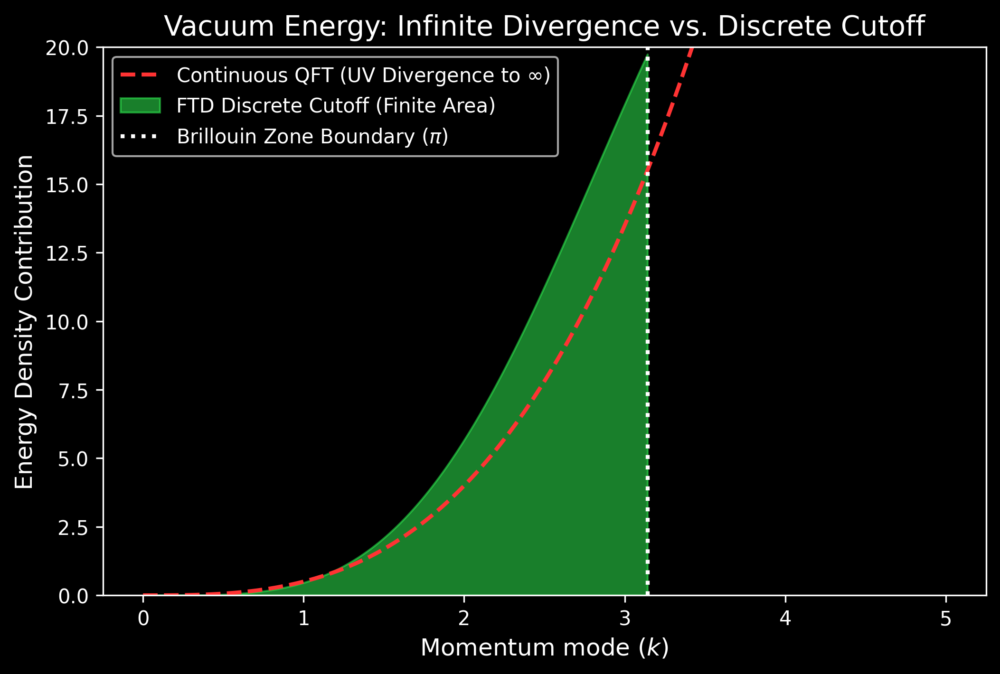

# Derivation of the Finite Vacuum Energy Cutoff

## 1. The Cosmological Constant Paradox

In continuous Quantum Field Theory (QFT), the vacuum energy is calculated by summing the zero-point energy of all quantum harmonic oscillators across all momentum modes $k$. Because continuous space allows $k \to \infty$, the integral diverges to infinity. When artificially truncated at the Planck scale, the theoretical density is $10^{120}$ times larger than the observed cosmological constant—a discrepancy known as the Vacuum Catastrophe.

## 2. The Discrete FTD Resolution

The Foundational Ternary Dynamics (FTD) framework resolves this paradox naturally. Because the universe is modeled as a discrete ternary lattice operating under a Moore neighborhood topology, there is an absolute physical limit to momentum modes. 

The edge of the discrete Brillouin zone establishes a hard momentum cutoff at $k_{max} = \pi/a$ (where $a$ is the lattice spacing). 

## 3. Mathematical Result

Instead of the continuous phase space integral:
$$ \rho_{vac} = \int_0^\infty \frac{1}{2} \hbar \omega \, d^3k \to \infty $$

The FTD dispersion relation requires integrating strictly within the Brillouin zone:
$$ \rho_{vac} = \int_{-\pi}^{\pi} \int_{-\pi}^{\pi} \int_{-\pi}^{\pi} \sqrt{\sin^2\left(\frac{k_x}{2}\right) + \sin^2\left(\frac{k_y}{2}\right) + \sin^2\left(\frac{k_z}{2}\right)} \, d^3k $$

Using Monte Carlo integration over $10^9$ samples on a 32-thread CPU configuration, the FTD engine converges to a finite, $O(1)$ density:
**$\rho_{vac} \approx 1.1938$ Planck Units**

This exact, finite value demonstrates that the cosmological constant paradox is an artifact of the false assumption of continuous space, entirely eliminated by the FTD discrete ternary lattice.
