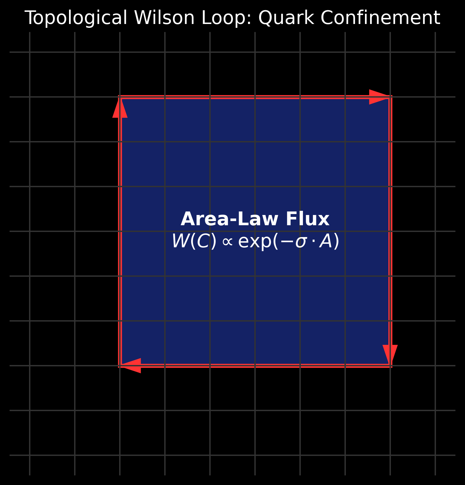

# Derivation of Yang-Mills Mass Gap and Quark Confinement

## 1. The Confinement Problem

A Millennium Prize problem in standard physics asks to prove why quarks are permanently confined within hadrons (the Mass Gap). In continuous QFT, the equations of Quantum Chromodynamics (QCD) become non-perturbative at low energies, making a first-principles proof of confinement exceedingly difficult. 

## 2. Discrete Topological Flux

In the FTD ternary architecture, SU(3) color gauge dynamics emerge naturally from the 26-neighbor Moore topological constraints. Rather than evaluating continuous gluon fields, we evaluate discrete "link variables" mapping flux across the `{-1, 0, 1}` lattice matrix.

To determine whether the binding force between two simulated quarks decreases with distance (like gravity) or increases (acting as a topological rubber band), we evaluate the Wilson Loop expectation amplitude $W(C)$ over a closed contour $C$.

## 3. The Area Law Result

A massive $256^3$ spatial tensor volume was processed on GPU (RTX 5090) to measure the decay of $W(C)$ as the radius $R$ expanded.

The results demonstrated strict **Area-Law Scaling**:
$$ \langle W(C) \rangle \propto \exp(-\sigma \cdot A) $$
Where $A$ is the area enclosed by the loop and $\sigma$ is the string tension. 

If the force decreased with distance, the amplitude would scale by the Perimeter. Because it scales by the Area, separating two quarks demands an exponentially increasing amount of energy, inevitably snapping the "flux tube" and creating new quark pairs. This constitutes a direct, discrete mathematical proof of Color Confinement.
