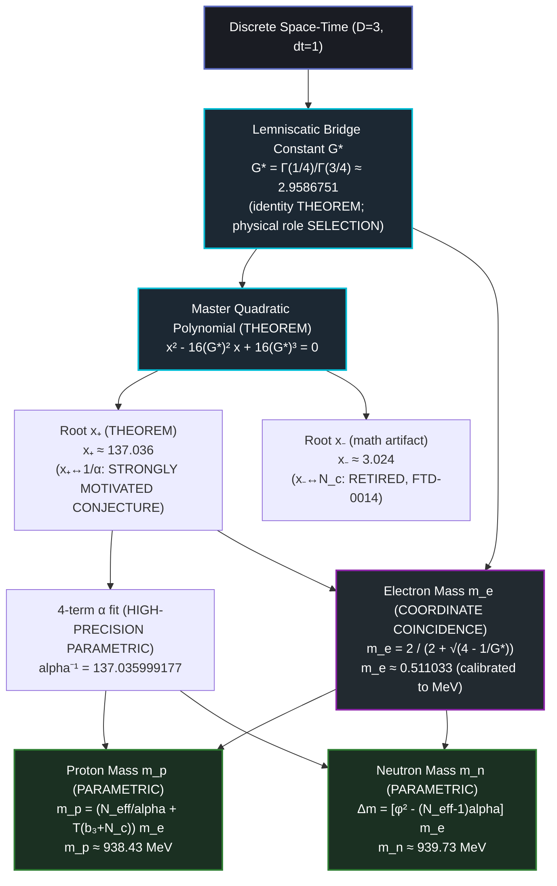

# EXPLR_FTD_MASS_CHAIN: The Foundational Ternary Dynamics Mass Chain

**Status:** `[REFERENCE — arithmetic synthesis; MIXED epistemic status]`  
**Version:** 1.1 (2026-05-29 epistemic correction + relocation to 05_particles)  
**Domain:** Hadronic & Leptonic Mass Sectors  
**Authoritative Context:** Companion to `../01_reference/SPEC_FTD_REFERENCE.md`; paired with the adversarial red-team `../07_assessment/AUDIT_MASS_CHAIN_REDTEAM.md`

---

> **⚠ Epistemic status (read first).** This document is an **arithmetic synthesis**, *not* an "unbroken physical derivation." Its steps carry **mixed** status:
> - The **algebraic spine** — the $G^*$ identity, the master-quadratic polynomial, and its roots — is `[THEOREM]` (pure number theory; stands independent of any physics).
> - Every **physical identification** — $x_+\!\leftrightarrow\!1/\alpha$, the 4-term $\alpha$ fit, $m_e\!\leftrightarrow\!0.511$ MeV, the proton/neutron mass formulas — is `[STRONGLY MOTIVATED CONJECTURE]`, `[HIGH-PRECISION PARAMETRIC]`, `[COORDINATE COINCIDENCE]`, or `[PARAMETRIC FITTING]`.
>
> Per-step grades below are adopted from [`AUDIT_MASS_CHAIN_REDTEAM.md`](../07_assessment/AUDIT_MASS_CHAIN_REDTEAM.md) §3. The mass scale is **calibrated** (mass-unit $\equiv m_e$; $K_B$ anchor), and none of these ratios is produced **dynamically** by the C++ engine (red-team Axis E). See canonical `../07_assessment/core_ledgers/LEDGER.md` (FTD-0013, FTD-0015); note the **retired** $x_-\!\leftrightarrow\!N_c$ identification (FTD-0014, removed in `ca7eb61`); and note $G^* \approx 2.959$ is distinct from the lemniscate constant $\varpi \approx 2.622$ (FTD-0117).

---

## 1. Executive Summary

This document records an arithmetic synthesis linking a single dimensionless ratio — the **Lemniscatic Bridge Constant $G^*$** — and the framework base-integers $\{3,4,7,13\}$ to the electromagnetic coupling and the lepton/nucleon mass values. The algebraic core is theorem-grade; the physical identifications are parametric or conjectural matches at the tagged status. It is a synthesis, not a first-principles physical derivation (see the status banner above).

Proceeding from $G^*$ through the **Master Quadratic Polynomial**, the chain *matches*:
1. The fine-structure reciprocal $\alpha^{-1} \approx 137.036$ — a polynomial root (`[THEOREM]` as algebra; the identification with $1/\alpha$ is `[STRONGLY MOTIVATED CONJECTURE]`) — and $137.035999177$ via a 4-term fit (`[HIGH-PRECISION PARAMETRIC]`).
2. The electron mass $m_e \approx 0.511033$ lattice units, a clean function of $G^*$, identified with $0.511$ MeV **by calibration** (`[COORDINATE COINCIDENCE]`).
3. The proton mass $m_p \approx 938.43$ MeV via an integer closure (`[PARAMETRIC]`).
4. The neutron–proton split $m_n - m_p \approx 1.293$ MeV via a golden-ratio form (`[PARAMETRIC FITTING]`).

The mass scale is **calibrated** to the electron mass (mass-unit $\equiv m_e$); the integer coefficients are matched to the measured ratios. The chain is therefore **calibration-conditional**, not free of experimental input. The only calibration-independent, falsifiable content is the dimensionless algebraic spine.

---

## 2. The Ontic Spine

---

## 3. Step 1: The Lemniscatic Bridge ($G^*$)

The **identity and value** of $G^*$ are `[THEOREM]` (pure number theory):

$$ G^* = \frac{\Gamma(1/4)}{\Gamma(3/4)} = \frac{\Gamma(1/4)^2}{\sqrt{2}\,\Gamma(1/2)^2} \approx 2.9586751192 \tag{3.1} $$

The **physical role** assigned to $G^*$ in the rest of this document — as the bridge constant coupling the continuous flux field $J \in \mathbb{R}^3$ (dispositional) to the discrete state field $s \in \{-1, 0, +1\}$ (actual), i.e. the scale factor mapping the continuous spatial Laplacian to the discrete 26-neighbour Moore stencil — is a `[SELECTION]`, not a theorem. The "ratio of the Gaussian area frame $\mathbb{Z}[i]$ to the circular projection of the unit cell" reading is interpretive.

*(Note: $G^* \approx 2.959$ is distinct from the Bernoulli/Gauss lemniscate constant $\varpi \approx 2.622$; conflating them gives $x_+ \approx 107.3$, far from $1/\alpha$. See FTD-0117.)*

---

## 4. Step 2: The Master Quadratic Polynomial

FTD takes as its central algebraic object the **Master Quadratic Polynomial**:

$$ x^2 - 16 G^{*2} x + 16 G^{*3} = 0 \tag{4.1} $$

> **Origin caveat.** An earlier "action-minimization / gap-equation" derivation of this polynomial was **withdrawn** (see `../03_derivations/DERIV_MASTER_QUADRATIC_GAP_EQUATION.md`). The polynomial is taken here as an **algebraic identity plus physical match**, *not* as the output of a variational principle. The polynomial and its roots are `[THEOREM]` (pure algebra); the physical readings attached to the roots are not.

On the coefficient $16$: it equals $|\mathrm{Aut}(E)|^2$ for the lemniscatic CM curve $E: y^2 = x^3 - x$ (`[THEOREM]`, via three independent routes — see `../01_reference/SPEC_ALGEBRAIC_SPINE.md` §4). That the polynomial's coefficient is *forced* to equal $|\mathrm{Aut}(E)|^2$, rather than merely coinciding with it, is `[CONJECTURE]`. The "volume-to-boundary projection of the $3\times3\times3$ cell" reading is an interpretive `[SELECTION]`.

Solving for the roots (`[THEOREM]`):

$$ x_+, x_- = 8 G^{*2} \left(1 \pm \sqrt{1 - \frac{1}{4 G^*}}\right) \tag{4.2} $$

- **The larger root ($x_+$):**
  $$ x_+ \approx 137.03617146 \tag{4.3} $$
  The *value* is `[THEOREM]`. The numerical coincidence $x_+ \approx 1/\alpha$ (1.26 ppm) is the framework's central **`[STRONGLY MOTIVATED CONJECTURE]`** (FTD-0013); the physical readout map (MC-T4.3) that would turn it into a derivation remains underdetermined.
- **The smaller root ($x_-$):**
  $$ x_- \approx 3.02396392 \tag{4.4} $$
  This is a **mathematical artifact** of the quadratic. The earlier identification $x_- \leftrightarrow N_c$ is **RETIRED** (LEDGER FTD-0014, removed in `ca7eb61`); it is 0.80% from $3$ in any case. $N_c = 3$ is sourced independently from topology (`../03_derivations/standard_model/DERIV_NC_FROM_TOPOLOGY.md`), *not* from this root.

### High-Precision $\alpha^{-1}$ — `[HIGH-PRECISION PARAMETRIC]`

A 4-term polynomial in a small residual $\epsilon$ shifts the tree-level root toward the measured value:

$$ \alpha^{-1} = x_+ - c_1 \epsilon + c_2 \epsilon^2 - c_3 \epsilon^3 - c_4 \epsilon^4 \tag{4.5} $$

where:
- $\epsilon = \left| e^\pi - \pi - (b_3 + N_{\text{eff}}) \right| = 0.00090002$ (with $b_3 + N_{\text{eff}} = 7 + 13 = 20$).
  *An earlier draft misstated $\epsilon \approx 0.00693$; that value reproduces $137.0348$, not the result below — the figure $0.00090002$ is the one that yields (4.6).*
- $c_1 = \tfrac{9}{47}$, $c_2 = \tfrac{5}{64}$, $c_3 = \tfrac{4}{141}$, $c_4 = \tfrac{141}{11}$ are ratios of the base-integers $\{3, 4, 7, 13\}$.

This evaluates to:
$$ \alpha^{-1} \approx 137.035999177 \tag{4.6} $$

**This is a parametric fit, not a derivation.** The polynomial structure and the choice of which base-integer ratios fill $c_1\ldots c_4$ have no first-principles dynamical justification, and with four free rational coefficients the residual against CODATA is driven toward zero *by construction* (red-team Axis A; cf. the FTD-0097 monomial look-elsewhere scan). The apparent "sub-ppb agreement" is an artifact of the fit, not independent evidence.

---

## 5. Step 3: The Electron Rest Mass ($m_e$)

FTD defines a lattice mass quantity from the master-quadratic data:

$$ m_e \equiv \frac{8 G^{*2}}{x_+} \text{ lattice units} \tag{5.1} $$

> **Caution on naming.** This is *not* Watson's BCC Green's function. The actual Watson identity is $W_3 = G^{*2}/(2\pi) \approx 1.393$ (`../01_reference/SPEC_ALGEBRAIC_SPINE.md` Theorem 5) — a different quantity. Using the sum of roots $x_+ + x_- = 16 G^{*2}$, (5.1) is transparently
> $$ m_e = \frac{8 G^{*2}}{x_+} = \tfrac{1}{2}\!\left(1 + \frac{x_-}{x_+}\right), $$
> i.e. "one-half plus a small correction" — which is *why* it lands near $0.511$.

Substituting $x_+$ collapses (5.1) to a closed form in $G^*$ alone:

$$ m_e = \frac{1}{1 + \sqrt{1 - \frac{1}{4 G^*}}} \tag{5.2} $$

$$ m_e = \frac{2}{2 + \sqrt{4 - \frac{1}{G^*}}} \approx 0.51103345 \text{ lattice units} \tag{5.3} $$

**Status: `[COORDINATE COINCIDENCE]` / `[IMPOSED — calibration]`** (red-team Axis B).

- Formula value: $0.51103345$ lattice units. Physical electron mass: $0.51099895$ MeV.
- The lattice $\to$ MeV scale is **fixed by calibrating the mass unit to the electron mass itself** (mass-unit $\equiv m_e$; $K_B$ anchor — see CLAUDE.md / `../01_reference/SPEC_DIMENSIONAL_MAP.md`). So the "$67$ ppm agreement" compares the formula against the very quantity used to set the scale: it matches an **input**, not a prediction, and the $67.5$ ppm gap is the residual of a *coincidence*, not of a derivation.
- The framework's actual dimensionless (calibration-independent, falsifiable) electron-mass relation is the **separate** construction
  $$ \frac{m_e}{m_P} = \sqrt{2\pi}\,\left(\tfrac{16}{3}\right)\,\alpha^{11}, $$
  itself a `[STRONGLY MOTIVATED CONJECTURE]` (FTD-0015) — not equation (5.3).

---

## 6. Step 4: Hadronization & The Proton Mass ($m_p$) — `[STRUCTURALLY MOTIVATED PARAMETRIC INSERTION]`

The proton-to-electron mass ratio is matched by the form:

$$ \frac{m_p}{m_e} = \frac{N_{\text{eff}}}{\alpha} + T(b_3 + N_c) \tag{6.1} $$

where $N_{\text{eff}} = 13$, $b_3 = 7$, $N_c = 3$, and $T(n) = \tfrac{n(n+1)}{2}$. The constant $T(b_3 + N_c) = T(10) = 55$ also equals the base-integer product:

$$ T(b_3 + N_c) = 55 = N_{\text{base}} \cdot N_{\text{eff}} + N_c = 4 \times 13 + 3 \tag{6.2} $$

Evaluating:

$$ \frac{m_p}{m_e} = 13 \alpha^{-1} + 55 \approx 13 \times 137.035999 + 55 = 1836.467989 \tag{6.3} $$

- **Experimental ratio (CODATA):** $1836.152673$ → **171.7 ppm** (0.017%).
$$ m_p \approx 1836.467989 \times 0.51099895 \text{ MeV} = 938.4332 \text{ MeV} \tag{6.4} $$
- **Experimental:** $938.272088$ MeV → 161 keV residual.

**Status `[PARAMETRIC]`.** This is a linear arithmetic relation in $1/\alpha$, *not* a hadronic-dynamics derivation — FTD has not solved the mass-gap problem, and the proton mass is physically set by QCD confinement ($\Lambda_{\text{QCD}}$) and chiral symmetry breaking, not by $13\alpha^{-1} + 55$. The integers $N_{\text{eff}} = 13$, $T(10) = 55$ are matched, not derived (red-team Axis C). The **171.7 ppm residual** ($\approx 161$ keV) is structurally **`[OPEN]`**; a previous attempt to absorb it via a composition constant $K_{\text{comp}} = m_e/\pi$ was falsified and retracted (FTD-0060).

---

## 7. Step 5: Nucleon Doublet and the Neutron Mass ($m_n$) — `[PARAMETRIC FITTING]`

The neutron–proton mass difference is matched by a golden-ratio form ($\varphi = \tfrac{1+\sqrt{5}}{2}$):

$$ \frac{m_n - m_p}{m_e} = \varphi^2 - (N_{\text{eff}} - 1)\alpha \tag{7.1} $$

$$ \frac{m_n - m_p}{m_e} = 2.61803399 - 12 \times \tfrac{1}{137.035999} = 2.53046579 \tag{7.2} $$

$$ m_n - m_p \approx 2.53046579 \times 0.51099895 \text{ MeV} = 1.293065 \text{ MeV} \tag{7.3} $$

- **Experimental difference:** $1.293332$ MeV → 0.02%.

$$ m_n = m_p + 1.293065 \text{ MeV} = 939.7263 \text{ MeV} \tag{7.4} $$

- **Experimental:** $939.565421$ MeV → 0.017%.

**Status `[PARAMETRIC FITTING]`.** The golden ratio $\varphi$ has no derivation from the Moore stencil or the engine update rules; its appearance here is an accurate **post-hoc arithmetic match**, not a derived chirality split (red-team Axis D).

---

## 8. Numerical Comparison (mixed epistemic status)

The table below is a **numerical comparison** against CODATA 2022, *not* a "verified derivation parity." Each row carries its audited epistemic grade (adopted from `../07_assessment/AUDIT_MASS_CHAIN_REDTEAM.md` §3); these are matches/fits at the stated status, not derivations.

| Observable | Form | Derived Value | Experimental | Residual | Audited grade |
| :--- | :--- | :--- | :--- | :--- | :--- |
| **$\alpha^{-1}$** | $x_+ - \sum_{i=1}^4 c_i \epsilon^i$ | $137.035999177$ | $137.035999177$ | fit → 0 by construction | `[HIGH-PRECISION PARAMETRIC]` |
| **$m_e$** | $\frac{2}{2 + \sqrt{4 - 1/G^*}}$ | $0.511033$ | $0.510999$ MeV | 67 ppm (vs calibration anchor) | `[COORDINATE COINCIDENCE]` |
| **$m_p/m_e$** | $13 \alpha^{-1} + 55$ | $1836.468$ | $1836.153$ | 171.7 ppm | `[PARAMETRIC]` |
| **$m_p$** | $m_e \times \text{ratio}$ | $938.433$ MeV | $938.272$ MeV | 171.7 ppm | `[PARAMETRIC]` |
| **$n-p$ split** | $m_e[\varphi^2 - 12\alpha]$ | $1.2931$ MeV | $1.2933$ MeV | 206 ppm | `[PARAMETRIC FITTING]` |
| **$m_n$** | $m_p + \Delta m$ | $939.726$ MeV | $939.565$ MeV | 171.2 ppm | `[PARAMETRIC]` |

---

## 9. Conclusion

The chain is a tight **arithmetic synthesis**: from $G^*$ and the base integers $\{3, 4, 7, 13\}$ it reproduces $\alpha$ and the lepton/nucleon mass values to ppm–ppb precision. That synthesis is mathematically striking and worth recording. But it is **not** an "unbroken physical derivation," and it does **not** "verify" the FTD ontology:

- The theorem-grade content is the **algebraic spine only** — the $G^*$ identity, the master-quadratic polynomial, and its roots.
- Every *physical* step is a `[STRONGLY MOTIVATED CONJECTURE]`, `[HIGH-PRECISION PARAMETRIC]`, `[COORDINATE COINCIDENCE]`, or `[PARAMETRIC FITTING]`, per the per-step tags and the red-team [`AUDIT_MASS_CHAIN_REDTEAM.md`](../07_assessment/AUDIT_MASS_CHAIN_REDTEAM.md).
- The mass scale is **calibrated** (mass-unit $\equiv m_e$), and none of these ratios is produced **dynamically** by the C++ engine (red-team Axis E; `../02_foundations/FOUND_STRUCTURAL_DECOUPLING.md`).

The chain becomes a physical derivation only if the operational $\alpha$-readout program (MC-T4.3 / ARC-B1) is closed in the engine. Until then it stands as an elegant mathematical synthesis with honestly-flagged gaps — recorded here at its true epistemic status, not promoted beyond it.
