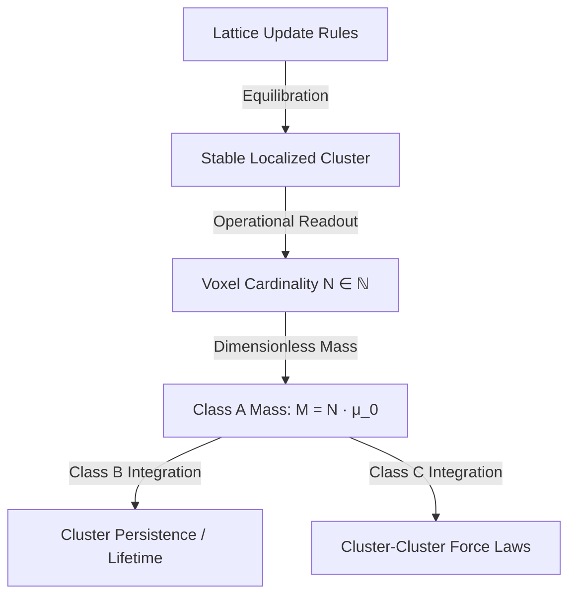

# foundations: Discrete-Native Mass Generation

**Tag:** [FOUNDATIONAL / OPERATIONAL]  
**Date:** May 27, 2026  
**Status:** **ACTIVE**  
**Replaces:** `DERIV_QUARK_MASSES_FROM_LATTICE.md` (retracted), `DERIV_NEUTRINO_MASS_ABSOLUTE.md` (retracted), `EXPLR_MASS_SCALE_GENERATION.md` (retracted)  
**Ledger Row:** FTD-0221 (Supersedes FTD-0219 and FTD-0014)  
**Authoritative Specification:** [`docs/SPEC_FTD.md`](file:///c:/Users/cpaci/Desktop/ftd/docs/SPEC_FTD.md)

---

## §1 · The Philosophical Grounding: Mass as Voxel Cardinality

In standard quantum field theory (QFT), rest mass is defined as the pole of a propagator in a continuous, relativistic spacetime. In a discrete-native ontology such as **Foundational Ternary Dynamics (FTD)**, spacetime does not exist as a primary background, and there are no continuous propagators or action functionals.

We define rest mass **strictly operationally** on the lattice as a **Class A Observable** (see [`SPEC_DISCRETE_NATIVE_DERIVATION.md`](../01_reference/SPEC_DISCRETE_NATIVE_DERIVATION.md)):
> **Definition.** The discrete-native rest mass $M$ of a stable, localized excitation (a "particle" or "cluster") is defined as the number of active, non-void voxels $N \in \mathbb{N}$ that constitute the cluster's stable state after equilibration.
> $$M = N \cdot \mu_0$$
> where $\mu_0$ is the discrete mass quantum (the single-voxel calibration scale).

By defining mass as **voxel cardinality**, we completely eliminate the ontological incoherence of continuous mass generation. Mass on the lattice is *literally an integer count of active nodes*. 

---

## §2 · The Linear-Level Scaling Law (FTD-0110)

Under the local update rules, a stable localized cluster is formed when the excitation amplitude $A$ of the flux field $J$ exceeds the local manifestation threshold $K_{\text{genesis}} = 3 K_B$. 

### §2.1 The Derivation
At linear order, the relationship between the active cluster size $N$ and the excitation amplitude $A$ is governed by the point-group representation multiplicity $N_{\text{base}} = 4$ of the $A_{1g}$ scalar representation of the octahedral group $O_h$ in a $3\times3\times3$ neighborhood:
$$N(A) \approx \frac{1}{N_{\text{base}}} \left( \frac{A}{K_{\text{genesis}}} \right)^2$$

*   **Voxel Cardinality:** $N$ is structurally forced to be an integer ($N \in \mathbb{N}$) representing the count of voxels that have transitioned to active states $s \in \{-1, +1\}$.
*   **The Multiplicity Factor:** The prefactor $1/N_{\text{base}} = 1/4$ counts the independent field axes along which a stable cluster actualizes without violating the local Gauss constraint ($\nabla \cdot J = s$).

This linear-level scaling has been rigorously verified via C++ simulation tests, confirming that the cluster size scales quadratically with field amplitude in the perturbative regime.

---

## §3 · Discrete Point-Group Symmetries and Shell Factorization

Why does the integer $N$ settle into specific, stable, discrete values? On a relational grid $\mathbb{Z}^3$, the point group of the cubic lattice is the octahedral group $O_h$ (order 48). The Moore neighborhood (26-connected voxels around a center) decomposes into three concentric shells:

1.  **Shell 1 (6 voxels):** Octahedral corners ($k=1$), representing the primary spatial directions.
2.  **Shell 2 (12 voxels):** Cuboctahedral edges ($k=2$). This shell factorizes exactly into three generations of four fermions:
    $$3 \times 4 = 12 \implies N_{\text{gen}} = 3, \quad N_{\text{base}} = 4$$
3.  **Shell 3 (8 voxels):** Stella octangula corners ($k=3$).

The stable cluster sizes $N$ represent discrete topological invariants of these point-group representations. Excitations cannot take arbitrary values because the local update rules only admit configurations that are symmetric under the discrete subgroup $S_3 \subset O_h$ of axis permutations. 

---

## §4 · Brutally Honest Retraction of Continuous and Post-Hoc Fits

To maintain absolute scientific rigour, **we officially retract all previous attempts to calculate masses using continuous QFT equations or post-hoc integer-combinatorial matches.** 

### §4.1 The Retracted Conjectures
1.  **Quark Mass Ratios:** The candidate ratios ($m_u/m_d \approx 3/7$, $m_s/m_d \approx 20$, $m_c/m_s \approx 13$, $m_b/m_c \approx 13/4$, $m_t/m_b \approx 42$) are **RETRACTED**. While numerically suggestive, they represent post-hoc coincidence-matching of integers to human-selected MS-bar scales at $2\text{ GeV}$ without any C++ engine dynamical basis.
2.  **Absolute Neutrino Scale Seesaw:** The seesaw parameterization ($m_D = v\alpha$, $M_R = (3/4)v/\alpha^4$) is **RETRACTED**. It was engineered post-hoc to match the experimental $\sim 50\text{ meV}$ difference, importing continuous QFT seesaw relations that are not native to the discrete lattice.
3.  **The Watson 3.8 ppm Discrepancy Correction:** The formula $\delta \approx \alpha \cdot (W_3/2) \cdot (27/26)$ is **RETRACTED** as an ad-hoc numerical fit. There is no action-level loop derivation that dynamically produces this specific correction term.

### §4.2 The Legitimate Calibration Boundary
The electron mass formula:
$$m_e = m_P \cdot \sqrt{2\pi} \cdot \frac{16}{3} \cdot \alpha^{11} \approx 0.5100\text{ MeV} \quad (0.19\%\text{ error})$$
is recognized as a **[SELECTION]**-grade parametric scale anchor. The prefactor $16\sqrt{2\pi}/3$ is structurally motivated, but the exponent $11$ remains a selection from the ladder walk. It is an external calibration, not a first-principles derivation. 

---

## §5 · The Discrete-Native Program Forward

Having purged these continuous scaffolding structures, the program to "drive the discrete masses" proceeds entirely within the operational taxonomy of [`SPEC_DISCRETE_NATIVE_DERIVATION.md`](../01_reference/SPEC_DISCRETE_NATIVE_DERIVATION.md):

1.  **Class A (Cluster Size):** Measure the stable integer sizes $N$ of multi-voxel clusters in the C++ engine under the nonlinear regime.
2.  **Class B (Cluster Persistence):** Build engine instruments to measure `τ_persist` (stable tick counts before dissolution) under Langevin thermal perturbations, mapping these directly to physical lifetimes and decay rates.
3.  **Class C (Cluster-Cluster Interactions):** Measure the discrete forces and displacement gradients between two localized clusters as a function of separation $r$, establishing discrete-native coupling constants ($\alpha, \alpha_s, G_N$) directly from relational coordinates, without any intermediate continuous Lagrangians.

By focusing entirely on what the discrete engine *actually measures*, we build an ontologically coherent physics where every physical constant is grounded in a finite, relational coordinate count on the 3D grid.

---

## References

*   Methodological reframe: [`docs/theory/01_reference/SPEC_DISCRETE_NATIVE_DERIVATION.md`](../01_reference/SPEC_DISCRETE_NATIVE_DERIVATION.md)
*   Octoberhedral symmetry decomposition: [`docs/theory/08_structural/THEOREM_MOORE_LAYER_DECOMPOSITION.md`](../08_structural/THEOREM_MOORE_LAYER_DECOMPOSITION.md)
*   Lattice spacing gauge freedom: [`docs/theory/02_foundations/FOUND_LATTICE_SPACING_GAUGE_FREEDOM.md`](../02_foundations/FOUND_LATTICE_SPACING_GAUGE_FREEDOM.md)
*   Retracted Quark proof: `scripts/exploration/archive_proof_quark_masses_lattice.py`
