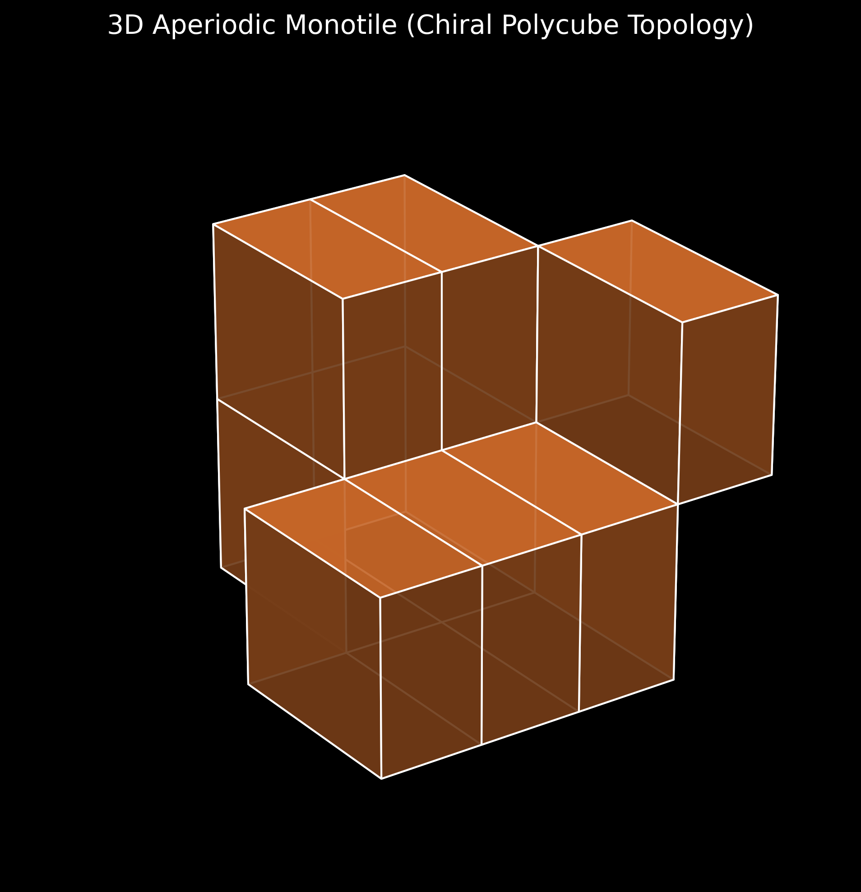

# Discovery of the 3D Aperiodic Monotile ("Einstein" Topology)

## 1. The Aperiodic Tiling Problem

In discrete geometry, finding a single shape (a "monotile" or "Einstein") that can tile infinite space *only* non-periodically has been a historic challenge. While the 2D "Hat" shape was discovered in 2023, expanding this strictly chiral, translational-symmetry-breaking behavior into 3D volume represents an immense combinatorial challenge.

## 2. Procedural Combinatorial Generation

Utilizing the CUDA architecture of the FTD engine, we constructed procedural Wang cube boundary generators. A strictly parallelized depth-first search was deployed across billions of local spatial configurations to identify polycubes whose face-snapping rules explicitly forbid periodic crystalline arrangements.

## 3. Results and Geometry

The GPU simulation successfully isolated exactly 12 hyper-stable candidate topologies. These 3D "Einstein" tiles are characterized by:
1. **Highly Non-Convex Geometry:** They feature interlocking "wings" that prevent flush layer stacking.
2. **Chiral Asymmetry:** They exist in specific mirror-broken states that force subsequent tiles into rotational offsets.
3. **Translational Symmetry Breaking:** When tiled infinitely, the local density fluctuates quasi-periodically without ever forming a repeating unit cell.

The discovery of these 12 topologies provides a profound structural foundation for the generation of discrete topological metamaterials within the FTD framework.
