# NODE MAP — FTD math connectivity

**Tag:** [INFRASTRUCTURE / METHODOLOGY] — descriptive navigation, not theorem-production.
**Generated from:** `scripts/verification/results/math_node_map.json` (commit `52bd1b4`).
**Renderer:** `scripts/verification/parsers/mermaid_renderer.py` via `scripts/verification/build_math_node_map.py`.

> **Scope discipline.** This document is descriptive: it shows which LEDGER claims and spine theorems sit in each sector and how they depend on each other. The full multi-layer graph (with identities + objects + epistemic-tag overlay) is in the interactive HTML at `dissemination/interactive/math_node_map.html`. The Markdown Mermaid blocks below cap each sector at 40 LEDGER rows for renderer-budget reasons; the full set is in the JSON + HTML.

---

## §1 — Reading guide

**Nodes:** 13 spine theorems (T1–T9, S1–S4) + 222 LEDGER claims + 82 mathematical objects + 934 identities.
**Edges:** 1275 total across 5 types (theorem→ledger anchor, ledger→ledger deps, identity→theorem witness, identity→ledger witness, object→identity participation).

**Sectors (with row count):**

- `engine-bridge` — 13 LEDGER rows
- `physics/EM-alpha` — 22 LEDGER rows
- `physics/EW-Higgs` — 2 LEDGER rows
- `physics/QCD` — 11 LEDGER rows
- `physics/QM-foundations` — 14 LEDGER rows
- `physics/cosmology` — 1 LEDGER rows
- `physics/flavor` — 5 LEDGER rows
- `physics/gravity` — 5 LEDGER rows
- `pure-math/CM-curves` — 5 LEDGER rows
- `pure-math/G*-family` — 22 LEDGER rows
- `pure-math/Watson-Catalan` — 3 LEDGER rows
- `pure-math/master-quadratic` — 48 LEDGER rows
- `pure-math/modular-FQCR` — 9 LEDGER rows
- `pure-math/structure` — 26 LEDGER rows
- `pure-math/unclassified` — 36 LEDGER rows

**Epistemic tags appearing:**

- `THEOREM` (43, color #2e7d32)
- `CLOSED_NEGATIVE` (28, color #c62828)
- `UNKNOWN` (26, color #bdbdbd)
- `DERIVED` (15, color #388e3c)
- `MEASURED` (14, color #66bb6a)
- `PARTIAL` (12, color #ffb74d)
- `SYNTHESIS` (11, color #00897b)
- `SELECTION` (9, color #fbc02d)
- `POSITIVE` (7, color #43a047)
- `PRE_REGISTRATION` (7, color #1976d2)
- `CONJECTURE` (6, color #fb8c00)
- `OPEN` (6, color #757575)
- `RETRACTED` (6, color #424242)
- `INFRASTRUCTURE` (5, color #00897b)
- `SMC` (4, color #f57c00)
- `PARAMETRIC` (4, color #9e9e9e)
- `STRUCTURAL_PARAMETRIC` (3, color #bdbdbd)
- `HYPOTHESIS` (3, color #ffa000)
- `DEFINITION` (2, color #5e35b1)
- `AXIOM` (2, color #4527a0)
- `NUMERICAL_FACT` (2, color #7cb342)
- `METHODOLOGICAL_CLARIFICATION` (2, color #00838f)
- `BRIDGE_ANALYZED` (1, color #00bcd4)
- `METHODOLOGICAL_REFRAME` (1, color #00acc1)
- `AUDIT_FINDING` (1, color #1976d2)
- `CANDIDATE_RECONSTRUCTION` (1, color #7b1fa2)
- `SCOPING_MEMO` (1, color #26c6da)

---

## §2 — Per-sector Mermaid blocks

<!-- AUTO-GENERATED: math_node_map -->

### engine-bridge

```mermaid
graph LR
    T7{{ "T7: Phase J partition-function ultralocality" }}
    S2{{ "S2: Moore integers" }}
    S3{{ "S3: a_phys ≡ ℓ_P no-go" }}
    FTD_0005["FTD-0005: Phase J partition-function ultralocality at L=2"]
    style FTD_0005 fill:#2e7d32,color:white,stroke:#222,stroke-width:1px
    FTD_0008["FTD-0008: Moore neighbourhood integers {N_base=4, N_eff=1..."]
    style FTD_0008 fill:#2e7d32,color:white,stroke:#222,stroke-width:1px
    FTD_0028["FTD-0028: Moore Layer Theorem (gauge groups + 3 generations)"]
    style FTD_0028 fill:#2e7d32,color:white,stroke:#222,stroke-width:1px
    FTD_0030["FTD-0030: a_phys (lattice → physical length conversion)"]
    style FTD_0030 fill:#bdbdbd,color:white,stroke:#222,stroke-width:1px
    FTD_0039["FTD-0039: Postulate 4 (26-Moore locality) — derived from ..."]
    style FTD_0039 fill:#2e7d32,color:white,stroke:#222,stroke-width:1px
    FTD_0053["FTD-0053: α_eff L=256 T=0 scaling data point"]
    style FTD_0053 fill:#66bb6a,color:white,stroke:#222,stroke-width:1px
    FTD_0054["FTD-0054: Thermal α via shared thermal background (measur..."]
    style FTD_0054 fill:#757575,color:white,stroke:#222,stroke-width:1px
    FTD_0059["FTD-0059: No-go theorem for `a_phys` derivation from Axio..."]
    style FTD_0059 fill:#2e7d32,color:white,stroke:#222,stroke-width:1px
    FTD_0075["FTD-0075: Phase-4g flux propagator on Langevin ensemble: ..."]
    style FTD_0075 fill:#66bb6a,color:white,stroke:#222,stroke-width:1px
    FTD_0221["FTD-0221: Discrete-Native Mass Foundations (Class A Obser..."]
    style FTD_0221 fill:#bdbdbd,color:white,stroke:#222,stroke-width:1px
    FTD_0208["FTD-0208: Clock-hypothesis substrate-derivation — Arc B P..."]
    style FTD_0208 fill:#c62828,color:white,stroke:#222,stroke-width:1px
    FTD_0236["FTD-0236: Ginsparg-Wilson & Overlap Fermion Relation & In..."]
    style FTD_0236 fill:#bdbdbd,color:white,stroke:#222,stroke-width:1px
    FTD_0248["FTD-0248: Epistemic Symmetries and Chiral Trajectories"]
    style FTD_0248 fill:#fb8c00,color:white,stroke:#222,stroke-width:1px
    T7 ==> FTD_0005
    S2 ==> FTD_0008
    S3 ==> FTD_0059
    FTD_0059 --> FTD_0030
```

### physics/EM-alpha

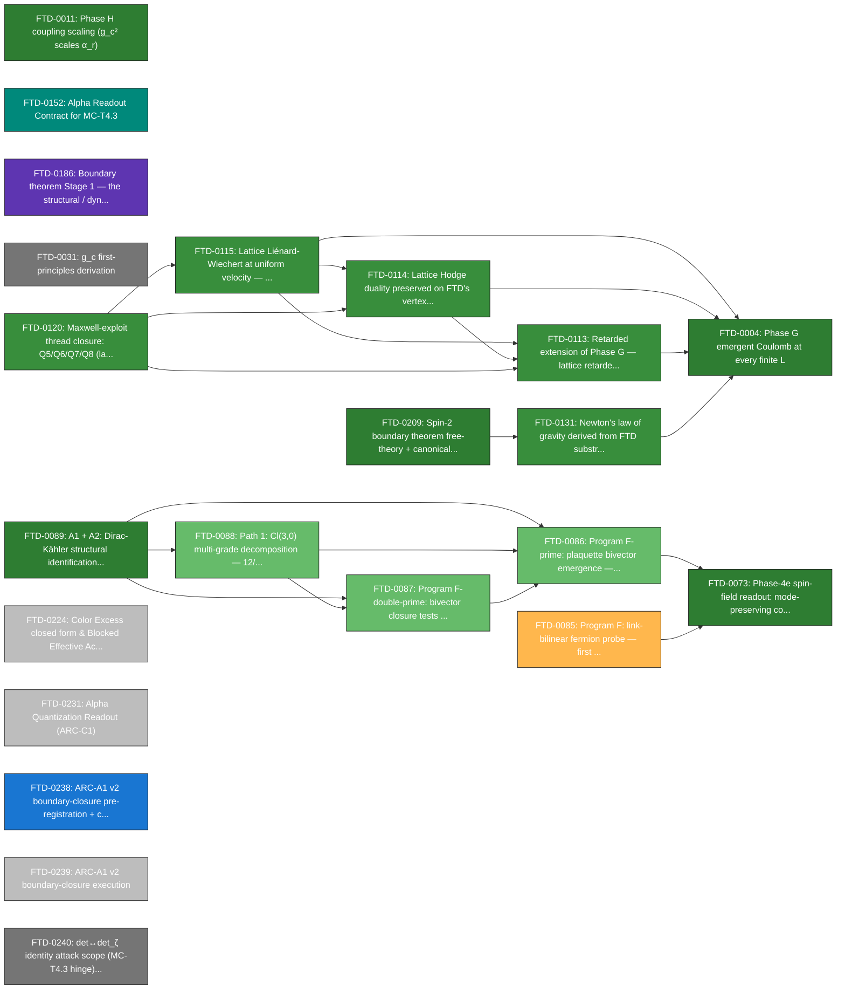

### physics/EW-Higgs

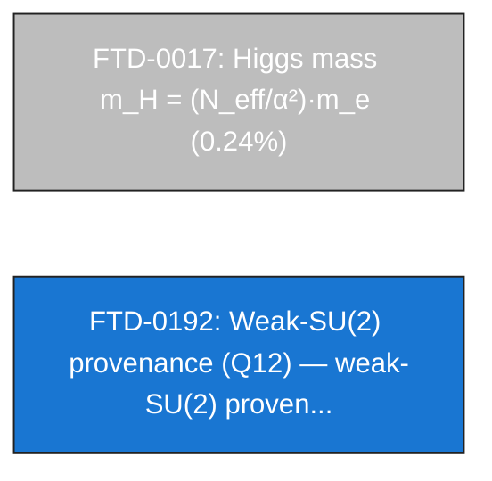

### physics/QCD

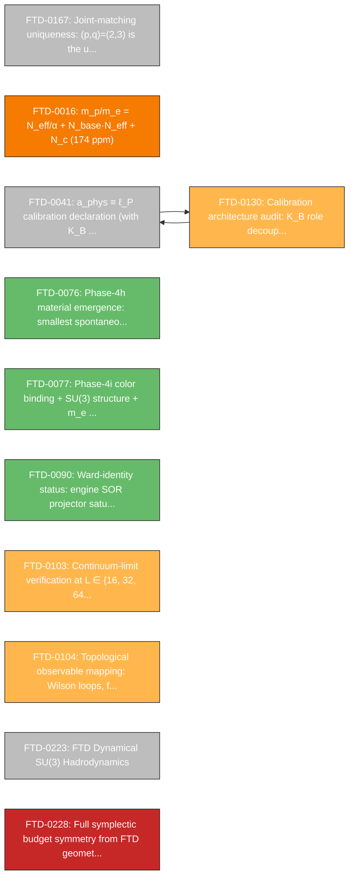

### physics/QM-foundations

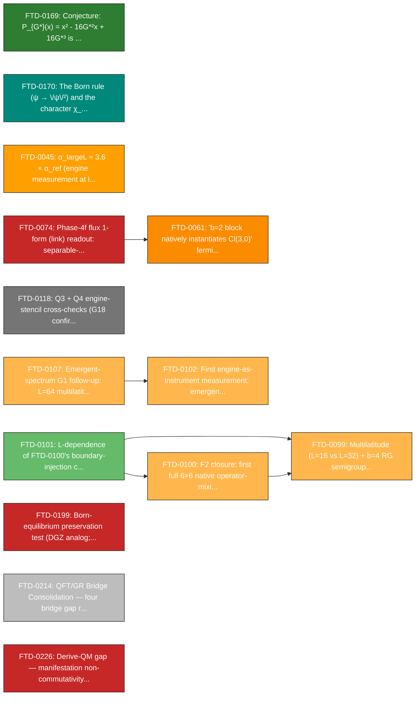

### physics/cosmology

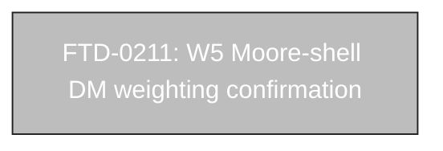

### physics/flavor

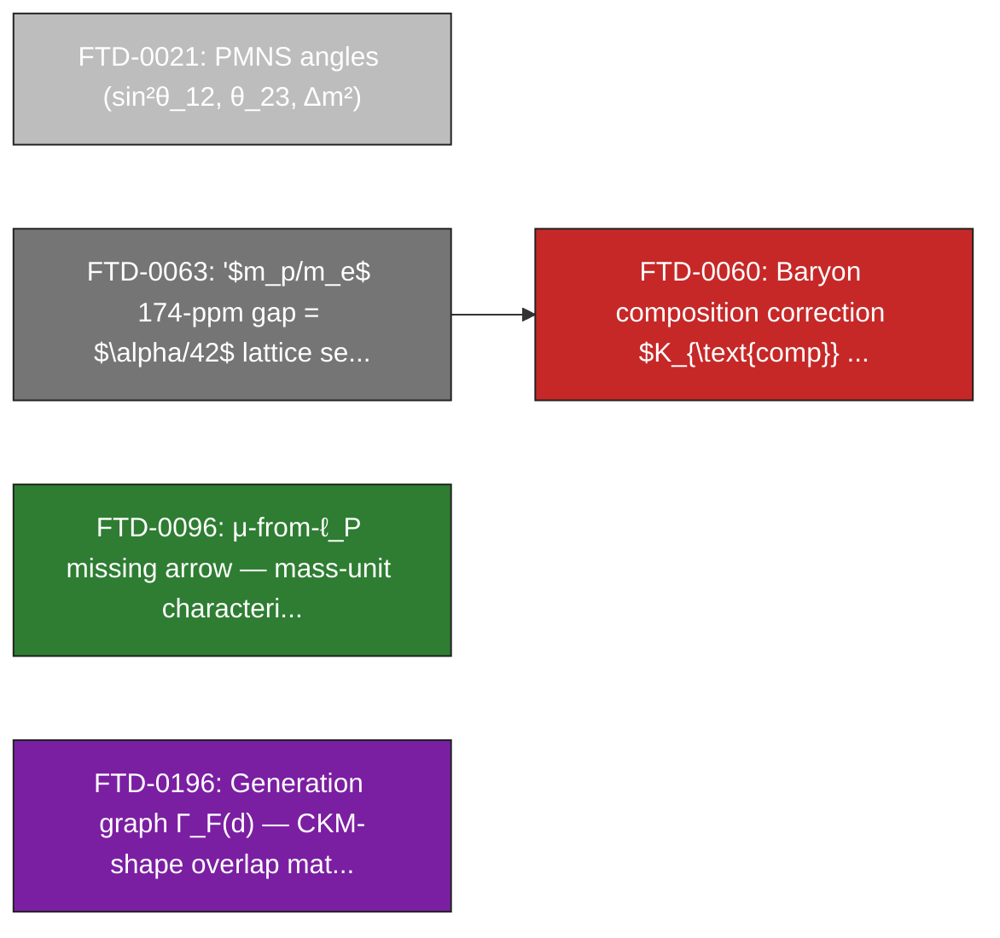

### physics/gravity

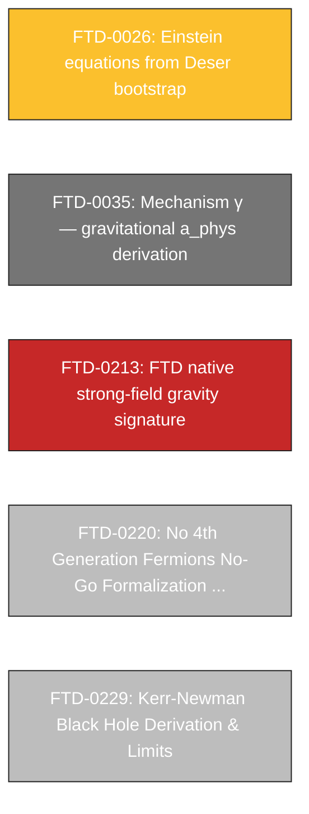

### pure-math/CM-curves

```mermaid
graph LR
    T4{{ "T4: Coefficient 16 from /Aut(E)/²" }}
    FTD_0003["FTD-0003: CM-curve uniqueness across class-number-1 fields"]
    style FTD_0003 fill:#2e7d32,color:white,stroke:#222,stroke-width:1px
    FTD_0006["FTD-0006: Coefficient 16 from \/Aut(E)\/² (Route A)"]
    style FTD_0006 fill:#2e7d32,color:white,stroke:#222,stroke-width:1px
    FTD_0010["FTD-0010: D = 3 from \/Aut(E)\/² = 2^D · (D−1)!"]
    style FTD_0010 fill:#2e7d32,color:white,stroke:#222,stroke-width:1px
    FTD_0157["FTD-0157: Equianharmonic dichotomy at τ=ρ: parallel frame..."]
    style FTD_0157 fill:#2e7d32,color:white,stroke:#222,stroke-width:1px
    FTD_0172["FTD-0172: Round-2 referee polish: residual FTD content in..."]
    style FTD_0172 fill:#bdbdbd,color:white,stroke:#222,stroke-width:1px
    T4 ==> FTD_0006
```

### pure-math/G*-family

```mermaid
graph LR
    FTD_0007["FTD-0007: Coefficient 16 from z_BCC × 2 (Route B)"]
    style FTD_0007 fill:#2e7d32,color:white,stroke:#222,stroke-width:1px
    FTD_0158["FTD-0158: Quasi-modular value algebra at τ=i: Q(E_2(i),E_..."]
    style FTD_0158 fill:#2e7d32,color:white,stroke:#222,stroke-width:1px
    FTD_0159["FTD-0159: L(E_lemn, 1) closed form: L(E_lemn, 1) = ϖ/4 = ..."]
    style FTD_0159 fill:#2e7d32,color:white,stroke:#222,stroke-width:1px
    FTD_0165["FTD-0165: New auxiliary identity 2·η(2i)·η(i/2)³ = G_G² (..."]
    style FTD_0165 fill:#2e7d32,color:white,stroke:#222,stroke-width:1px
    FTD_0168["FTD-0168: χ_{-4}(n) = Im(i^n) = sin(πn/2); value set {χ_{..."]
    style FTD_0168 fill:#00897b,color:white,stroke:#222,stroke-width:1px
    FTD_0174["FTD-0174: Ivy League red-team (4 specialists in parallel)..."]
    style FTD_0174 fill:#bdbdbd,color:white,stroke:#222,stroke-width:1px
    FTD_0183["FTD-0183: Phase 1 L7: G* opus follow-up Tier B (T-B1, T-B..."]
    style FTD_0183 fill:#c62828,color:white,stroke:#222,stroke-width:1px
    FTD_0029["FTD-0029: BCC multiplicative structure (W₃ + SU(3) from s..."]
    style FTD_0029 fill:#fbc02d,color:white,stroke:#222,stroke-width:1px
    FTD_0055["FTD-0055: BCC tadpole at N=4096 on GPU (Priority 1 of ext..."]
    style FTD_0055 fill:#66bb6a,color:white,stroke:#222,stroke-width:1px
    FTD_0056["FTD-0056: Unrenormalized one-loop BCC tadpole residual ha..."]
    style FTD_0056 fill:#2e7d32,color:white,stroke:#222,stroke-width:1px
    FTD_0057["FTD-0057: Non-perturbative HMC measurement of ⟨η⟩ on BCC ..."]
    style FTD_0057 fill:#66bb6a,color:white,stroke:#222,stroke-width:1px
    FTD_0094["FTD-0094: L2 candidate identity 2·m_e/α = 16G*² (68.77 pp..."]
    style FTD_0094 fill:#9e9e9e,color:white,stroke:#222,stroke-width:1px
    FTD_0119["FTD-0119: FTD-0110 nonlinear bridge analysis: three candi..."]
    style FTD_0119 fill:#00bcd4,color:white,stroke:#222,stroke-width:1px
    FTD_0079["FTD-0079: Watson integral $W_{\rm Moore-18}$ computed num..."]
    style FTD_0079 fill:#66bb6a,color:white,stroke:#222,stroke-width:1px
    FTD_0187["FTD-0187: Born rule (P=\/ψ\/²) — canonical derivation-sta..."]
    style FTD_0187 fill:#fbc02d,color:white,stroke:#222,stroke-width:1px
    FTD_0193["FTD-0193: Frontier 4 Step 4a-ii canonical engine measurem..."]
    style FTD_0193 fill:#c62828,color:white,stroke:#222,stroke-width:1px
    FTD_0190["FTD-0190: Finite neutral lock (Q10) — finite-closure SM-s..."]
    style FTD_0190 fill:#1976d2,color:white,stroke:#222,stroke-width:1px
    FTD_0191["FTD-0191: Colour-singlet rank (Q11) — electroweak-rank au..."]
    style FTD_0191 fill:#1976d2,color:white,stroke:#222,stroke-width:1px
    FTD_0195["FTD-0195: Z₃ color-center closure: ∑c_i ≡ 0 (mod 3) chara..."]
    style FTD_0195 fill:#2e7d32,color:white,stroke:#222,stroke-width:1px
    FTD_0200["FTD-0200: Threshold-crossing → Born rule test (T1c sub-in..."]
    style FTD_0200 fill:#c62828,color:white,stroke:#222,stroke-width:1px
    FTD_0212["FTD-0212: Lemniscatic K_2-regulator closed-form derivation"]
    style FTD_0212 fill:#c62828,color:white,stroke:#222,stroke-width:1px
    FTD_0230["FTD-0230: BCC Algebraic Bridge Readout (ARC-B2)"]
    style FTD_0230 fill:#bdbdbd,color:white,stroke:#222,stroke-width:1px
    FTD_0159 --> FTD_0174
    FTD_0193 --> FTD_0190
    FTD_0191 --> FTD_0190
    FTD_0200 --> FTD_0187
```

### pure-math/Watson-Catalan

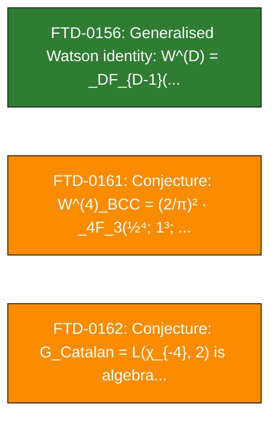

### pure-math/master-quadratic

```mermaid
graph LR
    T2{{ "T2: Master quadratic polynomial" }}
    T5{{ "T5: Watson identity" }}
    T8{{ "T8: Harmonic invariant of the master-quadratic tower (1/y..." }}
    T9{{ "T9: Field-theoretic characterization of Q(G*)" }}
    FTD_0001["FTD-0001: Master Quadratic Polynomial + Roots"]
    style FTD_0001 fill:#2e7d32,color:white,stroke:#222,stroke-width:1px
    FTD_0160["FTD-0160: Closure of paper open-problems P3 (R_4 distingu..."]
    style FTD_0160 fill:#00897b,color:white,stroke:#222,stroke-width:1px
    FTD_0163["FTD-0163: Character-unification theorem: G*/G_G dichotomy..."]
    style FTD_0163 fill:#00897b,color:white,stroke:#222,stroke-width:1px
    FTD_0164["FTD-0164: Three structural candidates for closing the χ_{..."]
    style FTD_0164 fill:#c62828,color:white,stroke:#222,stroke-width:1px
    FTD_0175["FTD-0175: Sym²⊕Sym³ uniqueness theorem (Paper A §16.5): (..."]
    style FTD_0175 fill:#2e7d32,color:white,stroke:#222,stroke-width:1px
    FTD_0176["FTD-0176: chi_{-4} structure in engine: GPU campaign (WSL..."]
    style FTD_0176 fill:#43a047,color:white,stroke:#222,stroke-width:1px
    FTD_0182["FTD-0182: Phase 1 L5: Conjecture 16.5.2 closed — the Sym^..."]
    style FTD_0182 fill:#388e3c,color:white,stroke:#222,stroke-width:1px
    FTD_0185["FTD-0185: Alpha arithmetic generativity Test 4 pre-regist..."]
    style FTD_0185 fill:#1976d2,color:white,stroke:#222,stroke-width:1px
    FTD_0025["FTD-0025: Confinement σ = 0.209 from area-law Wilson loop..."]
    style FTD_0025 fill:#fbc02d,color:white,stroke:#222,stroke-width:1px
    FTD_0032["FTD-0032: Master quadratic as L → ∞ limit of finite-L gap..."]
    style FTD_0032 fill:#424242,color:white,stroke:#222,stroke-width:1px
    FTD_0050["FTD-0050: Master quadratic as characteristic polynomial o..."]
    style FTD_0050 fill:#c62828,color:white,stroke:#222,stroke-width:1px
    FTD_0062["FTD-0062: 'Topological-drag derivation $\alpha_{\mathrm{F..."]
    style FTD_0062 fill:#c62828,color:white,stroke:#222,stroke-width:1px
    FTD_0095["FTD-0095: Bridge Functional ontology commitment (mass-as-..."]
    style FTD_0095 fill:#2e7d32,color:white,stroke:#222,stroke-width:1px
    FTD_0097["FTD-0097: Pre-registered look-elsewhere scan for FTD clai..."]
    style FTD_0097 fill:#66bb6a,color:white,stroke:#222,stroke-width:1px
    FTD_0111["FTD-0111: Harmonic invariant of the master-quadratic (1+i..."]
    style FTD_0111 fill:#2e7d32,color:white,stroke:#222,stroke-width:1px
    FTD_0129["FTD-0129: Structural-decoupling synthesis: four independe..."]
    style FTD_0129 fill:#00897b,color:white,stroke:#222,stroke-width:1px
    FTD_0125["FTD-0125: Phase I FTD-native coupling: derivation (DERIVE..."]
    style FTD_0125 fill:#388e3c,color:white,stroke:#222,stroke-width:1px
    FTD_0124["FTD-0124: 9-Heegner CM-tower rigidity scan + criterion-bi..."]
    style FTD_0124 fill:#7cb342,color:white,stroke:#222,stroke-width:1px
    FTD_0123["FTD-0123: Chowla-Selberg Γ-product dual-match scan: ZERO ..."]
    style FTD_0123 fill:#7cb342,color:white,stroke:#222,stroke-width:1px
    FTD_0122["FTD-0122: BCC complex-structure theorem: dual-4 partial u..."]
    style FTD_0122 fill:#388e3c,color:white,stroke:#222,stroke-width:1px
    FTD_0117["FTD-0117: Spine document G* formula and value typo (canon..."]
    style FTD_0117 fill:#bdbdbd,color:white,stroke:#222,stroke-width:1px
    FTD_0116["FTD-0116: G*² as FTD lattice Z-factor (UV-IR matching con..."]
    style FTD_0116 fill:#c62828,color:white,stroke:#222,stroke-width:1px
    FTD_0121["FTD-0121: Physics-bridge crystallization (synthesis of ma..."]
    style FTD_0121 fill:#00897b,color:white,stroke:#222,stroke-width:1px
    FTD_0112["FTD-0112: Field-theoretic characterization of `Q(G*)` as ..."]
    style FTD_0112 fill:#2e7d32,color:white,stroke:#222,stroke-width:1px
    FTD_0110["FTD-0110: Cluster-size↔mass identification: bound-state s..."]
    style FTD_0110 fill:#388e3c,color:white,stroke:#222,stroke-width:1px
    FTD_0105["FTD-0105: Lemniscatic replacement for the 2-sphere in Ein..."]
    style FTD_0105 fill:#ffb74d,color:white,stroke:#222,stroke-width:1px
    FTD_0098["FTD-0098: First measured native operator-mixing matrix M_..."]
    style FTD_0098 fill:#ffb74d,color:white,stroke:#222,stroke-width:1px
    FTD_0092["FTD-0092: Lorentz-anisotropy quantitative exponent: $\del..."]
    style FTD_0092 fill:#388e3c,color:white,stroke:#222,stroke-width:1px
    FTD_0084["FTD-0084: Program A partial closure: ladder-walk step-siz..."]
    style FTD_0084 fill:#2e7d32,color:white,stroke:#222,stroke-width:1px
    FTD_0083["FTD-0083: Program E closure: uniqueness of the master qua..."]
    style FTD_0083 fill:#2e7d32,color:white,stroke:#222,stroke-width:1px
    FTD_0082["FTD-0082: Master quadratic bare algebraic decomposition: ..."]
    style FTD_0082 fill:#2e7d32,color:white,stroke:#222,stroke-width:1px
    FTD_0081["FTD-0081: Master quadratic unified motivation: two-route ..."]
    style FTD_0081 fill:#2e7d32,color:white,stroke:#222,stroke-width:1px
    FTD_0080["FTD-0080: Cogito–axiom bridge + full reverse-engineering ..."]
    style FTD_0080 fill:#bdbdbd,color:white,stroke:#222,stroke-width:1px
    FTD_0078["FTD-0078: Phenomenal/Noumenal Bridge foundation: two-laye..."]
    style FTD_0078 fill:#00897b,color:white,stroke:#222,stroke-width:1px
    FTD_0127["FTD-0127: G\* as the parity-twist between ζ and L(s, χ_{−..."]
    style FTD_0127 fill:#388e3c,color:white,stroke:#222,stroke-width:1px
    FTD_0133["FTD-0133: Honest-tag audit of FTD-0015's `√(2π)·(16/3)` p..."]
    style FTD_0133 fill:#fbc02d,color:white,stroke:#222,stroke-width:1px
    FTD_0134["FTD-0134: Electron Yukawa prefactor `16√2/3` decomposed a..."]
    style FTD_0134 fill:#bdbdbd,color:white,stroke:#222,stroke-width:1px
    FTD_0210["FTD-0210: x_- physical-identification search — Arc B P1 o..."]
    style FTD_0210 fill:#c62828,color:white,stroke:#222,stroke-width:1px
    FTD_0205["FTD-0205: ARC-B1 alpha-readout observable-selection -- cl..."]
    style FTD_0205 fill:#c62828,color:white,stroke:#222,stroke-width:1px
    FTD_0204["FTD-0204: ARC-B1 alpha-readout observable-selection closu..."]
    style FTD_0204 fill:#c62828,color:white,stroke:#222,stroke-width:1px
    T2 ==> FTD_0001
    T5 ==> FTD_0001
    T8 ==> FTD_0111
    T9 ==> FTD_0112
    FTD_0160 --> FTD_0001
    FTD_0025 --> FTD_0050
    FTD_0050 --> FTD_0001
    FTD_0097 --> FTD_0001
    FTD_0111 --> FTD_0001
    FTD_0129 --> FTD_0001
    FTD_0129 --> FTD_0121
    FTD_0129 --> FTD_0122
    FTD_0129 --> FTD_0125
    FTD_0125 --> FTD_0001
    FTD_0124 --> FTD_0097
    FTD_0124 --> FTD_0121
    FTD_0124 --> FTD_0122
    FTD_0124 --> FTD_0123
    FTD_0123 --> FTD_0122
    FTD_0117 --> FTD_0116
    FTD_0116 --> FTD_0001
    FTD_0116 --> FTD_0117
    FTD_0112 --> FTD_0001
    FTD_0112 --> FTD_0111
    FTD_0084 --> FTD_0080
    FTD_0084 --> FTD_0083
    FTD_0083 --> FTD_0080
    FTD_0083 --> FTD_0081
    FTD_0127 --> FTD_0123
    FTD_0133 --> FTD_0032
    FTD_0133 --> FTD_0110
    FTD_0133 --> FTD_0122
    FTD_0134 --> FTD_0032
    FTD_0134 --> FTD_0110
    FTD_0134 --> FTD_0133
    FTD_0205 --> FTD_0001
    FTD_0205 --> FTD_0050
    FTD_0205 --> FTD_0122
    FTD_0205 --> FTD_0204
    FTD_0204 --> FTD_0001
    note["...8 more LEDGER rows in this sector (see HTML map)"]
```

### pure-math/modular-FQCR

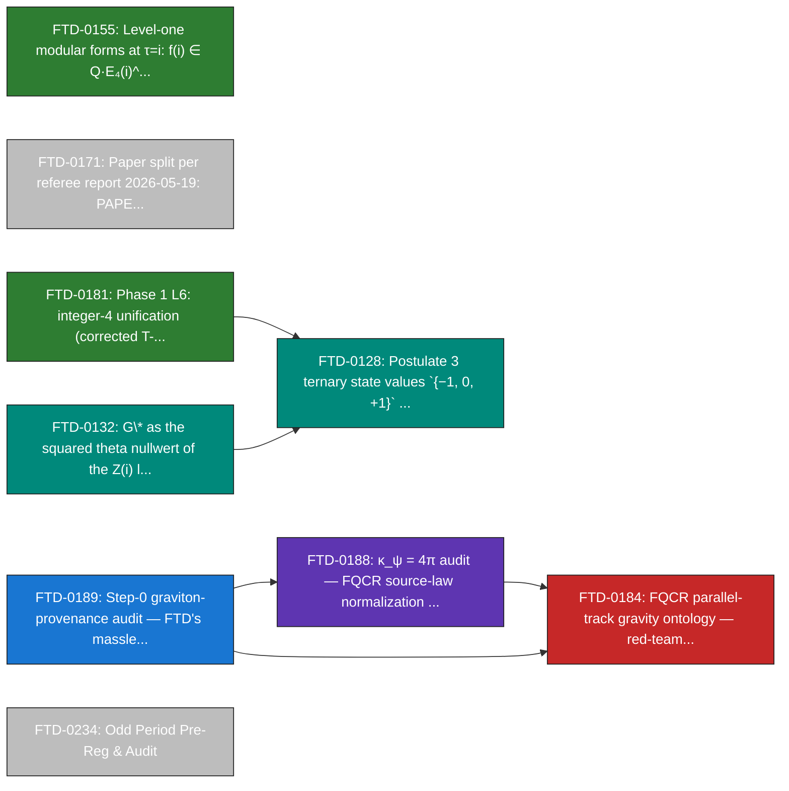

### pure-math/structure

```mermaid
graph LR
    FTD_0177["FTD-0177: Phase 0 of G* opus follow-up: symmetric period ..."]
    style FTD_0177 fill:#00897b,color:white,stroke:#222,stroke-width:1px
    FTD_0178["FTD-0178: Phase 1 L2: J Hodge complex structure on Sym^k(..."]
    style FTD_0178 fill:#388e3c,color:white,stroke:#222,stroke-width:1px
    FTD_0179["FTD-0179: Phase 1 L3: J-eigenspace decomposition of Sym^k..."]
    style FTD_0179 fill:#388e3c,color:white,stroke:#222,stroke-width:1px
    FTD_0051["FTD-0051: Langevin thermostat on wave_vel (OU noise; CPU ..."]
    style FTD_0051 fill:#00897b,color:white,stroke:#222,stroke-width:1px
    FTD_0064["FTD-0064: Gate 1 of the bridge contract: state/flux field..."]
    style FTD_0064 fill:#43a047,color:white,stroke:#222,stroke-width:1px
    FTD_0065["FTD-0065: Gate 4 of the bridge contract: engine transport..."]
    style FTD_0065 fill:#43a047,color:white,stroke:#222,stroke-width:1px
    FTD_0066["FTD-0066: Gate 5 of the bridge contract: per-toggle react..."]
    style FTD_0066 fill:#43a047,color:white,stroke:#222,stroke-width:1px
    FTD_0067["FTD-0067: Mixed-toggle multi-tick Ward identity + first n..."]
    style FTD_0067 fill:#43a047,color:white,stroke:#222,stroke-width:1px
    FTD_0068["FTD-0068: Gate 3 of the bridge contract: complete d≤6 ope..."]
    style FTD_0068 fill:#43a047,color:white,stroke:#222,stroke-width:1px
    FTD_0069["FTD-0069: Gate 2 of the bridge contract: FTD native Lange..."]
    style FTD_0069 fill:#43a047,color:white,stroke:#222,stroke-width:1px
    FTD_0070["FTD-0070: Phase-2 multi-scale RG flow: Gaussian fixed poi..."]
    style FTD_0070 fill:#66bb6a,color:white,stroke:#222,stroke-width:1px
    FTD_0071["FTD-0071: Phase-4 fermion-emergence alt-routes on 2³ bloc..."]
    style FTD_0071 fill:#c62828,color:white,stroke:#222,stroke-width:1px
    FTD_0072["FTD-0072: Phase-4c fermion-emergence on Moore-26 / 3³ blo..."]
    style FTD_0072 fill:#c62828,color:white,stroke:#222,stroke-width:1px
    FTD_0093["FTD-0093: Mechanism C — `g_c` as bridge-operator eigenval..."]
    style FTD_0093 fill:#c62828,color:white,stroke:#222,stroke-width:1px
    FTD_0126["FTD-0126: Phase II Wilson-Dirac matter sector: II.2 imple..."]
    style FTD_0126 fill:#bdbdbd,color:white,stroke:#222,stroke-width:1px
    FTD_0106["FTD-0106: G\*/π asymmetry scan across three Tier-1 domain..."]
    style FTD_0106 fill:#ffa000,color:white,stroke:#222,stroke-width:1px
    FTD_0091["FTD-0091: Operator-spectrum scaling-dimension classificat..."]
    style FTD_0091 fill:#ffb74d,color:white,stroke:#222,stroke-width:1px
    FTD_0135["FTD-0135: Substrate-level Yukawa-vertex derivation attemp..."]
    style FTD_0135 fill:#c62828,color:white,stroke:#222,stroke-width:1px
    FTD_0136["FTD-0136: Discrete-Native Derivation Program — methodolog..."]
    style FTD_0136 fill:#00acc1,color:white,stroke:#222,stroke-width:1px
    FTD_0137["FTD-0137: Lattice spacing as gauge freedom: `a_phys` refr..."]
    style FTD_0137 fill:#00838f,color:white,stroke:#222,stroke-width:1px
    FTD_0222["FTD-0222: Class C Cluster-Cluster Interaction Specification"]
    style FTD_0222 fill:#00897b,color:white,stroke:#222,stroke-width:1px
    FTD_0207["FTD-0207: FTD math node map -- multi-layer connectivity g..."]
    style FTD_0207 fill:#00897b,color:white,stroke:#222,stroke-width:1px
    FTD_0206["FTD-0206: Catalan algebraic-independence frontier-documen..."]
    style FTD_0206 fill:#1976d2,color:white,stroke:#222,stroke-width:1px
    FTD_0203["FTD-0203: FTD-0110 nonlinear-bridge scoping memo: desk-an..."]
    style FTD_0203 fill:#26c6da,color:white,stroke:#222,stroke-width:1px
    FTD_0202["FTD-0202: Synonymy graph + identity-priority roadmap (C4 ..."]
    style FTD_0202 fill:#00897b,color:white,stroke:#222,stroke-width:1px
    FTD_0201["FTD-0201: Phase J ultralocality (Theorem 7) honest retag ..."]
    style FTD_0201 fill:#00838f,color:white,stroke:#222,stroke-width:1px
    FTD_0178 --> FTD_0177
    FTD_0179 --> FTD_0177
    FTD_0179 --> FTD_0178
    FTD_0066 --> FTD_0067
    FTD_0068 --> FTD_0064
    FTD_0069 --> FTD_0051
    FTD_0070 --> FTD_0064
    FTD_0072 --> FTD_0071
    FTD_0106 --> FTD_0051
    FTD_0135 --> FTD_0136
    FTD_0136 --> FTD_0135
    FTD_0136 --> FTD_0137
    FTD_0137 --> FTD_0136
    FTD_0207 --> FTD_0202
    FTD_0206 --> FTD_0202
    FTD_0203 --> FTD_0051
    FTD_0202 --> FTD_0201
```

### pure-math/unclassified

```mermaid
graph LR
    T1{{ "T1: G* algebraic identity" }}
    S1{{ "S1: D = 3" }}
    FTD_0002["FTD-0002: G* algebraic identity (Watson–Chowla–Selberg)"]
    style FTD_0002 fill:#2e7d32,color:white,stroke:#222,stroke-width:1px
    FTD_0009["FTD-0009: Charge conservation per tick"]
    style FTD_0009 fill:#2e7d32,color:white,stroke:#222,stroke-width:1px
    FTD_0012["FTD-0012: Discriminant trichotomy (bosons/critical/fermions)"]
    style FTD_0012 fill:#2e7d32,color:white,stroke:#222,stroke-width:1px
    FTD_0013["FTD-0013: x₊ ↔ 1/α (1.26 ppm)"]
    style FTD_0013 fill:#f57c00,color:white,stroke:#222,stroke-width:1px
    FTD_0153["FTD-0153: Math-First Ontology"]
    style FTD_0153 fill:#00897b,color:white,stroke:#222,stroke-width:1px
    FTD_0154["FTD-0154: G* in P^exp (exponential periods, Kontsevich-Za..."]
    style FTD_0154 fill:#2e7d32,color:white,stroke:#222,stroke-width:1px
    FTD_0166["FTD-0166: Asymptotic-regime theorem for y² - 16 R^p y + 1..."]
    style FTD_0166 fill:#2e7d32,color:white,stroke:#222,stroke-width:1px
    FTD_0173["FTD-0173: Round-3 referee verification + cross-reference ..."]
    style FTD_0173 fill:#bdbdbd,color:white,stroke:#222,stroke-width:1px
    FTD_0180["FTD-0180: Phase 1 L4: H4 confirmed — (a,b) = (2,3) is the..."]
    style FTD_0180 fill:#388e3c,color:white,stroke:#222,stroke-width:1px
    FTD_0015["FTD-0015: m_e = m_P · √(2π) · (16/3) · α¹¹ (0.19%)"]
    style FTD_0015 fill:#388e3c,color:white,stroke:#222,stroke-width:1px
    FTD_0018["FTD-0018: sin²θ_W = 3/13 = 0.2308 at M_Z scale (CODATA M_..."]
    style FTD_0018 fill:#9e9e9e,color:white,stroke:#222,stroke-width:1px
    FTD_0019["FTD-0019: sin²θ_13 = 1/52"]
    style FTD_0019 fill:#9e9e9e,color:white,stroke:#222,stroke-width:1px
    FTD_0020["FTD-0020: α_s = 7/59"]
    style FTD_0020 fill:#9e9e9e,color:white,stroke:#222,stroke-width:1px
    FTD_0022["FTD-0022: 7-term α series matching CODATA to 24 digits"]
    style FTD_0022 fill:#fb8c00,color:white,stroke:#222,stroke-width:1px
    FTD_0023["FTD-0023: Bell violation S = 2√2"]
    style FTD_0023 fill:#fbc02d,color:white,stroke:#222,stroke-width:1px
    FTD_0024["FTD-0024: Loop coefficients c1=9/47, c2=5/64, c3=4/141"]
    style FTD_0024 fill:#fbc02d,color:white,stroke:#222,stroke-width:1px
    FTD_0027["FTD-0027: Cyclotomic Hamiltonian parameters (Φ_4, Φ_1·Φ_2..."]
    style FTD_0027 fill:#fbc02d,color:white,stroke:#222,stroke-width:1px
    FTD_0033["FTD-0033: Type III₁ classification of FTD flux algebra"]
    style FTD_0033 fill:#ffa000,color:white,stroke:#222,stroke-width:1px
    FTD_0034["FTD-0034: Engine convergence to QED in L → ∞ limit (EFT c..."]
    style FTD_0034 fill:#bdbdbd,color:white,stroke:#222,stroke-width:1px
    FTD_0036["FTD-0036: Postulate 1 (Discrete Space) — undefined-bounda..."]
    style FTD_0036 fill:#4527a0,color:white,stroke:#222,stroke-width:1px
    FTD_0037["FTD-0037: Postulate 2 (Discrete Time) — emergent from Lag..."]
    style FTD_0037 fill:#fbc02d,color:white,stroke:#222,stroke-width:1px
    FTD_0038["FTD-0038: Postulate 3 (Ternary States {−1, 0, +1})"]
    style FTD_0038 fill:#4527a0,color:white,stroke:#222,stroke-width:1px
    FTD_0040["FTD-0040: Postulate 5 (Determinism) — derived from Lagran..."]
    style FTD_0040 fill:#2e7d32,color:white,stroke:#222,stroke-width:1px
    FTD_0042["FTD-0042: Yang-Mills mass gap 'proof' (FTD_Yang_Mills_Mas..."]
    style FTD_0042 fill:#424242,color:white,stroke:#222,stroke-width:1px
    FTD_0043["FTD-0043: Navier-Stokes regularity 'proof' (FTD_Navier_St..."]
    style FTD_0043 fill:#424242,color:white,stroke:#222,stroke-width:1px
    FTD_0044["FTD-0044: Per-voxel mass gap from manifestation threshold..."]
    style FTD_0044 fill:#2e7d32,color:white,stroke:#222,stroke-width:1px
    FTD_0046["FTD-0046: FTD_Thermodynamic_Limit (PDF-only, no TeX source)"]
    style FTD_0046 fill:#424242,color:white,stroke:#222,stroke-width:1px
    FTD_0047["FTD-0047: DERIV_THERMODYNAMIC_REFLEXION (PDF-only, no TeX..."]
    style FTD_0047 fill:#424242,color:white,stroke:#222,stroke-width:1px
    FTD_0048["FTD-0048: 11 PDF-only papers without recoverable TeX source"]
    style FTD_0048 fill:#424242,color:white,stroke:#222,stroke-width:1px
    FTD_0049["FTD-0049: Project commit-attribution policy: no AI co-aut..."]
    style FTD_0049 fill:#bdbdbd,color:white,stroke:#222,stroke-width:1px
    FTD_0052["FTD-0052: s-field stochastic dynamics (ternary Metropolis..."]
    style FTD_0052 fill:#bdbdbd,color:white,stroke:#222,stroke-width:1px
    FTD_0058["FTD-0058: Structure-2 Ward-valid two-U(1) scalar gauge co..."]
    style FTD_0058 fill:#c62828,color:white,stroke:#222,stroke-width:1px
    FTD_0194["FTD-0194: Branch holonomy gap on a periodic torus — λ_min..."]
    style FTD_0194 fill:#2e7d32,color:white,stroke:#222,stroke-width:1px
    FTD_0219["FTD-0219: Absolute Mass Scale Calibration (μ) generation ..."]
    style FTD_0219 fill:#c62828,color:white,stroke:#222,stroke-width:1px
    FTD_0225["FTD-0225: Route B — substrate algebra type for emergent m..."]
    style FTD_0225 fill:#c62828,color:white,stroke:#222,stroke-width:1px
    FTD_0227["FTD-0227: Spekkens knowledge-balance from the internal-ob..."]
    style FTD_0227 fill:#ffb74d,color:white,stroke:#222,stroke-width:1px
    T1 ==> FTD_0002
    S1 ==> FTD_0036
```

---

## §3 — Object backbone (top-30 by valence)

Edges = pairs of objects co-participating in ≥ 3 verified identities. Shows the connective tissue of the corpus (G_G ↔ π ↔ G\* ↔ Γ-tower).

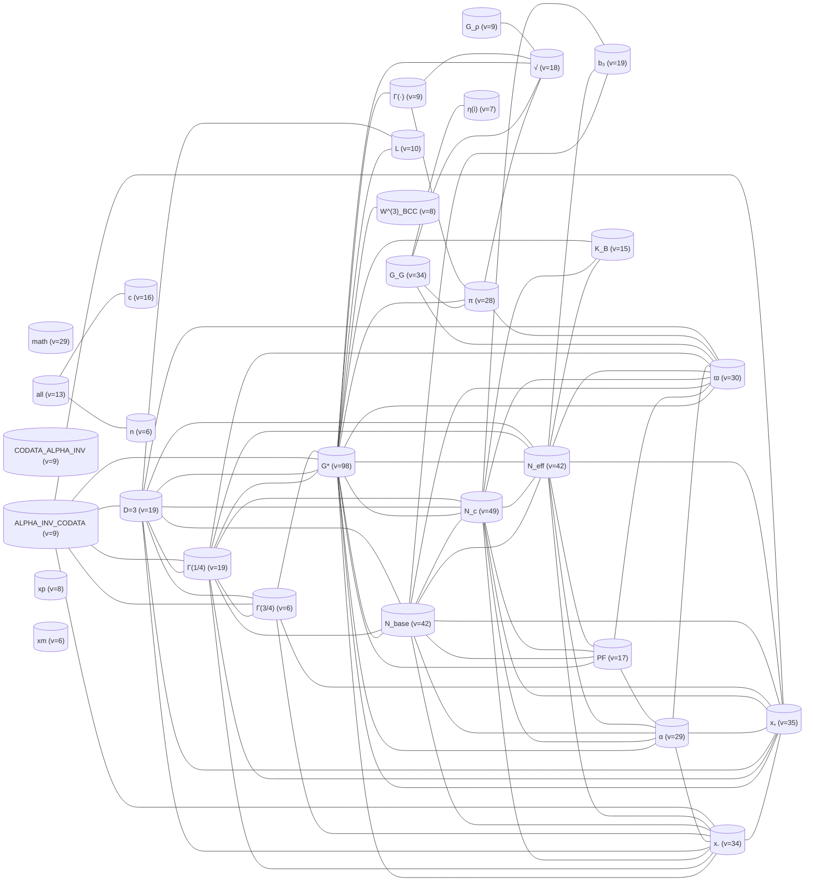

---

## §4 — Reproduction

```sh
# Rebuild the canonical JSON:
python scripts/verification/build_math_node_map.py

# Recompute the force-directed layout (caches x,y per node):
python dissemination/interactive/math_node_map_layout.py

# Regenerate this Markdown:
python -m scripts.verification.parsers.mermaid_renderer
```

---

## §5 — Cross-references

- `scripts/verification/results/math_node_map.json` — canonical machine-readable graph.
- `dissemination/interactive/math_node_map.html` — interactive Plotly.js viewer (filterable by layer, sector, epistemic tag, search).
- `docs/theory/09_mathematical/ROADMAP_IDENTITY_PRIORITIES.md` — G\*-paper-scoped synonymy graph (predecessor; covers `verify_gstar_paper.py` only).
- `docs/theory/01_reference/SPEC_ALGEBRAIC_SPINE.md` — canonical 9-theorem spine (source for layers.theorems).
- `docs/theory/07_assessment/LEDGER.md` — canonical claim registry (source for layers.ledger).
- LEDGER row FTD-0207 — this node map's provenance entry.
