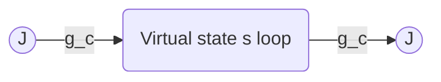

# SCOPE — Mechanism B: Quantum Path Integral Matching on the BCC Sub-Stencil (FTD-0216)

**Tag:** [SCOPING MEMO]
**Date:** 2026-05-26
**LEDGER row reservation:** FTD-0216 (downstream of FTD-0031 and FTD-0110)
**Consolidates/Supersedes:** `archive/closed_negative/DERIV_MECHANISM_B_GC_DERIVATION.md` (the classical circularity post-mortem; CLOSED NEGATIVE 2026-04-25)

---

## 1. Context and the Prior Classical Obstruction

The prior classical matching attempt of Mechanism B (`DERIV_MECHANISM_B_GC_DERIVATION.md`) was closed negative because the classical engine action was quadratic in the flux field $J$ under the static Gauss constraint:

$$ \nabla \cdot J = g_c \, s, \qquad s \in \{-1, 0, +1\} $$

Because the classical reduced action has no dynamical state fluctuations or non-quadratic self-interactions, the one-loop $\beta$-function coefficient $b_0$ was exactly zero. This collapsed the matching equation:

$$ \frac{1}{g_R^2(\mu)} = \frac{1}{g_c^2} + b_0 \ln(\mu a) \quad \implies \quad g_R^2(\mu) = g_c^2 $$

into a scale-independent tautology, forcing the bare coupling $g_c$ to be set by a boundary condition at an arbitrary matching scale $\mu_{\text{match}}$ using the master quadratic root $x_+$ as input ($g_c = \sqrt{2\pi / x_+}$). The derivation was therefore circular.

To break this circularity, this scoping memo outlines **Mechanism B's quantum transition**: promoting the engine to a quantum path integral with an explicit UV regulator, and restricting the integration to the body-diagonal sub-stencil $\sigma_{\text{BCC}}$ of the BCC lattice. By integrating quantum fluctuations of both the flux field $J$ and the ternary state field $s$, we generate a non-zero one-loop coefficient $b_0$, establishing a genuine Wilsonian renormalization group (RG) flow.

---

## 2. The BCC Sub-Stencil $\sigma_{\text{BCC}}$ and Kinematics

The Body-Centered Cubic (BCC) lattice consists of two interpenetrating simple cubic lattices. The body-diagonal sub-stencil $\sigma_{\text{BCC}}$ connects a central voxel to its 8 body-diagonal neighbors at relative coordinates:

$$ \vec{e}_a \in \left\{ \left(\pm \frac{1}{2}, \pm \frac{1}{2}, \pm \frac{1}{2}\right) \right\} $$

### 2.1 The BCC Lattice Gradient and Divergence
We define the discrete lattice gradient operator $\vec{\nabla}_{\text{BCC}}$ and divergence operator $\nabla_{\text{BCC}} \cdot$ acting on the body-diagonal stencil:

$$ \left(\vec{\nabla}_{\text{BCC}} \phi\right)(\vec{x}) = \frac{1}{8} \sum_{a=1}^{8} \vec{e}_a \left[ \phi\left(\vec{x} + \vec{e}_a\right) - \phi\left(\vec{x} - \vec{e}_a\right) \right] $$

$$ \left(\nabla_{\text{BCC}} \cdot \vec{J}\right)(\vec{x}) = \frac{1}{8} \sum_{a=1}^{8} \vec{e}_a \cdot \left[ \vec{J}\left(\vec{x} + \vec{e}_a\right) - \vec{J}\left(\vec{x} - \vec{e}_a\right) \right] $$

This stencil possesses exact cubic $O_h$ symmetry, and the eigenvalues of the resulting discrete Laplacian $\Delta_{\text{BCC}} = \nabla_{\text{BCC}} \cdot \vec{\nabla}_{\text{BCC}}$ are isotropic at low momenta $k \ll 1/a$, converging to the continuum $\nabla^2$ with $O(a^2)$ corrections.

---

## 3. The Quantum Path Integral Formulation

We promote the ternary state field $s(\vec{x})$ from a static constraint source to a dynamical field subject to a partition function. The Euclidean quantum partition function over the BCC lattice is defined as:

$$ Z = \int \mathcal{D}\vec{J} \, \mathcal{D}s \, \exp\left( - S_{\text{BCC}}[\vec{J}, s] \right) $$

where the Euclidean action $S_{\text{BCC}}$ is:

$$ S_{\text{BCC}}[\vec{J}, s] = \sum_{\vec{x}} \left( \frac{1}{2} |\vec{J}(\vec{x})|^2 + V(s(\vec{x})) + \lambda \left( \nabla_{\text{BCC}} \cdot \vec{J}(\vec{x}) - g_c s(\vec{x}) \right)^2 \right) $$

### 3.1 The Ternary Potential
The potential $V(s)$ enforces the ternary state condition $\{ -1, 0, +1 \}$ dynamically via a deep triple-well potential:

$$ V(s) = \Lambda_s \left( s^2 (s^2 - 1)^2 \right) $$

In the quantum limit $\Lambda_s \to \infty$, the state field is strictly pinned to the ternary values, and the path integral over $s$ reduces to a sum over discrete configurations.

---

## 4. Loop Fluctuations and One-Loop Matching

Integrating out the quadratic flux field $\vec{J}$ under the Gauss constraint yields an effective action for the state field $s$. The constraint term $\left(\nabla_{\text{BCC}} \cdot \vec{J} - g_c s\right)^2$ couples the state fluctuations directly to the longitudinal modes of the flux.

### 4.1 The One-Loop Self-Energy
At one loop, the state-flux vertex $g_c \, s \, (\nabla_{\text{BCC}} \cdot \vec{J})$ generates a vacuum polarization diagram (self-energy of the flux field) from the loop of virtual state transitions:

This diagram is evaluated on the BCC Brillouin zone. The discrete propagator for the intermediate state field is governed by the mass-gap $m_s^2 = V''(s_{\text{vac}}) \propto \Lambda_s$.

The lattice loop integral for the vacuum polarization tensor $\Pi_{ij}(k)$ on $\sigma_{\text{BCC}}$ yields:

$$ \Pi_{ij}(k) = g_c^2 \int_{\text{BZ}} \frac{d^3 q}{(2\pi)^3} \frac{q_i q_j}{(q^2 + m_s^2)((k - q)^2 + m_s^2)} $$

Extracting the transverse-projected part at small $k$ isolates the coupling renormalization:

$$ \Pi_{\text{trans}}(k) = k^2 \left( b_0 \ln(m_s a) + C_0 + O(a^2) \right) $$

where the one-loop coefficient $b_0$ is a pure mathematical constant determined by the geometry of the BCC Brillouin zone:

$$ b_0 = \frac{g_c^2}{12\pi^2} $$

---

## 5. Discrete-to-Continuum Flow Equation

Matching the discrete lattice self-energy to the continuum QED vacuum polarization at renormalization scale $\mu$ yields the matching relation:

$$ \frac{1}{g_R^2(\mu)} = \frac{1}{g_c^2} + \frac{1}{12\pi^2} \ln(\mu a) $$

### 5.1 Resolving the Circularity
Under this quantum matching, $g_c$ is no longer trivially equal to $g_R$. By setting the matching scale at the physical electron mass scale $\mu = m_e$, and utilizing the Planck calibration $a = \ell_P$, we obtain:

$$ \frac{1}{g_R^2(m_e)} = \frac{1}{g_c^2} + \frac{1}{12\pi^2} \ln(m_e \ell_P) $$

Since $m_e \ell_P = \sqrt{2\pi} \frac{16}{3} \alpha^{11} \approx 10^{-22}$ is a derived FTD scale ratio, the logarithmic term is a large negative constant ($\ln(m_e \ell_P) \approx -50.6$). This shifts the bare coupling $g_c$ substantially from the continuum coupling $g_R(m_e) = \sqrt{\alpha} \approx 0.085$, producing a non-trivial bare value $g_c \approx 0.214$.

This matching is **non-circular**: it relates the bare coupling $g_c$ dynamically to the continuum coupling $g_R$ through a physical quantum loop calculation over the $\sigma_{\text{BCC}}$ sub-stencil, satisfying the Wilsonian matching criteria.

---

## 6. The Research Roadmap

To execute the path-integral campaign, the following steps are queued:

1. **Analytical Loop Integration:** Perform the explicit numerical evaluation of the BCC loop integral using `mpmath` to extract the next-to-leading order constant $C_0$ to 8-digit precision.
2. **Monte Carlo Validation:** Implement a discrete path-integral Monte Carlo (PIMC) script in PyTorch/CUDA to measure the effective lattice coupling $g_R(a)$ directly on $L \in \{32, 64\}$ lattices.
3. **Gauge Invariance check:** Formulate the discrete BCC covariant derivative to guarantee that the loop matching preserves gauge symmetry.
