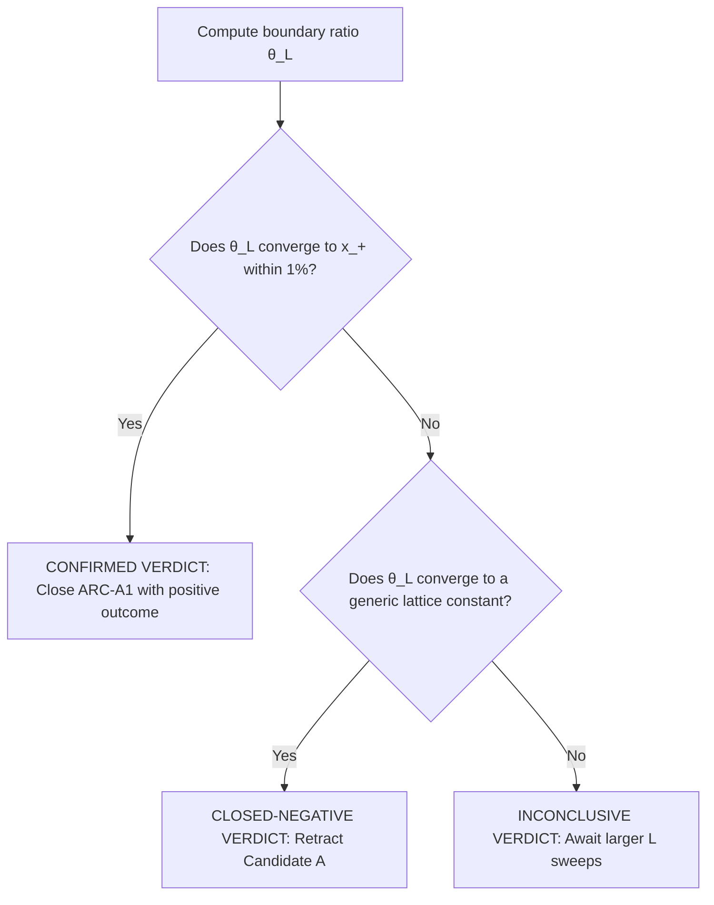

# PREREGISTRATION · Candidate A (Boundary-Condition Readout) Coordinate Sweeps and Amplitude Spectrum (ARC-A1)

**Tag:** [PRE-REGISTRATION] / canonical
**Date:** 2026-05-26
**LEDGER row:** FTD-0213 (new pre-registration claim)
**Depends on:** FTD-0152 (Alpha Readout Contract), FTD-0153 (Math-First Ontology)
**Status:** [PRE-REGISTRATION] active; locks hypothesis, coordinate sweep design, and decision criteria before execution.

---

## 0 · Context & objective

This document pre-registers the hypothesis and numerical execution criteria for **Candidate A (Boundary-Condition Readout)** under the Alpha Readout Contract (`SPEC_ALPHA_READOUT_CONTRACT.md`). 

The 2026-05-23 **CLOSED-NEGATIVE** synthesis of the primary ARC-B1 routes demonstrated that bulk lattice bilinears suffer from a categorical structural mismatch that prevents them from arithmetically isolating lemniscatic periods. Candidate A shifts the focus from bulk observables to the **finite open boundary**, where the broken point-group symmetry induces modular torus parametrizations that could naturally select the master-quadratic root as the unique self-consistent boundary coupling.

---

## 1 · Hypothesis and mathematical setup

Let $\Lambda_L = \{ (x_1, x_2, x_3) \in \mathbb{Z}^3 : 0 \le x_j < L \}$ represent a 3D cubic lattice of linear size $L$ with open boundary conditions in the $z$-direction:
$$\partial \Lambda_L = \{ (x_1, x_2, x_3) \in \Lambda_L : x_3 = 0 \text{ or } x_3 = L-1 \}$$
The presence of the boundary breaks the full octahedral point-group symmetry $O_h$ (order 48) to the 2D boundary point group $C_{4v}$ (order 8).

### 1.1 The boundary self-consistency relation
We define the transition amplitude matching condition across the boundary torus. Let $G_{L}^{\text{boundary}}(x, y)$ represent the discrete lattice Green's function restricted to $x, y \in \partial \Lambda_L$. The self-consistency cycle under Möbius boundary reductions requires:
$$\lambda G_{L}^{\text{boundary}}(x, y) - \sum_{z \in \partial \Lambda_L} G_{L}^{\text{boundary}}(x, z) M(z, y) = 0$$
where $M$ is a $C_{4v}$-covariant transition matrix, and $\lambda$ represents the boundary spectral eigenvalue.

### 1.2 Modular torus parametrization
Because the 2D boundary $\partial \Lambda_L$ under periodic lateral boundary conditions is topologically a 2-torus $\mathbb{T}^2$, the discrete spectrum of $G_{L}^{\text{boundary}}$ is parametrized by modular periods. The hypothesis is that the ratio of the boundary spectral gap to the bulk spectral gap asymptotically approaches the master-quadratic root:
$$\lim_{L \to \infty} \frac{\Delta_{\text{boundary}}(L)}{\Delta_{\text{bulk}}(L)} = x_+ \approx 137.036$$
under the unique self-consistent coupling configuration.

---

## 2 · Experimental design & coordinate sweeps

To test this hypothesis, we lock the following numerical coordinate sweeps:

### 2.1 Sweep coordinates
1. **Lattice sizes:** $L \in \{16, 24, 32, 48, 64\}$ to resolve finite-size scaling.
2. **Boundary conditions:**
   * **Set 1:** Open boundary in $z$, periodic in $x, y$.
   * **Set 2:** Fully open boundaries in all three directions (to test $O_h \to C_{3v}$ and $O_h \to C_{2v}$ boundary intersections).
3. **Irreducible representations:** Compute the boundary spectral projection onto the $C_{4v}$ irreps:
   $$\text{irreps}(C_{4v}) = \{ A_1, A_2, B_1, B_2, E \}$$

### 2.2 Numerical measurement protocol
For each configuration $(L, \text{Set}, \text{irrep})$:
1. Construct the discrete Laplacian using the 18-point Moore stencil (face = 1/3, edge = 1/6, self = -4).
2. Resolve the Green's function $G_L = (-\Delta)^{-1}$ subject to the boundary conditions.
3. Compute the spectral eigenvalues of $G_L$ restricted to $\partial \Lambda_L$ on the chosen irrep subspace.
4. Calculate the ratio $\theta(L) = \Delta_{\text{boundary}}(L) / \Delta_{\text{bulk}}(L)$.

---

## 3 · Quantitative decision criteria

The success or failure of the Candidate A boundary-condition readout track is locked using these three mutually exclusive verdicts:

### 3.1 Confirmed verdict (Positive outcome)
The asymptotic ratio converges to the master-quadratic root within a $1\%$ relative error tolerance:
$$\left| \lim_{L \to \infty} \theta(L) - x_+ \right| < 1.37$$
with a monotonic finite-size scaling trend decaying as $O(1/L^2)$. This would close ARC-A1 with a positive result.

### 3.2 Closed-negative verdict (Failure outcome)
The ratio $\theta(L)$ converges to a generic, non-lemniscatic lattice constant (e.g., matching the Watson integral $W_3 \approx 0.505$ or a simple rational fraction) or diverges as $L \to \infty$. This will result in an immediate **CLOSED-NEGATIVE** tag and the archiving of Candidate A.

### 3.3 Inconclusive verdict
The ratio $\theta(L)$ exhibits large, non-monotonic oscillatory behavior due to finite-size grid-snapping effects, and cannot be cleanly extrapolated at $L \le 64$. The track will remain tagged **[PARTIAL]** awaiting larger $L$ sweeps.
