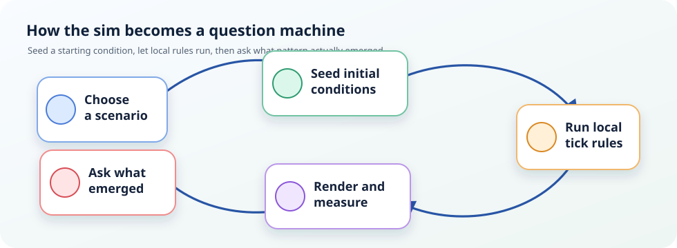
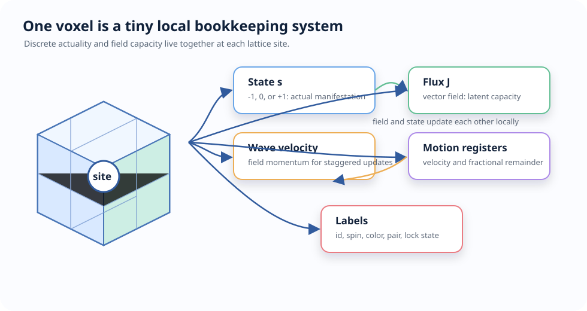
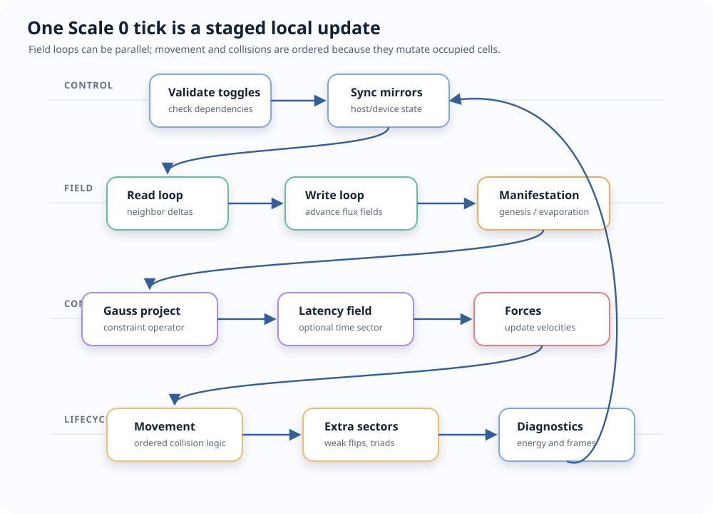
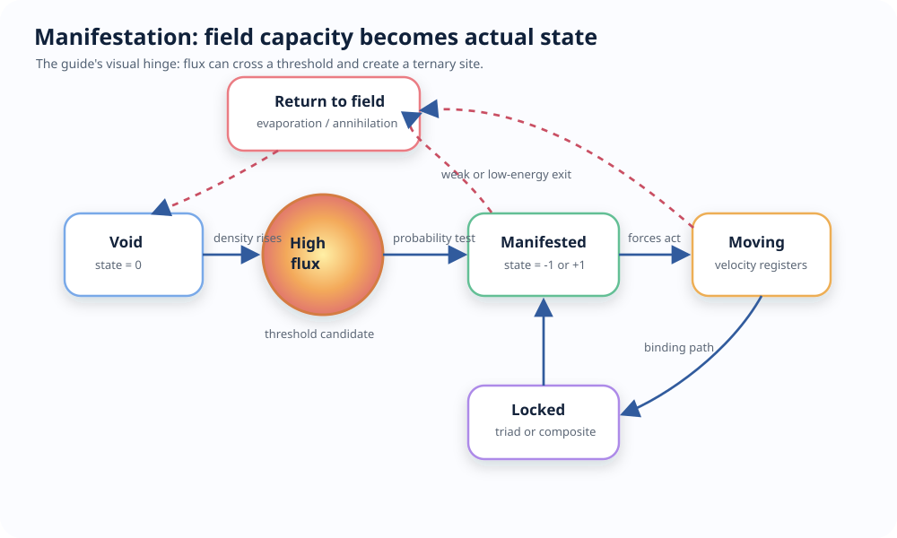
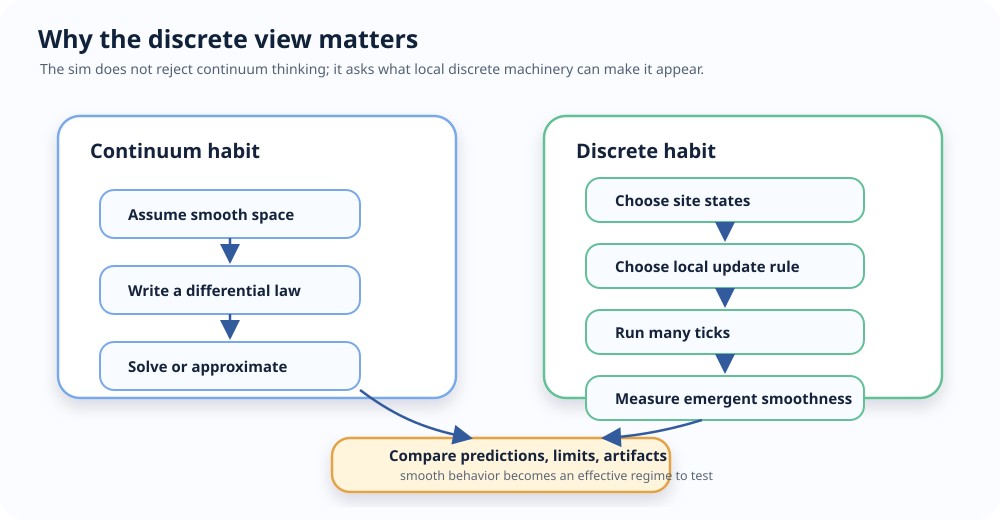
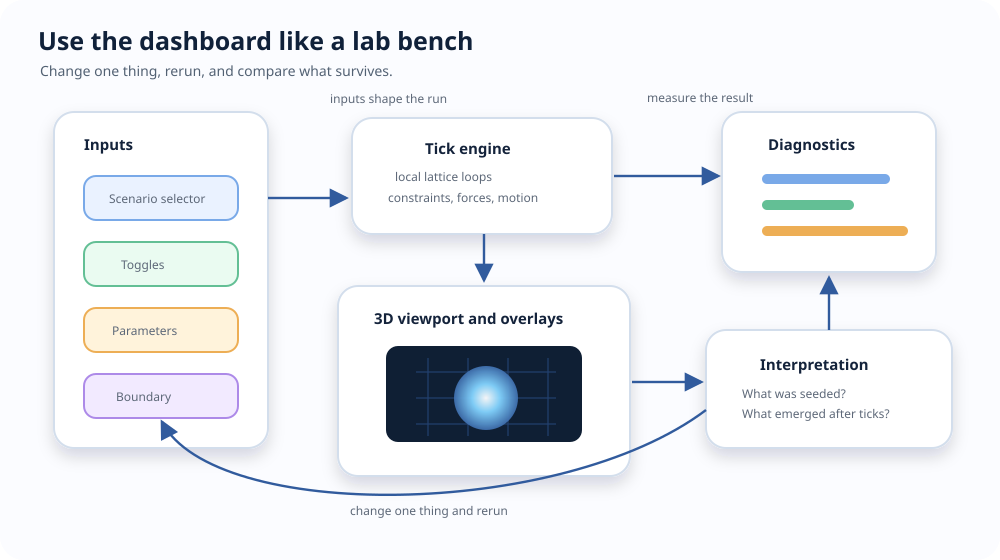
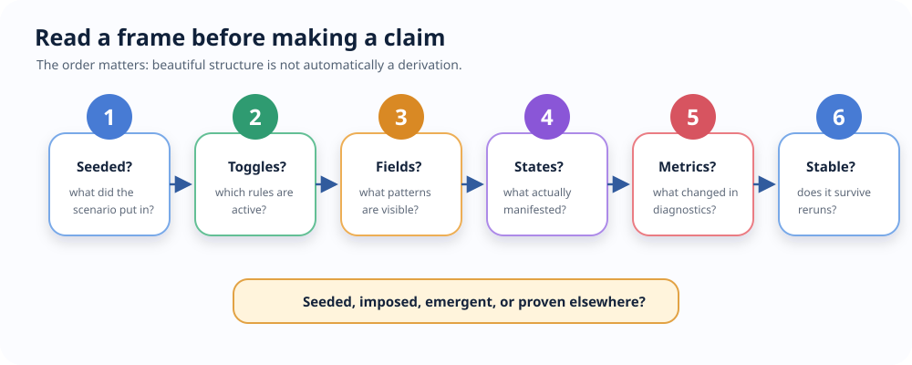
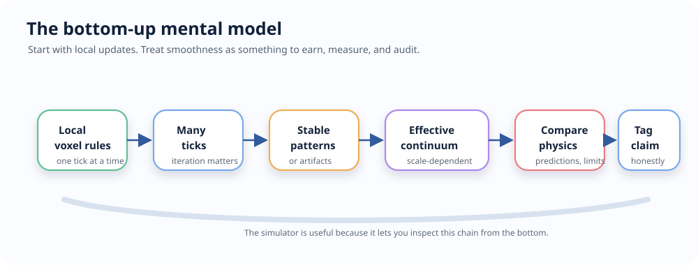

# FTD Simulation Visual Guide

This guide explains the simulation as something you can watch and reason with.
It is for readers who want the shape of the system before reading callstacks,
tests, or theory ledgers.

The key idea:

> The simulator treats discreteness as fundamental. Continuity is what repeated
> local updates look like after many sites and many ticks.

## 1. The Whole Loop

A scenario gives the system a starting condition: a pulse, field, particle,
atom, molecule, or cosmic arrangement. After that, the scenario stops being the
author. The tick cycle becomes the author.

That is the simulator's most important teaching move. It lets you ask:

- What did I put in by hand?
- What did the local rules produce afterward?
- Which behavior survives when I change scale, resolution, toggles, or boundary
  conditions?

## 2. One Voxel

Scale 0 is a cubic lattice. Each site is a voxel with two main layers:

The `state` is discrete actualization: void, negative manifestation, or
positive manifestation. The `flux` is the dispositional field: it propagates,
couples, gets projected by constraints, and can create or move manifested
states.

The continuous-looking field in the dashboard is not assumed as a smooth
background. It is a value stored at lattice sites and updated by neighbor
rules. Smoothness is something you judge from the pattern that appears across
many sites.

## 3. The Tick Cycle

Every Scale 0 tick is a staged pass over the lattice:

The staging is what makes the sim understandable. Field updates are mostly
parallel local loops. Collisions and movement are ordered because two particles
cannot safely write the same target cell at the same time.

## 4. Manifestation

Manifestation is the visual hinge of the engine: latent field intensity becomes
an actual ternary state.

What to watch:

| Event | What it looks like | What it teaches |
|---|---|---|
| Genesis | New positive or negative state appears from high flux | Matter-like actuality can be modeled as a thresholded field event |
| Evaporation | A weak isolated state returns to void | Persistence is conditional, not automatic |
| Pair production | Neighboring opposite signs appear together | Local charge balance can be enforced at creation |
| Annihilation | Opposite signs clear and field energy bursts | State can dissolve back into field structure |
| Triad binding | Compact same-sign triples become locked | Stable composites can be represented as local discrete structures |

## 5. Why A Discrete Perspective Matters

A continuous model often starts with smooth space, smooth fields, and
differential equations. This simulator asks a different question:

> What if smooth behavior is the large-scale appearance of a finite local update
> process?

That shift is useful because it makes assumptions visible.

The discrete view forces several questions into the open:

- How far can information move in one tick?
- Which effects are local and which are imposed by a projection?
- Which smooth symmetries are exact, approximate, or broken by the lattice?
- Which apparent particles are stable structures, temporary excitations, or
  seeded visuals?
- What changes when resolution, boundary shape, damping, or toggles change?

The point is not "continuum physics is useless." The point is sharper:
continuity can be an emergent regime, and the simulator lets you inspect the
local machinery underneath that regime.

## 6. What You Can Expect To Learn

| You can learn | Where to look | Useful because |
|---|---|---|
| How waves emerge from neighbor updates | `flux-pulse`, `s0-field-plane-wave`, field overlays | You see propagation as repeated local exchange, not as an assumed smooth medium |
| How actuality appears from latent field capacity | `flux-cascade`, `flux-random-genesis`, manifestation diagnostics | You can separate field energy from manifested state |
| How constraints shape fields | Gauss projection and divergence overlays | You can see conservation-like behavior as an operator in the tick loop |
| How forces are field-mediated | Coulomb, gravity, Lorentz, force overlays | You can inspect forces as local samples from field structure |
| How collisions differ from field updates | `flux-annihilation`, movement diagnostics | You see why mutation order matters in a discrete lattice |
| How quantum-like demos are seeded | `quantum-double-slit`, `quantum-tunnel`, `quantum-entangle` | You can distinguish a pedagogical scenario from a derived theorem |
| How macro models relate to Scale 0 | Scale 1 particles, Scale 2 atoms, Scale 5 cosmic | You can compare discrete substrate intuition with coarser effective models |
| How claims should be audited | epistemic tags and assessment docs | You avoid mistaking a visualization for a derivation |

## 7. The Dashboard As An Instrument

Use the dashboard like a lab bench:

1. Start with a simple scenario.
2. Let it run for a short interval.
3. Turn on one overlay or diagnostic.
4. Change one toggle or parameter.
5. Rerun and compare the pattern.

Good examples:

| Start with | Then ask |
|---|---|
| `flux-pulse` | Does the pulse spread like a wave? Does it preserve shape or disperse? |
| `s0-field-plane-wave` | How does a regular field pattern move across the lattice? |
| `light-photon-race` | What does the lattice speed limit look like visually? |
| `flux-cascade` | When does field intensity become manifestation? |
| `flux-annihilation` | How does state return to field energy? |
| `s0-vacuum-electron` | What is seeded as particle structure, and what does the engine do afterward? |
| `s0-seed-hydrogen` | What is the difference between a composite seed and a stable evolved structure? |
| `quantum-double-slit` | Which parts are scenario construction, and which patterns emerge during evolution? |

## 8. Reading A Frame

When you look at a running simulation, read it in this order:

This order helps avoid a common mistake: seeing a beautiful structure and
immediately treating it as a physical claim. In this project, the first question
is always whether the structure was seeded, imposed, emergent in simulation, or
proven somewhere else.

## 9. What The Simulator Is Useful For

The sim is useful as an instrument for:

- Building intuition about local causality and finite propagation speed.
- Watching how field values, constraints, and discrete states interact.
- Separating seed assumptions from evolved behavior.
- Finding numerical artifacts caused by grid resolution, boundary conditions,
  or update ordering.
- Testing whether a proposed discrete rule produces a stable large-scale
  pattern.
- Teaching why "continuous" can mean "effective at this scale" rather than
  "fundamental at every scale."

It is not useful as a shortcut around epistemic discipline. A scenario can
demonstrate a mechanism, motivate a conjecture, or provide a regression target.
It does not by itself prove that the mechanism is physically true.

## 10. Mental Model

Keep this picture in mind:

The simulator is valuable because it lets you stand at the bottom of that chain.
Instead of beginning with the smooth equation, you begin with the local update
and watch where smoothness appears, where it breaks, and what had to be imposed
to make it appear.

## 11. Where To Go Next

- [SCENARIO_ARCHITECTURE.md](SCENARIO_ARCHITECTURE.md) explains how scenario ids,
  bridges, seed bodies, and toggle profiles fit together.
- [CALLSTACKS.md](CALLSTACKS.md) traces each primary feature from entrypoint to
  implementation.
- [ARCHITECTURE.md](ARCHITECTURE.md) explains loop dynamics, memory ownership,
  backend synchronization, and manifestation lifecycle.
- [SPEC_ENGINE.md](SPEC_ENGINE.md) is the detailed living engine reference.
- [../docs/theory/07_assessment/AUDIT_EPISTEMIC_AUDIT.md](../docs/theory/07_assessment/AUDIT_EPISTEMIC_AUDIT.md)
  is the place to check claim status.
