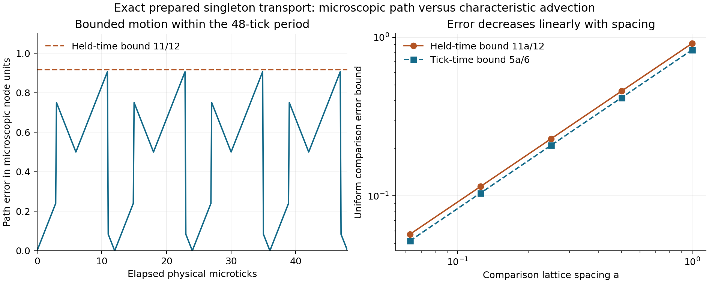

# Strict recovery wave 1: transport, constituents and interactions

Date: 2026-09-05. Status: **WAVE AUDITED; physical recovery remains open; current candidate unchanged**.
Owner instruction: proceed on recovery of all scales. This wave consumes the
next gates in [the stack program](PROGRAM_STRICT_DISCRETE_STACK.md), using the
existing finite law before considering a separately priced successor.

## Work and ownership

| Work | Implementer | Independent review |
|---|---|---|
| Exact invariant transport sector and its continuum comparison | Continuum agent | Observation/physics agent |
| Exact stationary kinetic reference and preparation feasibility | Continuum agent | Observation/physics agent |
| Constituent traces, fixed carrier/encounter matrix, WSL2 CUDA measurement | Causal agent | Continuum agent |
| Structural material/macroscopic obstructions and successor requirements | Observation/physics agent | Causal agent |
| Full finite counting-ensemble pushforward and integrated evidence | Coordinator | Observation/physics agent |

Writers own separate new modules. The accepted staged law, native kernel and
dashboard physics remain unchanged. Mathematical finite-alphabet enumeration
is used to prove identities, not to search for experimental near-matches.
GPU measurement campaigns execute through WSL2. Independent reviews return
defects to the implementing owner before a gate receives acceptance.

## Exact finite ensembles

`recovery_ensemble.py` represents an external finite list of complete states by
immutable canonical checkpoints and positive integer multiplicities. The
selected counting measure is not a primitive probability or a joint universe
of interacting tokens. Every member shares the lattice and actual clock.

For a complete state map F and multiplicity m, its exact pushforward is

`m_next(y) = sum_{x : F(x)=y} m(x)`.

This is finite reindexing of a deterministic map. It preserves total count;
composition agrees with applying every microscopic tick. Complete states that
merge under named expiry combine their multiplicities. Marginal agreement
does not trigger a merge. Observers receive private restored copies, and
expectations are rational numbers with exact integer arithmetic. Resource caps
reject a requested computation instead of dropping branches or inserting a
closure. No sampling uncertainty occurs in an explicitly enumerated ensemble;
coverage of a larger preparation family is a separate question.

Equal periodic complete states can have different external winding histories.
This compression supports instantaneous complete-state observables on the
torus; it does not retain an unwrapped trajectory lift. Euclidean transport
comparisons keep separate finite trajectory labels/histories, while the torus
metric can use the corresponding projected bound. Neither observer history
nor a counting multiplicity is inserted into the ontic state.

The known actual-law collision witness is a regression target, not a newly
selected physical campaign: four equally counted preparations occupy channel
sets empty, {0}, {1}, {0,1} at one site in the homogeneous occupied background.
After admission and collision, channels 4 and 5 have covariance 3/16. Exact
pushforward retains this correlation; multiplying its marginals would erase it.
The instrument makes such discarded information visible through actual states.

## Registered recovery questions

The [transport contract](DERIV_STRICT_TRANSPORT_SECTOR.md) is written before
its validation. It asks whether homogeneous, doubly occupied relations plus
exactly one global field token form an invariant sector, and whether its finite
path admits a uniform-in-time characteristic transport bound. All 384 channels
are examined through the actual channel permutation. Initial layer/background
cycles, saved gates, physical stage timing and seam lifts are included.

The [carrier registration](PREREG_STRICT_CARRIER_RECOVERY.md) separately fixes
isolated relation/field preparations and paired encounter/separation controls.
Its GPU campaign must preserve the pre-execution case manifest, source and
protocol hashes. Toroidal recurrence is not binding; separation on a periodic
domain is not guaranteed causal disconnection. Constituent identity ambiguity
after collision must be reported rather than resolved by arbitrary matching.

## How results advance the scales

| Requested level | What this wave can establish | What it cannot infer |
|---|---|---|
| Scale 0 / continuum | Exact finite transport, complete ensemble evolution in specified support, declared finite-scale error | Maxwell, collisional relaxation, isotropic fluid or physical calibration |
| Scale 1 / carriers | Persistence, transport, absorption and constituent exchange under registered preparations | Particle species, spin, mass or arbitrary composite stability |
| Scale 2 / atoms | Necessary dynamical mechanisms and scoped obstructions for candidate matter | Atomic identity or spectra from an assigned element label |
| Scale 3 / molecules and bulk | Binding/exchange requirements and their executable falsifiers | Chemical bonding or constitutive laws supplied by a reference solver |
| Scale 4 / gravity | Causal source/response requirements and obstructions in the specified sector | Planetary gravity from kinematic motion or catalog masses |

Results below were integrated after independent audit. Restricted exact transport
does not close the earlier full correlation/Maxwell certificate. A scoped
negative result does not exclude all emergent structures of the finite law.
Successor requirements price any added records, channel selection, schedule or
exchange mechanism; no such addition is canonically adopted by this wave.

## Independently accepted results

**Prepared transport:** all 384 channels form 32 twelve-hop cycles. Including
the layer, homogeneous background and four physical stages gives a 48-microtick
internal period with net displacement `(±4,±4,±4)`. There are eight distinct
anisotropic velocities with components `±1/12` in node/microtick units. At
integer ticks the path differs from uniform translation by at most `5a/6` in
L-infinity distance; holding positions between ticks gives `11a/12`. Exact
finite label pairing gives the same upper bound in W1 with L-infinity cost.

The comparison velocity in an external chart is `(a/tau) v`, where a and tau
are declared comparison spacings. The bound is uniform over any stated finite
horizon. With fixed a/tau and decreasing a, this supplies a controlled
characteristic-advection comparison for this prepared sector. An additional
initial-measure approximation error must be included when comparing to a
different initial distribution, with matching velocity-species weights.
This establishes no physical time calibration, isotropic fluid or interacting
Maxwell sector. Independent review accepted the proof and **54 tests**,
including rejection of inconsistent externally supplied trajectory reports.



This figure evaluates the exact prepared-sector path and comparison bounds;
it is not an additional measurement campaign. Reproduce it with
`python -m phi_v2_lattice.experiments.plot_recovery_transport` after setting
`PYTHONPATH=scripts`.

**Full finite ensembles:** independent review accepted **9 tests**, including
exact covariance 3/16 after the actual collision, arbitrary-precision weights,
complete-state expiry merging, nonmutation, semigroup composition and resource
rejection. This is exact evolution of the stated finite support. It does not
enumerate the exponentially larger half-occupation reference ensemble or
establish its marginal closure.

**Stationary kinetic reference:** independent review accepted the
[finite counting proof](DERIV_STRICT_KINETIC_REFERENCE.md) and **22 tests**.
Over the homogeneous doubly occupied background, every field configuration
is permitted and the actual collision/streaming maps preserve externally
selected Bernoulli(p) counting weights for any rational p in [0,1]. Saved
gates retain their correlations with the bank. The complete record family
recurs modulo 48 microticks when the advancing absolute clock is excluded.
This establishes an invariant reference family, not attraction to it or
closure of its spatially perturbed tangent family.

The exactly-two eligibility is `q(p)=binom(192,2) p^2 (1-p)^190`, maximized
at p=1/96. This separately named preparation has expected field population
2,916 on L=9 and about 6,347 eligible pair transactions over 64 microticks.
These are exact counting expectations evaluated numerically for readability;
they are not campaign measurements or independent temporal trials. The
half-occupation certificate keeps its original preparation and obstruction.
Relaxation, unresolved correlation bounds and interacting continuum recovery
remain open. The exact fractions and finite-map checks are in the calculation
evidence linked below.

**Material constraints:** independent review accepted **13 tests** and the
[structural audit](AUDIT_STRICT_MATERIAL_MACRO_RECOVERY.md). Its finite checks
cover all 162 relation/gate cases and 55,008 frozen collision rows. Occupied
relation-anchor inventories stay fixed; field inventory cannot increase;
the empty-bank relation sector cannot transmit between anchors. These block
specific anchored-matter identifications. Mobile mixed field/relation phase
defects and interacting field composites remain explicitly open.

The [successor requirements](SPEC_STRICT_RECOVERY_SUCCESSOR_REQUIREMENTS_V1.md)
specify two routes: test collective structures in the current law, or price
new finite exchange and transport transactions. The latter must account for
information erased by absorption and rerun all causal, conservation and
complete-state tests before adoption. Requirements alone are not a recovery.

Exact calculation evidence is [retained here](evidence/strict-recovery-wave1-exact.json).
Reproduce it from the repository root:

```powershell
$env:PYTHONPATH='scripts'
python -m phi_v2_lattice.experiments.run_recovery_wave1 --output engine/docs/evidence/strict-recovery-wave1-exact.json
```

**Registered carriers:** the [v2 audit](AUDIT_STRICT_CARRIER_RECOVERY.md) accepted
all 600 preparations and 38,400 physical CUDA microticks on the WSL2 RTX 5090.
It recorded 792 field hops, 528 admissions, 72 ambiguous collision vertices,
816 relation residency intervals and zero anchor migrations. All 528 initially
present field tokens in this blank-background matrix were eventually admitted;
the longest isolated-field lifetime among these fixtures was 13 microticks.
These are finite registered results, not a lifetime theorem for arbitrary
flags, backgrounds or collective preparations.

Independent review reconstructed every preparation, decoded all initial/final
complete checkpoints and audited every compact transition. All 29 frozen
sources, 600 input hashes and execution/preflight/lock receipt links passed.
Seventeen instrument tests pass. A missing mandatory-collision check found in
the first verifier was repaired; the original run remains unaccepted provenance.
The same scientific matrix was freshly locked and rerun as v2 before acceptance.
The [complete accepted campaign report](evidence/strict-carrier-recovery-v2.json)
retains each external segment and ambiguous collision vertex. M1 and M2 remain
open; the campaign supplies constituent accounting and bounded obstructions.

## Integrated verification and disposition

The integrated suite passed **335 tests in 38.68 seconds**, with
`FTD_STRICT_CUDA_REQUIRED=1` and `FTD_STRICT_WASM_MODULE` pointing to the compiled
strict module. No test was skipped. It includes all 220 foundation tests and
115 new recovery tests: 54 transport, 9 complete ensembles, 22 kinetic
reference, 13 structural obstructions and 17 carrier instrumentation tests.
Independent reviewers reproduced each new group before integration.

The [wave source manifest](evidence/strict-recovery-wave1-manifest-2026-09-05.json)
freezes the new modules, tests, contracts, plots and calculation/campaign
reports. The 69 identities in the earlier foundation manifest were rechecked
unchanged. The previous browser lifecycle/performance measurements therefore
remain evidence for that exact local lab only; this wave adds no production
dashboard mode and makes no new FPS claim. The carrier campaign additionally
retains its own pre-execution source lock, input locks and WSL2 runner identity.

T1 (prepared advection) and K1 (stationary counting reference) pass in their
declared sectors. General continuum response, carrier/composite recovery,
atomic and molecular mechanisms, bulk constitutive behavior and gravitation
remain research gates. The successor requirements record concrete falsifiers
and finite-record costs for the next wave. No new law or physical identity is
adopted by this disposition.
