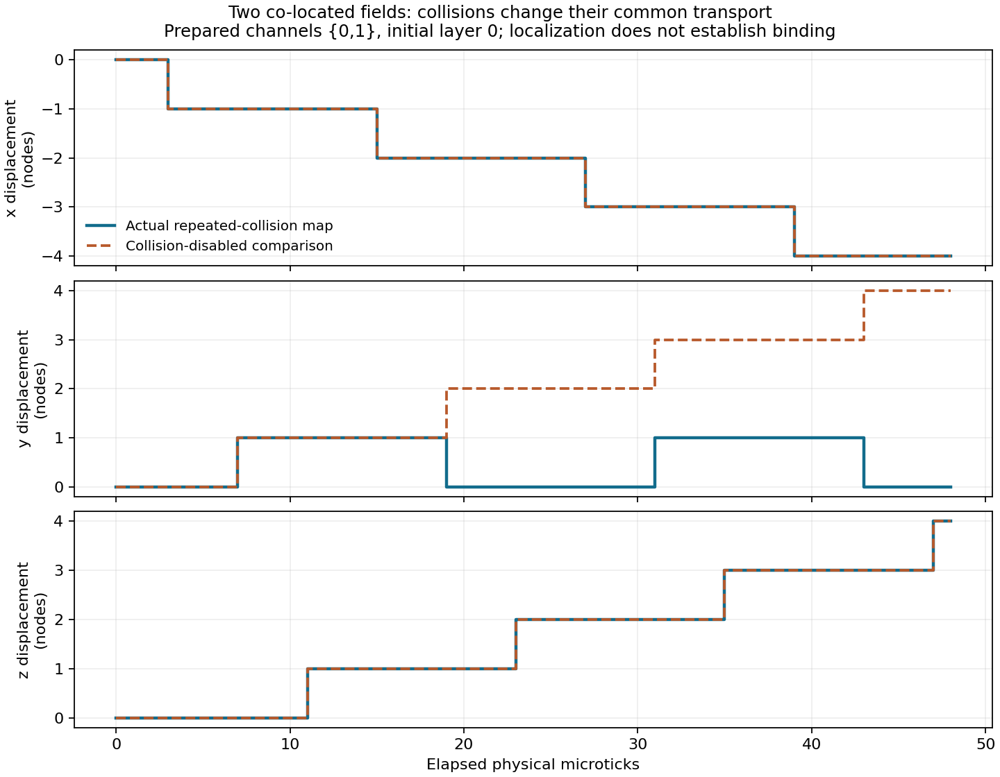

# Strict recovery wave 2: interactions, response and conserved currents

Date: 2026-09-05. Status: **WAVE AUDITED; physical recovery remains open; candidate law unchanged**.
This continues the independently audited [first wave](PROGRAM_STRICT_RECOVERY_WAVE_1.md).
Frozen first-wave sources and evidence remain unchanged. No higher-scale
reference solver supplies missing microscopic dynamics.

## Ownership and gates

| Work | Exclusive implementation owner | Independent reviewer |
|---|---|---|
| Finite collision response at the selected stationary counting reference | Continuum agent | Coordinator; observation agent for the later full-tangent bound |
| Two-field scattering and localization sector | Observation agent | Continuum agent |
| Registered mixed field/relation response, WSL2 CUDA | Causal agent | Coordinator, then observation agent |
| Exact inventory continuity and finite-scale weak-current bound | Coordinator | Observation agent |

Contracts precede validation and GPU execution. Independent review returns
defects to the writer before acceptance. The coordinator owns integration and
evidence. No canonical adoption, production migration or public deployment is
part of this research wave.

## Dependencies through the scales

| Level | Next dynamical question | Evidence needed for promotion |
|---|---|---|
| Scale 0 / fields | How does a collision transform a perturbed stationary reference, including correlations? | Full response and repeated unresolved-mode return bounds, followed by a registered finite-time continuum comparison |
| Scale 1 / carriers | Do actual collisions redirect or dynamically localize constituents? Can mixed defects transmit causal response? | Persistent interacting structures with response and lifetime evidence; distinguish co-moving kinematics from binding |
| Scale 2 / atoms | Does localized internal structure exchange and selectively respond through the same field law? | Operational internal states, spectra and exchange; no assigned species as a recovery shortcut |
| Scale 3 / molecules and bulk | Do composites bind and does conserved transport acquire a constitutive law? | Perturbation/dissociation response, relaxation and finite-scale errors; continuity alone is insufficient |
| Scale 4 / gravity | Can mobile probes, clocks and signals share one source and response account? | Causal backreaction and an independently validated macroscopic gravitational limit |

The new exact inventory-current question concerns storage counts. It must not
be substituted for physical mass, energy, electric charge or a gravity source.
Any positive wave result will carry its precise preparation and observable
domain; an obstruction remains scoped to the domain that was actually proved.

## Independently accepted finite results

**Collisional response.** The [response calculation](DERIV_STRICT_KINETIC_RESPONSE.md)
derives the exact one-collision marginal Jacobian and generated pair covariances
from the full finite counting measure at p=1/96. A perturbation of channel zero
creates 10,305 nonzero pair-covariance derivatives per layer. Writing
`r=p(1-p)^189`, the maximum magnitude is `(55/32)r`. The selected uniform
reference-family perturbation instead generates zero covariance. Thus the
preserved reference and nonuniform response have different closure properties.
The coordinator independently checked the formulas, finite constraint argument
and **23 tests in 9.54 seconds** before the later full-tangent extension.

Exact common-kernel classification gives only two fixed spatially uniform
additive field-channel invariants: the two polarity populations. This excludes
a naive fixed channel-weight momentum vector in this prepared sector. It does
not classify stage-dependent, nonlinear or mixed-record observables.

**Interacting pair transport.** The [pair-sector proof](DERIV_STRICT_PAIR_SECTOR.md)
and **18 tests** passed independent continuum-agent review (4.61 seconds).
Actual collisions redirect opposite x-directed hops into opposite z-directed
hops. The invariant co-located, same-flag pair sector has 864 collision-boundary
states, partitioned into 96 three-cycle and 48 twelve-cycle orbits. Including
background and physical schedule gives 48-microtick internal recurrence up to
translation. Some repeatedly colliding pairs have face-diagonal drift, extending
the previous singleton body-diagonal transport sector.

This is interaction-dependent transport with a sharp limitation: separating the
same-flag constituents by a nonzero periodic offset removes collisions and
leaves free co-motion with no restoring response. It therefore does not pass
the binding gate. General field composites and mixed backgrounds remain open.



The figure evaluates the proved finite maps for channels {0,1}; it adds no
measurement campaign. Reproduce it with
`python -m phi_v2_lattice.experiments.plot_recovery_pair` and `PYTHONPATH=scripts`.

**Inventory continuity.** The [current proof](DERIV_STRICT_INVENTORY_CONTINUITY.md)
and **15 tests** passed independent observation-agent review (0.63 seconds).
All eight complete arrays evolve through the actual law. Local polarity
inventory balances with streaming currents and the easily missed current from
negative-direction admission to the neighboring SC storage owner. For every
rational test function on the torus the discrete weak balance is exact.

For an external periodic smooth test function with axial curvature bounded by
B, the source-gradient approximation has error at most
`N_transfers B a^2/(2 normalizer)`. Over fixed chart time and bounded a/tau,
normalization by conserved inventory gives an O(a) weak consistency bound.
No constitutive law, measure-convergence theorem or physical mass follows.
Independent review also found and repaired overflow in externally supplied
NumPy-integer reports; all accepted counts now use Python integers.

**Complete tangent error budget.** The response extension constructs the
weighted-L2 score space of the full finite counting reference. Its exact
unresolved norm includes all Boolean orders, not only the measured pair
covariances. Isometries of the phase-dependent complete reference fibers and
orthogonal projection give a finite-horizon Duhamel bound that includes later
returns from unresolved coordinates. Streaming retains the exact physical
schedule and channel permutation. The executable specialization uses spatially
homogeneous channel-score perturbations and counts all L^3 sites.

Independent review reproduced **34 response tests in 10.88 seconds**, plus six
additional rational-probe identities. For h=e0 at L=3 the full-tangent versus
projected-score norm budget is at most 33.49571 after two/four microticks and
52.992292 after eight, using rational upper enclosures. These loose bounds
establish an explicit error account; they do not pass a useful small-error
continuum window. The population-score mode has exactly zero leakage.

The final response extension also bounds finite-amplitude full-ensemble
evolution. The exact product-density remainder contains every higher Boolean
order of the initial preparation, and full reference isometries preserve its
norm. Adding that remainder to |epsilon| times the tangent bound gives a
complete weighted-L2 comparison against an external linear density, which
may be signed and never substitutes for the actual runtime. For L=3, h=e0 at
each site, epsilon=1/192 and eight physical microticks, the bound is exactly
at most `625633/1920000` (about 0.32585). Independent review reproduced the
final **39 response tests in 10.83 seconds** and accepted this restricted
finite-amplitude result. It establishes no closed nonlinear kinetic equation.

## Registered mixed-record measurements

The first [mixed-response audit](AUDIT_STRICT_MIXED_RESPONSE.md) passed
independent complete replay: **160 CUDA transitions, 170 complete snapshots**,
native/Python/GPU state and event equality at every microtick, 13 paired
intervention histories and 34 frozen source identities. All five field/no-field
comparisons changed relation payload at tick 2; all four defect/reference
comparisons changed field channels at tick 7. Field differences reached
periodic Moore distance two from the defect.

No defect changed a remote relation anchor's payload. Independent review also
accepted the scoped all-time reason: with one common field flag, at most one
field per site and every SC anchor occupied, admissions and collisions never
occur. Field phases can differ while all fields have identical spatial
translation. Defect/reference populations and saved gates therefore remain
identical, preventing a return effect at another relation anchor. The measured
16-tick result and this preparation-specific induction are distinct evidence.

This obstruction motivates the separately registered
[heterogeneous scattering probe](PREREG_STRICT_MIXED_SCATTERING.md): exact pair
{0,32} at each central-cube site, 54 probe fields, the same matched controls,
L=17 periodic and 32 physical microticks. Its hypothesis and complete-state
checks were fixed before execution. It preserves the first campaign and asks
whether actual direction-changing collisions allow remote relation feedback.
Either outcome retains its registered criteria and remains short of binding.

The [heterogeneous campaign audit](AUDIT_STRICT_MIXED_SCATTERING.md) retained
**320 CUDA transitions and 340 complete snapshots**. All native/Python/GPU
state and event comparisons passed. Both SC defects changed other relation
payloads first at tick 18; neither FCC defect did so through tick 32. All four
field-free defect controls remained local. The actual SC witness passes
through direction-changing collision outputs at tick 14, changed per-site
populations at tick 15, changed saved gates at tick 17 and changed payloads at
33 remote stored owners at tick 18. The audit retains specific channel and
relation codes, and the FCC null remains a bounded observation.
The independent reviewer reproduced the entire report, all 320 transitions
and events, all 13 paired support histories and all 39 archived source files.
It separately checked the direction/population/gate/payload chain against
the retained snapshots and the remote SC owner (6,8,8), axis 0 witness.

This demonstrates a causal feedback mechanism outside the previous common-flag
sector. It does not establish restoring binding or translating occupied anchor
constituents. Both campaigns remain finite periodic results; absence of observed
seam contact does not establish an undefined-boundary equivalence.

## Integrated evidence and disposition

The final integrated suite passed **431 tests in 50.77 seconds**, with CUDA
required and the compiled strict WASM module enabled. No test was skipped.
This includes all 335 previously accepted tests and 96 new tests: 39 response,
18 pair-sector, 15 inventory-continuity, 17 mixed-response and 7 heterogeneous
scattering tests. Every new group received independent review. No previously
frozen law, kernel or first-wave source was edited.

The two new GPU campaigns together retain **480 actual microticks and 510
complete snapshots**, plus all events and their independent native/Python
reproductions. These counts are separate from the earlier 600-case carrier
campaign. Timing includes instrumentation and establishes no new browser or
simulation-throughput claim. Large checkpoint/source archives remain in the
named local build directories; persistent reports preserve their identities.

Reproducible [exact calculation evidence](evidence/strict-recovery-wave2-exact.json)
contains local map counts, rational response coefficients, complete invariant
classification, finite-horizon budgets and conditional weak-current bounds.
Run from the repository root with `PYTHONPATH=scripts`:

```text
python -m phi_v2_lattice.experiments.run_recovery_wave2 --output engine/docs/evidence/strict-recovery-wave2-exact.json
```

The [wave manifest](evidence/strict-recovery-wave2-manifest-2026-09-05.json)
freezes implementation and research evidence after audit. GPU campaigns also
have their own pre-execution locks and archived sources. This is a research
snapshot, not a committed production release or a canonical law adoption.

| Gate advanced | Disposition after this wave |
|---|---|
| Field dynamics / full response | Exact one-collision correlations; restricted homogeneous full-tangent and finite-amplitude error bounds accepted; useful kinetic and continuum scale window OPEN |
| Collective transport | Exact repeatedly interacting co-located pair sector accepted; formation, restoring response and robust material identity OPEN |
| Mixed interaction | Field/relation influence and SC-induced remote relation feedback accepted in fixed periodic preparations; general material force law OPEN |
| Atomic/molecular mechanisms | Remote exchange of record influence supplies a necessary interaction mechanism; internal spectra, binding and chemical state structure OPEN |
| Bulk continuum | Exact inventory continuity and O(a) weak consistency accepted; constitutive closure, relaxation and physical quantity identification OPEN |
| Gravitating macroscopic matter | Common source/inertia/clock/signal interpretation and gravitational response OPEN; no independent planetary engine promoted |

Next scientific work must test localized interacting structures against
formation and displacement/dissociation perturbations, retain the correlations
needed for a spatially varying continuum response, and attach one justified
account of energy/inertia before material or gravitational identification.
Existing exact results provide observables and falsifiers for those gates;
passing the software suite does not satisfy them.
