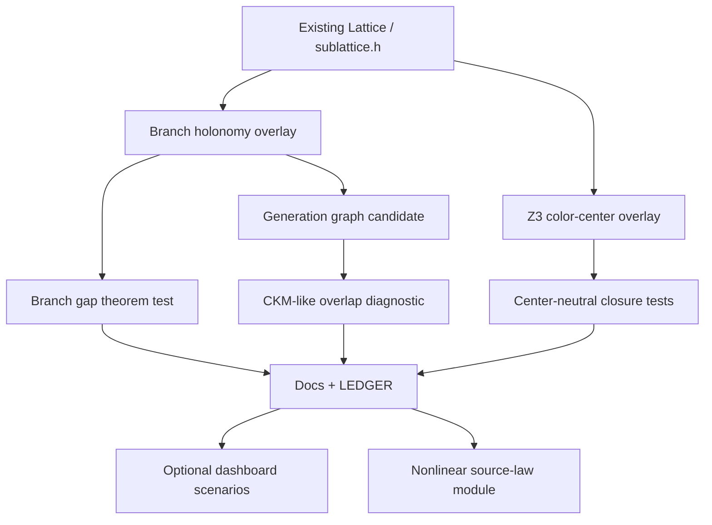

# FTD Engine Agent Implementation Plans

Version: v0.1  
Target repo: `williamsteinmetz/Foundational-Ternary-Dynamics`  
Purpose: give an engine agent executable, repo-native instructions for integrating the recent graph-theoretic FTD modules into the existing C++/WASM lattice engine.

## Non-negotiable operating rules

1. Do not replace the engine. Extend it.
2. Start with header-only or isolated test modules.
3. Do not modify `RenderBridge`, phase kernels, CUDA kernels, or WASM bindings until theorem/test modules are green.
4. Every physics/theory claim must carry an epistemic label:
   - DEFINITION
   - THEOREM
   - CONDITIONAL THEOREM
   - AXIOM / SELECTION
   - RECONSTRUCTION
   - CANDIDATE PRINCIPLE
   - PARAMETRIC INSERTION
   - OPEN
   - RETIRED / FAILED
5. Preserve the golden-tick gate. New work must not perturb production physics unless explicitly intended.
6. Prefer exact finite-graph checks before floating simulation checks.
7. If a result is only a graph reconstruction, do not call it a derivation.

## Current integration strategy

The recent Python graph modules should be treated as prototype proofs. The repo already has:

- a C++17 lattice engine;
- periodic cubic lattice infrastructure;
- BCC/FCC/SC sub-stencil support;
- CTest and `ftd_add_test`;
- Python proof/tests;
- WASM + Three.js dashboard;
- claim ledger and status discipline.

Therefore implement the new modules in this order:

1. `branch_holonomy.h` + `test_branch_holonomy_gap.cpp`
2. `color_center.h` + `test_z3_color_center.cpp`
3. `generation_graph.h` + `test_generation_graph.cpp`
4. Documentation + ledger updates
5. Optional dashboard scenarios
6. Nonlinear scalar source-law solver

## High-level dependency graph



## Recommended branch and commit plan

Use small, audit-friendly commits:

1. `feature/ftd-graph-overlays`
2. Commit 1: branch holonomy header + test
3. Commit 2: Z3 color center header + test
4. Commit 3: generation graph header + test
5. Commit 4: docs + ledger entries
6. Commit 5: optional dashboard scenario wiring

## Test command sequence

Native CPU-only quick path:

```bash
cmake -S engine -B engine/build -DFTD_ENABLE_CUDA=OFF -DCMAKE_BUILD_TYPE=Release
cmake --build engine/build --config Release
cd engine/build
ctest --output-on-failure -C Release -R "branch_holonomy|z3_color|generation_graph"
ctest --output-on-failure -C Release -R "render_bridge_golden"
```

Full repo-safe path:

```bash
cd engine/build
ctest --output-on-failure -C Release
python -m pytest scripts/tests/
```

Only run GPU/CUDA tests in the repo's established WSL2 path if required.

## File map

| Task | New files | Existing files to edit |
|---|---|---|
| Branch holonomy | `engine/include/ftd/branch_holonomy.h`, `engine/tests/test_branch_holonomy_gap.cpp` | `engine/CMakeLists.txt` |
| Z3 color center | `engine/include/ftd/color_center.h`, `engine/tests/test_z3_color_center.cpp` | `engine/CMakeLists.txt` |
| Generation graph | `engine/include/ftd/generation_graph.h`, `engine/tests/test_generation_graph.cpp` | `engine/CMakeLists.txt` |
| Docs | three theory docs | `docs/theory/07_assessment/LEDGER.md`, `docs/theory/META_INDEX.md`, optionally `META_PROJECT_ATLAS.md` |
| Dashboard | optional JS scenario/visual modules | `engine/web/js/bridge/scenarios/`, `engine/web/js/config/toggles.js` |

## Definition of done for the first integration wave

- New C++ tests compile and pass.
- `render_bridge_golden` remains unchanged.
- New docs clearly separate theorem-level results from reconstruction.
- No production physics tick path changes.
- The ledger tags are honest and conservative.
